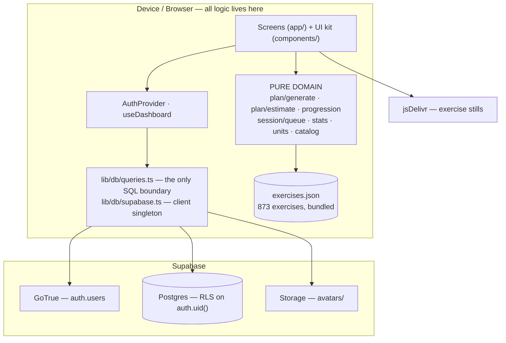
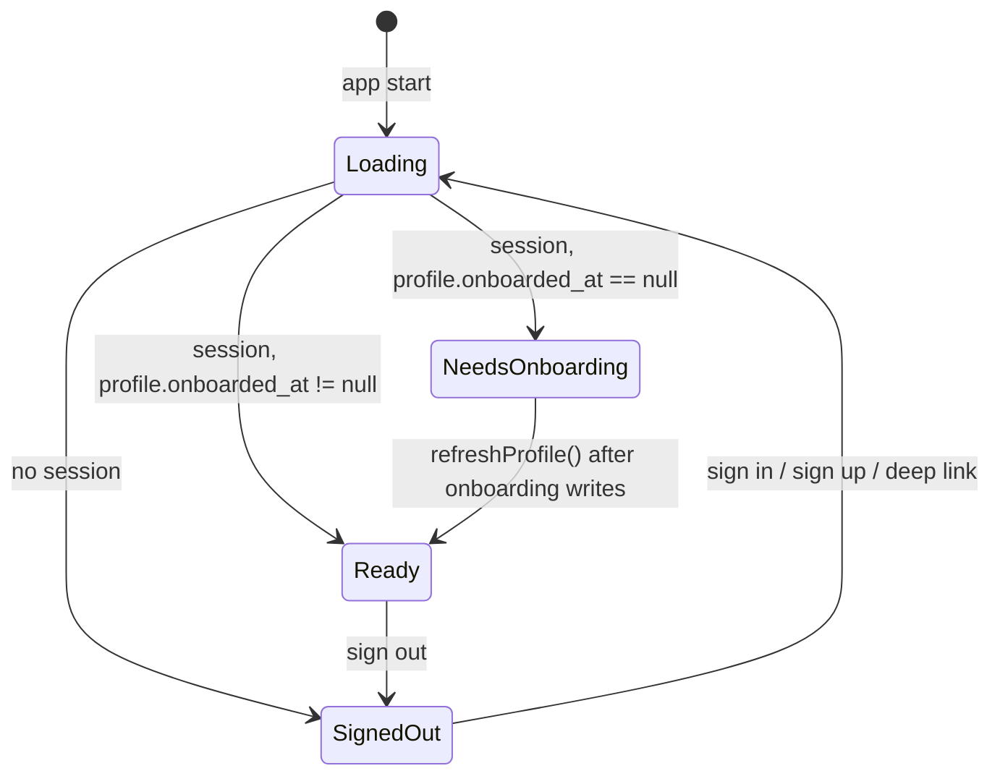
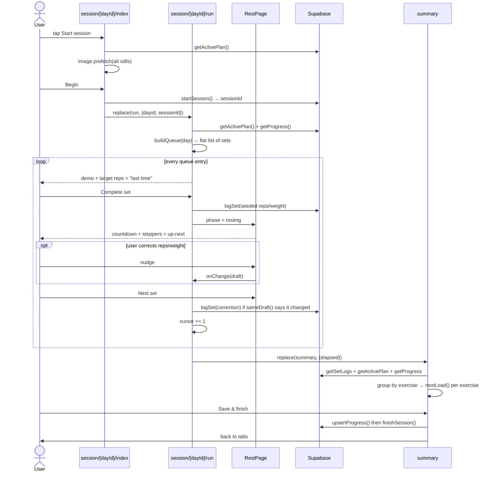
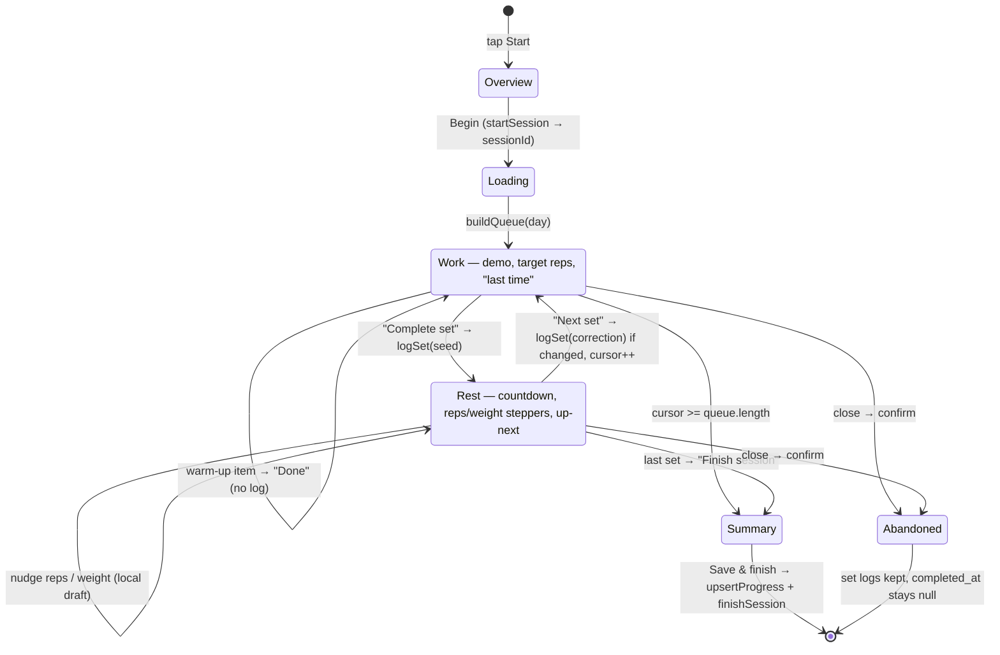
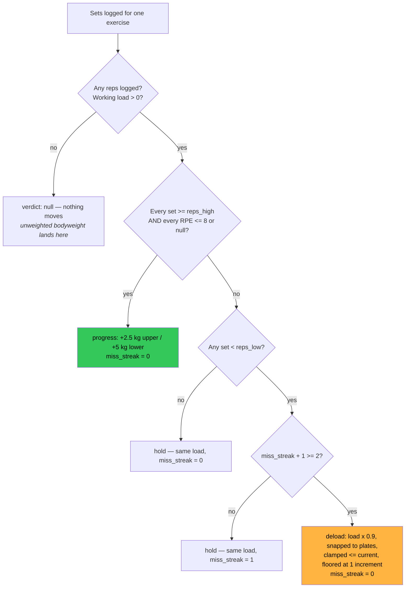
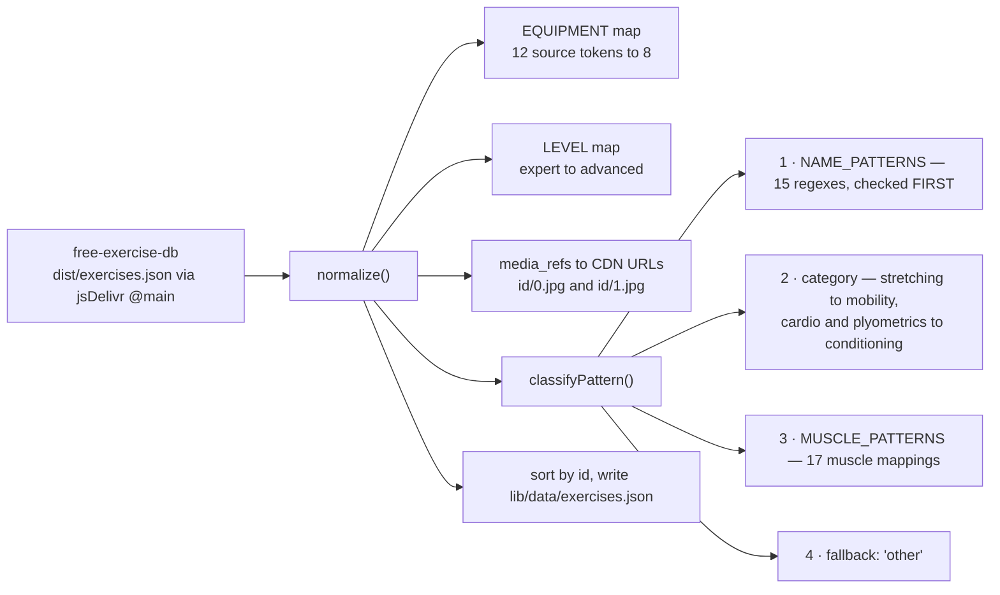
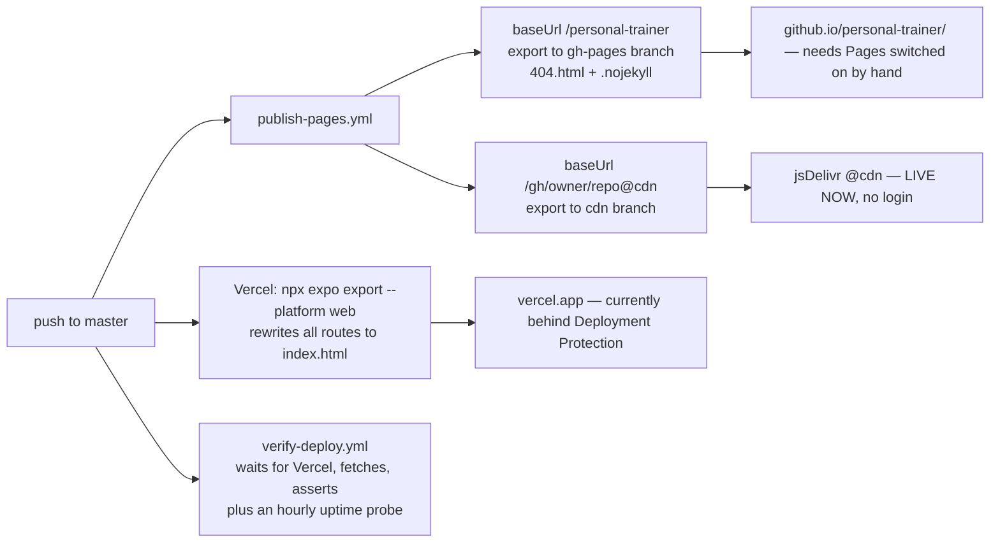

# Office Gym — Engineering Handoff

**Repo:** `mateosauton/personal-trainer` · **App:** Office Gym (`office-gym-trainer`)
**Audience:** the engineer taking this over. No prior context assumed.
**Verified at handoff:** `npx tsc --noEmit` clean · `npx jest` → 13 suites, 109 tests, ~5 s · web build live
**Companion:** [IMPROVEMENTS.md](./IMPROVEMENTS.md) — prioritised proposals for speed, usability and scale.

---

## Contents

| § | Section | Read it when |
|---|---------|--------------|
| [0](#0-read-this-first) | **Read this first** | Now. Includes zero-to-running-app. |
| [1](#1-domain-model-and-glossary) | Domain model and glossary | Now. Ten words the whole codebase speaks. |
| [2](#2-risks-and-known-gaps) | **Risks and known gaps** | Now. The twenty-one things that will bite you. |
| [3](#3-framework-choices-and-why) | Framework choices, and why | Before proposing a swap. |
| [4](#4-architecture) | Architecture | Before your first change. §4.3 is the most important table here. |
| [5](#5-runtime-behaviour) | Runtime behaviour | Before touching auth, routing or the session player. |
| [6](#6-folder-structure) | Folder structure | When you can't find something. |
| [7](#7-conventions) | Conventions, and what "done" means | Before your first PR. |
| [8](#8-user-flows) | User flows | To understand the product. |
| [9](#9-the-exercise-database-the-catalog) | The exercise database | Before touching plan generation. |
| [10](#10-database-architecture) | Database architecture | Before any schema change. |
| [11](#11-environments-build-and-deploy) | Environments, build and deploy | Before shipping. |
| [12](#12-testing) | Testing | Before your first PR. |
| [13](#13-operations) | **Operations** — reset, debug, ownership | The first time something is broken. |
| [14](#14-design-system) | Design system | Reference, when writing UI. |
| [15](#15-your-first-two-weeks) | Your first two weeks | After §0–2. |
| [16](#16-appendix--where-everything-lives) | Appendix — where everything lives | Constantly. |

---

## 0. Read this first

### 0.1 What this app is, in three sentences

A personal-training app for an office gym. It asks you seven questions once, deterministically generates a week of
training from your answers, and then runs each session set by set — demo image, target reps, rest timer, weight
prompt — logging every set and progressing your loads automatically.

There is **no AI, no model call and no server-side logic**. The plan generator is a pure rule engine that runs on
the device against a catalog bundled into the binary. Supabase holds nothing but your own rows.

### 0.2 Zero to a running app

Requires **Node 22** (`package.json` pins `engines.node: "22.x"`; there is no `.nvmrc` — add one).

#### Path A — no backend, about a minute

The fastest way to see the app work. `tools/dev/` ships a stand-in for every Supabase endpoint this app calls, with
two seeded accounts, so you need no cloud project at all.

```bash
npm install
node tools/dev/mock-supabase.mjs 54321 &
printf 'EXPO_PUBLIC_SUPABASE_URL=http://127.0.0.1:54321\nEXPO_PUBLIC_SUPABASE_KEY=mock\n' > .env
npx expo start --web --port 8081
```

Sign in as **`demo@officegym.test` / `demo1234`** (onboarded, with a plan and history) or
**`fresh@officegym.test` / `demo1234`** (lands in onboarding).

**You did it right when:** the browser shows the dark "Welcome back." sign-in screen, and `demo@officegym.test`
lands on Home with a streak card and a "Start session" button.

The mock also exposes `GET /__reset`, `GET /__state` (assert a write actually landed) and `GET /__slow?ms=700`
(hold loading states on screen long enough to look at).

#### Path B — your own Supabase, about ten minutes

Needed for anything touching real auth, RLS or Storage.

1. Create a project at [supabase.com](https://supabase.com). From **Settings → API** copy the **project URL** and the **publishable (anon) key**. Never the service-role key — see [§11.1](#111-configuration).
2. Open **SQL Editor** and run, in this order, pasting each file whole:
   - `supabase/migrations/0001_init.sql`
   - `supabase/migrations/0002_profile_identity.sql`

   > There is **no Supabase CLI setup in this repo** — no `supabase/config.toml`, no `supabase` devDependency. Migrations are plain SQL applied by hand. Adopting the CLI is worth an afternoon; see [§10.6](#106-migrations).
3. **Authentication → Providers → Email:** turn **Confirm email off** for local development, or every signup needs a working deep link. With it on the flow is real, and `lib/deep-link.ts` handles both PKCE and implicit token returns.
4. **Authentication → URL Configuration:** add your deep link to the redirect allow-list. `Linking.createURL('/')` resolves to an `exp://…` address in Expo Go and `officegym://` in a standalone build.
5. Configure and run:

```bash
cp .env.example .env      # fill in the URL and publishable key
npx expo start --lan      # scan the QR with the iPhone Camera app, open in Expo Go
```

**You did it right when:** Sign up → you land in onboarding step 1 of 7 → tap Continue seven times → the "Hang
tight" build screen ticks through three stages → Home shows a plan.

#### The rest of the commands

```bash
npm test        # 109 tests, ~5s
npm run lint    # tsc --noEmit — NOT a linter, see §7.1
npm run catalog # rebuild lib/data/exercises.json from free-exercise-db
```

No Xcode or Android Studio needed: the app runs in Expo Go, and the same source builds to a static web bundle.

### 0.3 Fifteen-minute orientation

Read these eight files, in this order. It is about 1,365 lines and it is the whole system.

| # | File | Lines | Why |
|---|------|------:|-----|
| 1 | `lib/types.ts` | 110 | The entire domain model. Every other file speaks these types. |
| 2 | `lib/plan/splits.ts` | 134 | The training templates — the product's opinion, expressed as data. |
| 3 | `lib/plan/generate.ts` | 356 | The generator. The most valuable file in the repo. |
| 4 | `lib/session/queue.ts` | 71 | How a plan becomes a flat list of "one set to do". |
| 5 | `lib/progression.ts` | 94 | Double progression: how loads move week to week. |
| 6 | `app/_layout.tsx` | 81 | The routing gate — three app states, declaratively guarded. |
| 7 | `app/session/[dayId]/run.tsx` | 326 | The player. Where users spend their time. |
| 8 | `supabase/migrations/0001_init.sql` | 193 | The schema and every RLS policy. |

Then read [§2 Risks](#2-risks-and-known-gaps) and [§4.3 Where each number is computed](#43-where-each-number-is-computed).

### 0.4 Working tree state — do this before anything else

The tree at handoff has **substantial uncommitted work**: a tab removed (`app/(tabs)/history.tsx`), a screen moved
(`(tabs)/profile.tsx` → `profile.tsx`), a hook replaced (`lib/usePlan.ts` → `lib/useDashboard.ts`), six untracked
components (`Calendar`, `Doodle`, `ExerciseStrip`, `Header`, `Icon`, `Streak`) and nine untracked test files.
`tsc` and the full suite are green on it.

Your first act is to review `git status` / `git diff` and commit it in coherent pieces. Do not start feature work
on top of an uncommitted refactor.

---

## 1. Domain model and glossary

### 1.1 The nouns

| Term | Meaning | Type |
|------|---------|------|
| **Catalog** | The 873 bundled exercises. Static reference data; ships in the binary. | `Exercise[]` |
| **Pattern** | Movement pattern (`squat`, `hinge`, `h_push`, `v_pull`, `core`…). The unit the generator slots by. | `Pattern` |
| **Split** | Weekly shape, chosen by training frequency (Full Body, Upper/Lower, PPL). | `SPLITS[days]` |
| **Plan** | One user's generated programme: a name, a split, N `PlanDay`s. Exactly one is `is_active`. | `Plan` |
| **Day** | One session template in the rotation. Warm-up + 4 work blocks. | `PlanDay` |
| **Block** | A group inside a day. `warmup` \| `straight` \| `superset` \| `circuit`. | `PlanBlock` |
| **Item** | One exercise inside a block, with its sets/reps prescription. | `PlanItem` |
| **Session** | One actual training instance of a Day, on a date. | `sessions` row |
| **Set log** | One logged set: reps, load, bodyweight flag. | `SetLog` |
| **Progress** | Per-exercise running state: last load, best load, best e1RM, miss streak. | `exercise_progress` row |

### 1.2 The training vocabulary

These appear throughout the code and are assumed knowledge in the comments:

| Term | What it means here |
|------|--------------------|
| **Double progression** | The progression rule this app implements: hold the load constant and work *up* the rep range; only when every set reaches the top of the range do you add weight and drop back to the bottom. Two variables, moved one at a time — hence "double". See [§8.3](#83-progression--what-happens-to-your-loads). |
| **RPE** | Rate of Perceived Exertion, 1–10 — how hard a set felt. 8 ≈ "two reps left in the tank". The schema and `nextLoad` support it; **the UI never collects it** (risk [U5](#2-risks-and-known-gaps)). |
| **e1RM** | Estimated one-rep max: the load you could lift once, extrapolated from a heavier-rep set. Computed with the **Epley** formula (`load × (1 + reps/30)`) in `lib/units.ts`. Only meaningful from 1–12 reps, which is where the app lives. |
| **Tonnage / volume** | Used interchangeably in this codebase and in the UI: `Σ (reps × effective load)` for a set of logs. `sessionTotals().volumeKg` is the canonical computation. |
| **Effective load** | What a set actually loaded. For normal work that is `weight_kg`; for bodyweight work it is `profile.bodyweight_kg + added_load_kg`, which is what makes a weighted pull-up comparable to a lat pulldown. |
| **Straight sets / superset / circuit** | Straight = all sets of one exercise, then rest. Superset = two exercises back to back. Circuit = three or more, rotating. This distinction changes the arithmetic — see §1.3. |
| **Calendar day** | `dayKey()` = `format(new Date(started_at), 'yyyy-MM-dd')` — a UTC `timestamptz` rendered in **device-local** time. The streak, the calendar and "today's totals" all key on this, and all key on `started_at`, not `completed_at`. See §1.4. |

### 1.3 Two structural facts that explain most of the code

**A plan is a rotation, not a schedule.** There is no "Tuesday is leg day". `nextDay = plan.days[completedSessions
% plan.days.length]`. Miss a week and there is no hole to feel guilty about. The calendar is a *record*, never a
*plan*.

**A block's `kind` changes the arithmetic.** For `straight`, sets live on the *item* (`item.sets`) and the block
runs once. For `superset`/`circuit`, sets live on the *block* (`block.rounds`) and the items rotate. Every place
that counts sets — `queue.ts`, `estimate.ts`, `summary.tsx` — branches on this. Get it wrong and the numbers
silently disagree.

### 1.4 The calendar-day contract — read this before touching the streak

Three facts, none of them obvious, all load-bearing:

1. **Days are device-local, timestamps are UTC.** `dayKey` formats a `timestamptz` through the device's timezone. A user who trains at 23:50 in Berlin and a user who trains at the same instant in São Paulo get different day keys. A user who flies west can see a day appear twice, or a streak break that did not happen.
2. **The streak keys on `started_at`.** A session started at 23:58 and finished at 00:20 counts for the day it *started*. That is defensible; it is also undocumented anywhere but here.
3. **Only completed sessions count.** `getRecentSessions` filters `completed_at is not null`, and `completed_at` is written only when the user presses Save on the summary — so an abandoned summary silently costs a streak day (risk [C2](#2-risks-and-known-gaps)).

If a user reports a wrong streak, check these three before reading `streakDays`, which is correct and well tested.

---

## 2. Risks and known gaps

**This section is deliberately at the front.** It is the shortest path to not breaking something. Ids match
[IMPROVEMENTS.md](./IMPROVEMENTS.md), which specifies the fix for each.

| Id | Issue | Where | Impact |
|----|-------|-------|--------|
| [**C1**](./IMPROVEMENTS.md#c1--make-saveplan-transactional) | **`savePlan` is not transactional.** It deactivates existing plans *before* inserting the new one, then does four dependent inserts. A failure at any step leaves the user with **no active plan** and orphaned rows. | `lib/db/queries.ts` | 🔴 Data loss, on a flaky network during onboarding or rebuild |
| [**C3**](./IMPROVEMENTS.md#c3--stop-a-failed-profile-read-looking-like-a-new-user) | **A failed profile read looks like a new user.** `auth.tsx` catches a `getProfile` error and sets `profile = null`; the gate reads that as "needs onboarding". A cold start on bad signal can drop an existing user into onboarding, and completing it replaces their plan. | `lib/auth.tsx`, `app/_layout.tsx` | 🔴 Data loss, on a common condition |
| [**C4**](./IMPROVEMENTS.md#c4--offline-tolerant-set-logging) | **No offline write path.** `logSet` is awaited inline; a failure shows an alert and the user cannot advance. Gyms have bad signal. | `run.tsx`, `queries.ts` | 🔴 The core loop fails exactly where it is used |
| [**C5**](./IMPROVEMENTS.md#c5--remove-the-200-session-ceiling) | **The rotation is capped at 200 sessions.** `nextDay` is derived from `getRecentSessions(userId, 200).length`, so past 200 the rotation freezes and the streak and calendar truncate. | `lib/useDashboard.ts` | 🔴 Correctness, at ~1 year of use |
| [**C2**](./IMPROVEMENTS.md#c2--complete-the-session-when-it-ends-not-when-a-button-is-pressed) | **An abandoned summary loses the session.** `completed_at` is written only by the summary's Save button; set logs survive but the session never appears in history, never counts toward the streak and never advances the rotation. | `summary.tsx` | 🟠 Silent data invisibility |
| [**U2**](./IMPROVEMENTS.md#u2--a-rest-timer-that-survives-a-locked-phone) | **The rest timer drifts and dies when backgrounded.** A `setInterval` decrementing state, no wall-clock anchor, and the completion buzz only fires in the foreground. | `components/RestPage.tsx` | 🟠 Wrong rest = wrong training |
| [**C7**](./IMPROVEMENTS.md#c7--make-the-calendar-day-explicit) | **Calendar days are device-local and undocumented.** See §1.4. Travel and near-midnight sessions produce streaks nobody can explain. | `lib/stats.ts` | 🟠 Unexplainable bug reports |
| [**P2**/**P3**](./IMPROVEMENTS.md#p2--one-cache-instead-of-four-independent-reads) | **The plan is fetched four times per session flow** and both tabs refetch everything on every focus. No cache anywhere. | multiple | 🟠 Latency and cost |
| [**P1**](./IMPROVEMENTS.md#p1--stop-parsing-1-mb-of-json-at-startup) | **1.06 MB of exercise JSON is parsed at startup**, of which ~59% is fields the app never reads. | `lib/catalog.ts` | 🟠 Cold-start time |
| [**U1**](./IMPROVEMENTS.md#u1--fix-the-faint-token-contrast-failure) | **`colors.faint` fails WCAG contrast** (2.89:1) and is used for real text. | `lib/theme.ts` | 🟠 Accessibility |
| [**U6**](./IMPROVEMENTS.md#u6--observability-for-a-blind-app) | **No error boundary, no crash reporting, no analytics.** A render error is a white screen you never hear about. | app-wide | 🟠 Blind operation |
| [**C6**](./IMPROVEMENTS.md#c6--guard-against-a-duplicate-active-plan) | **Nothing prevents two active plans.** `plans_user_idx` is a *non-unique* partial index, and `getActivePlan` uses `.maybeSingle()`, which errors on two rows. | `0001_init.sql` | 🟡 A latent hard failure |
| [**U5**](./IMPROVEMENTS.md#u5--decide-what-rpe-is-for) | **RPE is dead weight.** Two columns and a progression branch exist; the UI writes `null` every time, so the `rpe ≤ 8` gate never does anything and progression is more aggressive than it claims. | schema, `run.tsx`, `progression.ts` | 🟡 Wire it up or delete it |
| [**S1**](./IMPROVEMENTS.md#s1--reach-the-other-27-of-the-catalog) | **27% of the catalog is unreachable** — `ALL_EQUIPMENT` omits `'other'`, so 239 exercises can never be selected. | `generate.ts` | 🟡 Less variety than the dataset offers |
| [**Q1**](./IMPROVEMENTS.md#q1--run-types-and-tests-in-ci) | **No CI for types or tests**, and no linter. `npm run lint` runs `tsc` and is misleadingly named. | `.github/workflows/` | 🟡 Regressions reach `master` |
| [**Q2**](./IMPROVEMENTS.md#q2--make-the-dev-harness-runnable) | **`drive.mjs` cannot run on a fresh checkout** — `playwright` is missing from `package.json` and the Chromium path is hardcoded. | `tools/dev/` | 🟡 The harness rots |
| [**M1**](./IMPROVEMENTS.md#m1--password-reset-and-account-recovery) | **There is no password reset.** `sign-in.tsx` offers only `signInWithPassword` and `signUp` — no `resetPasswordForEmail`, no magic link, no email change. A forgotten password is permanent loss of the entire training history, with no path back that does not involve you opening the Supabase dashboard. | `app/(auth)/sign-in.tsx` | 🔴 Total account loss |
| [**M3**](./IMPROVEMENTS.md#m3--close-the-avatar-bucket) | **The `avatars` bucket is world-readable.** `for select to public`, stable path `<uid>/avatar.<ext>`, no MIME allowlist and no size cap. Every user's face photo is fetchable unauthenticated by anyone holding the URL. See [§10.4](#104-storage--and-its-one-real-security-problem). | `0002_profile_identity.sql`, `queries.ts` | 🔴 The one real security finding |
| [**C8**](./IMPROVEMENTS.md#c8--make-the-rotation-per-plan) | **The rotation cursor is lifetime-wide, not per-plan.** `completedCount` counts every completed session ever, across all plans, so rebuilding drops you into the middle of a plan you have never seen. | `lib/useDashboard.ts` | 🟠 Live bug, fires on every rebuild |
| [**Q5**](./IMPROVEMENTS.md#q5--fix-the-two-unguarded-effects) | **Two effects have no cancellation flag and one has no `.catch`.** `run.tsx:46` — a failed plan load is an unhandled rejection that strands the player on a spinner. | `run.tsx`, `session/[dayId]/index.tsx` | 🟠 Silent hang |
| [**Q4**](./IMPROVEMENTS.md#q4--housekeeping) | **Housekeeping:** two unused dependencies (`zustand`, `@gorhom/bottom-sheet`), a stale `jest.config.js` comment, `daysSinceLast` in `stats.ts` is tested but has **no consumer**, and the allowed `days_per_week` range is hardcoded in **five** places. | `package.json`, misc | 🟢 Tidiness |

**Two traps that are not risks, just sharp edges** — they will cost you a PR if you do not know them:

- **The set write path is a three-part type contract.** See [§5.3](#53-the-write-path-of-one-set). Add a field to a logged set without touching all three and it silently never saves.
- **The allowed training frequencies live in five files plus a database CHECK constraint.** See [§16](#16-appendix--where-everything-lives).

---

## 3. Framework choices, and why

| Layer | Choice | Version | Why this, and what it costs |
|-------|--------|---------|------------------------------|
| Runtime | **Expo** (managed) | SDK 54 | Runs in Expo Go — no Xcode, no provisioning, no build step to test on a real phone. Cost: native modules limited to what Expo ships or config plugins allow. |
| UI | **React Native** + **react-native-web** | 0.81.5 / 0.21 | One source, three targets. The hosted web build is the same code. |
| Language | **TypeScript**, `strict: true` | 5.9 | The domain is full of near-identical numbers (kg vs lb, reps vs seconds) that types keep apart. |
| Routing | **expo-router** (file-based) | 6.0 | Deep links come free — needed for Supabase email confirmation. Typed routes on. |
| Backend | **Supabase** (Postgres + GoTrue + Storage) | js 2.109 | RLS means authorisation is one `auth.uid()` predicate per table and **there is no application server to write**. |
| State | **React Context + hooks** | — | Exactly one context (`AuthContext`) plus one shared hook. `zustand` is in `package.json` and **unused**. See §5.4. |
| Animation | **Reanimated 4** + worklets | 4.1 | UI-thread animation; every one respects `ReduceMotion.System`. |
| Icons | **lucide-react-native**, deep-imported | 1.35 | `components/Icon.tsx` deep-imports seven glyphs so the 1,500-icon barrel never enters the bundle. |
| Images | **expo-image** | 3.0 | `cachePolicy="memory-disk"` — a session repeats offline after its first run. |
| Dates | **date-fns** | 4.4 | Tree-shakeable; only `format`, `differenceInCalendarDays` and month helpers are used. |
| Tests | **Jest** + `jest-expo` + Testing Library RN | 29.7 | Runs pure logic *and* component render tests. |
| Hosting | **Vercel** (primary), GitHub Pages + jsDelivr (mirrors) | — | `npx expo export --platform web` → static SPA. See [§11.2](#112-the-three-deployed-targets). |

### 3.1 Choices worth defending in a review

**The catalog is bundled, not in Postgres.** It is *reference data versioned with the binary*, and the generator
runs on-device, so it must work with no network. The size cost is real and is addressed in
[IMPROVEMENTS §P1](./IMPROVEMENTS.md#p1--stop-parsing-1-mb-of-json-at-startup) without giving that up.

**Plan generation is deterministic, not a model call.** Seeded from the user id (`lib/plan/rng.ts`), so the same
answers reproduce the same plan and two users with identical answers still get different picks. Testable, free,
instant, offline. This is a feature.

**No state library.** One piece of genuinely global state (session + profile) and one shared read
(`useDashboard`). Revisit only when §5.4's rule breaks — and read
[IMPROVEMENTS §P2](./IMPROVEMENTS.md#p2--one-cache-instead-of-four-independent-reads) first, because the actual
need is a *cache*, not a store.

### 3.2 Dependencies with no importer

Verified by grep across `app/`, `components/`, `lib/`, `scripts/`, `tools/`, `__tests__/`:

- `zustand` — **no import anywhere.** Removable.
- `@gorhom/bottom-sheet` — **no import anywhere.** Left over from the pre-`RestPage` weight drawer. Removable.
- `react-native-svg` — no direct import, but a **peer dependency of `lucide-react-native`**. Keep.
- `expo-constants` — no direct import; pulled in by the Expo toolchain. Check `npm ls expo-constants` before touching.

---

## 4. Architecture

### 4.1 The dependency rule

This is the whole architecture. Everything else is detail.

```
app/  ──▶  components/  ──▶  lib/theme, lib/motion, lib/types
  │
  ├──▶  lib/auth, lib/useDashboard  ──▶  lib/db/queries  ──▶  lib/db/supabase  ──▶  network
  │
  └──▶  lib/catalog, lib/plan/*, lib/progression, lib/session/*, lib/stats, lib/units
                                    ▲
                                    └── PURE. No I/O. No React. No Supabase. Ever.
```

**Domain never imports data access, and never imports React.** That is why the domain suites run with **no mocks at
all** (the four component suites do mock `expo-router`, `lib/auth` and `lib/db/queries`), and it is what would let
plan generation move server-side if the product ever needs it
([IMPROVEMENTS §S5](./IMPROVEMENTS.md#s5--multi-user-and-coach-mode-if-the-product-goes-there)).

**Guard it.** If you find yourself importing `lib/db/*` from `lib/plan/*`, `lib/stats.ts`, `lib/progression.ts`,
`lib/units.ts` or `lib/session/*`, the design has drifted. A CI check is proposed in
[IMPROVEMENTS §Q3](./IMPROVEMENTS.md#q3--enforce-the-architecture).

### 4.2 The runtime shape



### 4.3 Where each number is computed

**The most useful table in this document.** There is exactly one owner for every derived number — Home and Plan
used to each do their own arithmetic and drifted apart.

| Number | Owner | Consumers |
|--------|-------|-----------|
| Sets / reps / minutes / body parts for a **planned** day | `lib/plan/estimate.ts` → `estimateDay` | Home card, Plan cards |
| Projected tonnage before training | `lib/plan/estimate.ts` → `estimateVolumeKg` | Home card |
| Actual tonnage, sets, reps | `lib/stats.ts` → `sessionTotals` | Home (today), Plan (picked day), Summary |
| Streak, trained days, recent-day strip | `lib/stats.ts` | `Streak`, `Calendar` |
| Next load, verdict, miss streak | `lib/progression.ts` → `nextLoad` | Summary only |
| Effective load, e1RM, unit conversion | `lib/units.ts` | Summary, `RestPage`, Profile |
| What set comes next | `lib/session/queue.ts` → `buildQueue` | Run player |

**Rule: a screen never does domain arithmetic inline.** If a screen needs a number that does not exist yet, add a
pure function next to its siblings, unit-test it, and call it. This is the single most important convention here.

**Three places the codebase currently breaks its own rule.** Know them, because they are where "the number is
wrong" bugs actually live:

| Inline computation | Where | Should be |
|--------------------|-------|-----------|
| **Today's *actual* minutes** — `todaySessions.reduce((s, x) => s + (x.duration_s ?? 0), 0) / 60` | `app/(tabs)/index.tsx:72-77` | `lib/stats.ts`. If a user says "minutes are wrong *after* I trained", this is the code, not `estimateDay`. |
| Dedupe of today's exercises for the thumbnail strip | `app/(tabs)/index.tsx` | Fine to leave, but it re-runs on every render ([IMPROVEMENTS §P6](./IMPROVEMENTS.md#p6--cheap-wins)) |
| Per-line grouping and e1RM roll-up | `app/session/[dayId]/summary.tsx:62-100` | Extractable and testable; currently the largest untested calculation in the app |

Also worth knowing before you chase an estimate bug: **`estimateDay` uses a flat `SECONDS_PER_SET = 45`** and is
entirely independent of the `session_minutes` the user chose in onboarding — that choice only affects `REST` and
`CIRCUIT_ROUNDS` at *generation* time. So a 30-minute session can legitimately estimate at 38 minutes.

---

## 5. Runtime behaviour

### 5.1 The routing gate

`app/_layout.tsx` resolves three states and guards them **declaratively** with `Stack.Protected`, not with a
redirect in an effect.



Two hard-won rules, both commented in the file — do not undo them:

1. **Guard, don't redirect.** Every screen behind the gate calls `useUserId()`, which *throws* without a session. A screen the user does not belong on must never mount.
2. **Never unmount the navigator and then navigate.** Onboarding finishes by calling `refreshProfile()` and nothing else. Racing a `router.replace()` against the gate flip is what previously left the app on a dead spinner.

**The known defect here is [C3](#2-risks-and-known-gaps):** `profile === null` means both "never onboarded" and
"the read failed", and the gate treats both as *send them to onboarding*.

### 5.2 A live session



Three behaviours to understand before changing anything here:

- **The set is written on "Complete set", before the user confirms it.** Seeded from last session's reps and load, upserted on `(session_id, plan_item_id, set_index)`; a correction during rest overwrites the same row. One tap logs a set — and a *guess* is persisted if the user quits mid-rest ([IMPROVEMENTS §U4](./IMPROVEMENTS.md#u4--stop-persisting-a-guess-as-a-logged-set)).
- **A session is only "done" when the summary is saved** — risk [C2](#2-risks-and-known-gaps).
- **The player cannot be escaped by accident.** `gestureEnabled: false`, `presentation: 'fullScreenModal'`, no tab bar, and the ✕ confirms via `lib/alerts.ts`.

### 5.3 The write path of one set

**Read this before adding any field to a logged set.** Three types govern the write path, and they are not
connected by the compiler:

```
SetDraft            SetLog                    set_logs
(display units)  →  (kg, DB shape)         →  (Postgres row)
RestPage.tsx:12     lib/types.ts:101          0001_init.sql
        │                   │
        │                   └── spread STRAIGHT into the upsert:
        │                       queries.ts:191  { session_id, ...set }
        │                       → it is both the row type AND the insert type
        │
        └── compared by sameDraft() — run.tsx:25
            ┌──────────────────────────────────────────────────┐
            │ if (draft && !sameDraft(draft, savedRef.current)) │
            │     await save(entry, draft)                      │
            └──────────────────────────────────────────────────┘
            This comparator decides whether a correction is written AT ALL.
            It compares exactly three fields: reps, weight, asBodyweight.
```

So adding, say, a per-set `notes` field means touching **six** places, not the three that
[§10.6](#106-migrations) implies for an ordinary column:

1. the migration (`add column if not exists`)
2. `lib/types.ts` → `SetLog` — and it must be **optional or defaulted**, because the type doubles as the insert shape
3. `lib/db/queries.ts` → `getSetLogsForSessions` has an explicit column list. `getSetLogs` rides along on `select('*')`; `logSet` needs no change because it spreads the whole object
4. `components/RestPage.tsx` → `SetDraft` **and** the UI to edit it
5. `app/session/[dayId]/run.tsx` → the `seed` construction and the `save()` mapping
6. `app/session/[dayId]/run.tsx:25` → **`sameDraft`** — miss this and a notes-only edit is silently never persisted

That last one is the expensive mistake. There is no test covering it; add one when you touch it.

### 5.4 State ownership

| State | Owner | Lifetime |
|-------|-------|----------|
| Auth session + profile | `AuthProvider` (React context) | App |
| Plan, history, streak, today's totals | `useDashboard(userId, bodyweightKg)` | **Per screen instance** |
| Session cursor, phase, draft | `run.tsx` local `useState` | One session |
| Rest countdown | `RestPage` local `useState` | One rest |
| Form state | Screen-local | One screen |

**Rule: lift state only when two siblings must agree.** That has happened once — Home and Plan both needed plan +
history, so `useDashboard` exists. Note each screen holds its *own* instance, so switching tabs refetches
everything. That is the current cost of having no cache layer
([IMPROVEMENTS §P2](./IMPROVEMENTS.md#p2--one-cache-instead-of-four-independent-reads)).

---

## 6. Folder structure

```
.
├── app/                          # expo-router: the file tree IS the route tree
│   ├── _layout.tsx               #   root: providers + the three-state routing gate
│   ├── onboarding.tsx            #   /onboarding — 7 steps, NOT in a group (a group index would claim "/")
│   ├── profile.tsx               #   /profile — modal over the tabs, opened by the Home avatar
│   ├── (auth)/                   #   group: rendered only when signed out
│   │   ├── _layout.tsx
│   │   └── sign-in.tsx           #     sign in / sign up / dev sign-in, one screen, two modes
│   ├── (tabs)/                   #   group: the two-tab shell
│   │   ├── _layout.tsx
│   │   ├── index.tsx             #     Home — who you are, how you're doing, what's next
│   │   └── plan.tsx              #     Plan — calendar + rotation + recent sessions
│   └── session/                  #   full-screen, no tab bar, no swipe-back
│       ├── _layout.tsx
│       └── [dayId]/
│           ├── index.tsx         #     overview: what you're about to do; prefetches media
│           ├── run.tsx           #     the player
│           └── summary.tsx       #     totals, PRs, progression verdicts, save
│
├── components/                   # presentational. No data access, no domain maths.
│   ├── ui.tsx                    #   THE UI KIT: Screen, Card, Button, Chip, ProgressBar, type scale
│   ├── Icon.tsx                  #   the only place lucide is imported
│   ├── Header.tsx                #   avatar + greeting; the way into Profile
│   ├── ExerciseMedia.tsx         #   the 2-still crossfade — the app's signature element
│   ├── ExerciseStrip.tsx         #   a row of paused thumbnails
│   ├── RestPage.tsx              #   the whole between-sets screen (timer + logging + up-next)
│   ├── Calendar.tsx              #   month grid, trained days filled
│   ├── Streak.tsx                #   streak numeral + 14-day dot strip
│   ├── NumberField.tsx           #   numeric input with an iOS accessory bar (decimal-pad has no return key)
│   ├── Doodle.tsx                #   MarkerStroke / DoodlePop — the hand-drawn accents
│   └── Attribution.tsx           #   free-exercise-db credit
│
├── lib/
│   ├── types.ts                  # the domain model — read this first
│   ├── theme.ts                  # design tokens: colors, space, radius, type, duration
│   ├── motion.ts                 # animation constants + reduced-motion helpers
│   ├── catalog.ts                # CATALOG, getExercise, candidates(filter), limitation rules
│   ├── units.ts                  # kg⇄lb, cm⇄in, plate steps, effective load, Epley e1RM
│   ├── progression.ts            # double progression: nextLoad()
│   ├── stats.ts                  # streak, trained days, session totals
│   ├── alerts.ts                 # confirm()/notify() — RN Alert is a NO-OP on web
│   ├── auth.tsx                  # AuthProvider, useAuth, useUserId
│   ├── deep-link.ts              # email-confirmation deep link → session (PKCE + implicit)
│   ├── dev-auth.ts               # whitelisted one-tap test sign-in
│   ├── useDashboard.ts           # the one shared read for both tabs
│   ├── data/exercises.json       # 873 exercises, ~1.06 MB — GENERATED, do not hand-edit
│   ├── db/
│   │   ├── supabase.ts           #   client singleton (AsyncStorage, detectSessionInUrl: false)
│   │   └── queries.ts            #   every query in the app. The only SQL boundary.
│   ├── media/provider.ts         # resolveMedia / prefetchUrls
│   ├── plan/
│   │   ├── generate.ts           #   the rule engine
│   │   ├── splits.ts             #   day templates by training frequency
│   │   ├── estimate.ts           #   pre-session projections
│   │   └── rng.ts                #   seeded PRNG + shuffle
│   └── session/queue.ts          # plan → flat list of sets
│
├── supabase/migrations/          # 0001_init.sql, 0002_profile_identity.sql — applied BY HAND
├── scripts/build-catalog.mjs     # free-exercise-db → lib/data/exercises.json
├── tools/dev/                    # headless harness: mock-supabase, drive, serve-dist
├── __tests__/                    # 13 suites, 109 tests
└── .github/workflows/            # publish-pages.yml, verify-deploy.yml (neither runs tests)
```

### 6.1 Where do I put a new…?

| New thing | Goes in | Must it be tested? |
|-----------|---------|--------------------|
| Screen | `app/<route>.tsx` | Render test if it has branching states |
| Reusable visual | `components/` | Only if it has logic (like `initials()`) |
| Domain calculation | `lib/<area>.ts` or `lib/<area>/` | **Yes, always** |
| Query | `lib/db/queries.ts` | No (mocked at call sites) |
| Design token | `lib/theme.ts` | Add it to the contrast test ([§14.4](#144-accessibility-audit-of-the-palette)) |
| Regression from a real bug | `__tests__/regressions.test.ts` | It *is* the test |
| Schema change | new `supabase/migrations/NNNN_name.sql` | Update `lib/types.ts` in the same commit — and check [§16](#16-appendix--where-everything-lives) for constants that mirror it |

---

## 7. Conventions

The codebase is highly consistent but **most of these conventions are unwritten and unenforced**. Each is marked
**[established]** (already followed throughout — keep doing it) or **[proposed]** (a gap; adopt it).

### 7.1 Tooling

| Concern | Today | Proposal |
|---------|-------|----------|
| Types | `npm run lint` = `tsc --noEmit`, `strict: true`. Clean. | Rename the script to `typecheck` — calling it `lint` hides that **there is no linter**. |
| Linting | **None.** No ESLint installed, yet `// eslint-disable-next-line` comments exist in `lib/alerts.ts` and `app/(tabs)/plan.tsx:71` — they are inert. | **[proposed]** `eslint-config-expo` + `eslint-plugin-react-hooks`. The `plan.tsx` hooks suppression then needs justifying or fixing. |
| Formatting | None. Style is consistent by hand: 2-space indent, single quotes, trailing commas, ~100 col. | **[proposed]** Prettier, `printWidth: 100, singleQuote: true`, `--check` in CI. |
| Tests in CI | **Not run.** | **[proposed]** [IMPROVEMENTS §Q1](./IMPROVEMENTS.md#q1--run-types-and-tests-in-ci). |
| Imports | `@/*` alias → repo root, configured in `tsconfig.json` and `jest.config.js`. | Keep. Never `../../..`. |

### 7.2 TypeScript **[established]**

- `strict: true`, and **no `any` anywhere in the repo** (verified). Where an untyped shape crosses a boundary it is narrowed explicitly — see the `never`-cast ladder in `getActivePlan`, which is honest about Supabase's nested-select typing rather than reaching for `any`.
- Domain unions over loose strings: `Goal`, `Level`, `Pattern`, `BlockKind`, `Units`. About to add a `string` with five valid values? Add a union to `lib/types.ts`.
- `Record<Union, T>` for exhaustive lookup tables (`SCHEME`, `SUBSTITUTES`, `REST`, `LEVEL_RANK`) — the compiler then tells you when a new union member needs a row.
- `interface` for object shapes, `type` for unions and aliases.
- **`null` means "known absent", `undefined` means "not supplied".** `Profile.bodyweight_kg: number | null` is a user who has not told us; an optional parameter is a caller who did not pass one. Load-bearing in `effectiveLoadKg` and `estimateVolumeKg`.
- **Some types double as insert shapes.** `SetLog` is spread straight into an upsert ([§5.3](#53-the-write-path-of-one-set)); a new non-optional field breaks every call site.

### 7.3 Naming **[established]**

| Kind | Convention | Example |
|------|-----------|---------|
| Components / component files | `PascalCase` | `RestPage.tsx` |
| Library files | `camelCase.ts` or a lowercase noun | `useDashboard.ts`, `catalog.ts` |
| Route files | expo-router's rules, lowercase | `sign-in.tsx`, `[dayId]/run.tsx` |
| Hooks | `use` prefix | `useDashboard`, `useUserId` |
| Booleans | `is` / `has` / `can` | `is_bodyweight`, `isPlainLift`, `canSubmit` |
| DB columns and row types | `snake_case`, matching Postgres exactly | `reps_low`, `added_load_kg` |
| Everything else in TS | `camelCase` | `bodyweightKg`, `restSeconds` |
| Module constants | `SCREAMING_SNAKE` | `SPLITS`, `SUBSTITUTES` |
| **Units in the name** | Always suffix a physical quantity | `weight_kg`, `durationS`, `restSeconds`, `height_cm` |

That last row matters most. The app converts kg/lb and cm/in **at the display edge only** — everything stored and
computed is metric and seconds. A variable called `weight` with no suffix is a bug waiting to happen;
`SetDraft.weight` is display-units on purpose and says so in its doc comment.

### 7.4 Comments **[established — and unusual]**

This codebase comments **why, never what**, and does it well. See `lib/catalog.ts`'s `LIMITATIONS` block or
`lib/alerts.ts`'s header: each explains a decision, the failure that motivated it, and what breaks if it is undone.

- File-level block comment on any module with a non-obvious reason to exist.
- Inline comments only where the code would otherwise look wrong (`// Rounding alone could push a light load *up*`).
- No JSDoc `@param`/`@returns` ceremony — the types already say that.
- **Never delete a "why" comment while changing the code it guards.** Update it, or explain why the reason expired.

### 7.5 Styling **[established]**

- `StyleSheet.create` at the bottom of each file, one `styles` object.
- **Every value comes from `lib/theme.ts`.** No literal hex, no magic spacing.
- Layout-only props (`flex: 1`, `gap`, `marginTop: space.xl`) may be inline; anything reusable goes in the sheet.
- Composition over props: `<Card>`, `<Overline>`, `<Body>` compose. No `variant="h1|h2|h3"` soup.
- Text renders through the kit's typography components so the scale stays whole. There are seven raw `<Text>` uses outside the kit today; see [§14.3](#143-usage-rules) for which are deliberate and which are drift.

### 7.6 Async, errors, and effects **[established]**

- **The cancellation pattern.** An awaiting effect should use `let cancelled = false` and check before every `setState`. Three do — `useDashboard`, `auth.tsx`, `summary.tsx`. **Two do not:** `app/session/[dayId]/run.tsx:46` and `app/session/[dayId]/index.tsx:25`; the former also has **no `.catch`**, so a failed plan load is an unhandled rejection that leaves the player on a spinner. Use the pattern, and fix those two when you are next in them.
- **Loading set before the await, cleared in `finally`.**
- **Queries throw, screens catch.** `queries.ts` does `if (error) throw error` everywhere **except one place**: `savePlan`'s first, destructive statement (`queries.ts:50`) discards its error entirely. That is the same line risk [C1](#2-risks-and-known-gaps) is about.
- **User-facing failure goes through `lib/alerts.ts`.** Never `Alert.alert` directly — it is a literal no-op on react-native-web, which once silently broke every confirmation on the hosted build.
- **Degrade, don't strand.** A failed avatar upload must not lose an onboarding; a failed profile read must not leave a spinner forever. But **degrade visibly** — several of these currently swallow the error entirely ([IMPROVEMENTS §U6](./IMPROVEMENTS.md#u6--observability-for-a-blind-app)).
- `Promise.all` for independent reads. Sequential awaits only for real dependencies (`savePlan`'s four levels).

### 7.7 Accessibility **[established, with one gap]**

- Nearly every `Pressable` carries `accessibilityRole` and, when the label is not its text, `accessibilityLabel`. **Two omit the role:** the session ✕ (`run.tsx:230`, which does have a label) and `Calendar.tsx:83` (deliberate, for untrained days).
- Selection state is announced: `accessibilityState={{ selected }}` on `Chip`, `{{ expanded }}` on the Plan disclosure, `accessibilityRole="radio"` on onboarding options.
- `ProgressBar` exposes `accessibilityRole="progressbar"` with `accessibilityValue`.
- **Every animation respects the OS reduced-motion setting** — consistently, in `Chip`, `ProgressBar`, `Doodle` and all four screen transitions.
- Touch targets are ≥ 44 pt almost everywhere (`Button` min-height 56, `Stepper` 56×56; `profile.tsx` and `sign-in.tsx` lower their ghost buttons to exactly 44). **One exception:** the Calendar's month arrows are 36 pt (`Calendar.tsx:108`) and fail the guideline.
- **Gap:** `colors.faint` fails WCAG contrast — [§14.4](#144-accessibility-audit-of-the-palette).

### 7.8 Testing **[established]**

- Files: `__tests__/<subject>.test.ts(x)`.
- **Pure domain logic is tested exhaustively and without mocks** — that is the point of §4.1.
- `regressions.test.ts` is a deliberate institution: every bug found in a real test pass gets a test named after the defect, grouped by `describe`. Keep adding to it.
- `it.each` for matrix coverage — every split (2–6 days) × seven hand-picked equipment sets × a knee case and an all-five-limitations case. Not exhaustive over equipment (2⁷ combinations), and deliberately so.
- Component tests query by accessible role/label, not test ID, where a role exists.
- The header comment in `jest.config.js` is **stale** — it claims only pure logic is tested and RN is never touched. Both are now false. Fix it.

### 7.9 Git **[established]**

Conventional-commit prefixes for infrastructure (`ci:`, `build:`, `docs:`, `test:`, `fix:`, `feat:`, `chore:`,
`refactor:`); plain imperative sentences for product changes (`Log sets on a full rest page instead of a drawer`).

**[proposed]** Standardise on Conventional Commits throughout: `feat(session): log sets on a full rest page`.
Branches `feat/…`, `fix/…`, `chore/…`. Squash-merge to `master` — Vercel builds every push to it, so `master` must
always be deployable.

### 7.10 What "done" looks like

A change is ready to merge when:

- [ ] `npx tsc --noEmit` is clean and `npm test` is green.
- [ ] Any bug you fixed has a test in `__tests__/regressions.test.ts`, named after the defect.
- [ ] New domain logic is a pure function under `lib/` with its own test — not inline in a screen (§4.3).
- [ ] No new literal colour, spacing or font size; everything from `lib/theme.ts` (§7.5).
- [ ] Every new `Pressable` has a role and a label; every new animation checks reduced motion (§7.7).
- [ ] Any dialog goes through `lib/alerts.ts`, never `Alert.alert` (§7.6).
- [ ] A schema change is **one commit** containing the migration **and** `lib/types.ts` **and** the query — plus any mirrored constant from [§16](#16-appendix--where-everything-lives).
- [ ] Any "why" comment you invalidated is updated, not deleted (§7.4).
- [ ] Verified on a real device *or* in the headless harness ([§11.4](#114-driving-the-ui-without-a-device)) — not only in tests.

---

## 8. User flows

### 8.1 Onboarding — seven steps

`app/onboarding.tsx`. `STEPS = ['you','goal','level','days','length','body','limits']`, then a build screen.

| # | Step | Asks | Default | Feeds |
|---|------|------|---------|-------|
| 1 | `you` | Photo + name, both optional | none | `display_name`, `avatar_url` |
| 2 | `goal` | Stronger / muscle / lean / stay fit | `hypertrophy` | `SCHEME` (sets and reps), RNG seed |
| 3 | `level` | New / comfortable / experienced | `intermediate` | catalog level cap, specialist categories |
| 4 | `days` | 2–6 | `4` | `SPLITS[days]`, RNG seed |
| 5 | `length` | 30 / 45 / 60 min | `45` | `REST`, `CIRCUIT_ROUNDS` |
| 6 | `body` | Units, bodyweight, height | `kg`, blank | effective load, e1RM, projected volume |
| 7 | `limits` | Shoulders / lower back / knees / neck / wrists | none | `candidates()` exclusion rules |

Design decisions embedded here, all defensible, all worth knowing:

- **Every answer has a default.** Tap Continue seven times and you get a working 4-day, 45-minute hypertrophy plan. Nothing blocks.
- **The equipment question was deliberately removed.** `ALL_EQUIPMENT` is assumed — one fewer question was judged worth more than the filtering.
- **Only `userId`, `goal` and `daysPerWeek` seed the RNG** (`makeRng(`${userId}:${goal}:${daysPerWeek}`)`). Experience is *not* in the seed — it changes the candidate *pool* (the level cap and specialist categories), not the shuffle. So rebuilding after changing session length or limitations gives the same picks with different dosing; changing goal or frequency reshuffles.
- **The build screen is not a spinner.** Three named stages — saving photo, building plan, saving profile — because against a real database this takes seconds.
- **Onboarding never navigates.** It writes, calls `refreshProfile()`, and lets the gate move the app (§5.1).

### 8.2 A training session



**How a plan becomes a queue** (`lib/session/queue.ts`) — memorise this:

| Block kind | Iteration | Queue key |
|------------|-----------|-----------|
| `warmup` | one entry per item | `block:item:1` |
| `straight` | `item.sets` entries per item | `block:item:<set>` |
| `superset` / `circuit` | `block.rounds` × items, **rotating** (A1 B1, A2 B2, A3 B3) | `block:item:<round>` |

> **Footnote, because it will catch you:** `buildQueue` has **no `warmup` branch**. Warm-up items fall through the
> identical `straight` code path and yield one entry each only because the generator emits `sets: 1` for them
> (`generate.ts:209`). Change that and warm-ups silently gain queue entries.

`partnerOf(entry)` returns a partner exercise so the work screen can show "Then straight into…". It fires for
**both** `superset` and `circuit` blocks and returns only `others[0]` — so in a three-item circuit it names one of
the two remaining exercises, arbitrarily.

### 8.3 Progression — what happens to your loads

`lib/progression.ts`, applied once per exercise on the summary screen.



Three subtleties the code comments and you should not undo:

- **Increments are computed in the user's units, then stored in kg.** A kg-fixed 2.5 step walks a lb lifter onto 140.5, 146, 151.5 — numbers no plate set can make.
- **A missing RPE counts as manageable.** Since the UI never collects RPE, that branch is *always* true today — risk [U5](#2-risks-and-known-gaps).
- **Deload is clamped.** Rounding alone could push a light load *up* (1.5 → 2.5 kg), so the result is floored at one increment and clamped at or below the current load.

### 8.4 Bodyweight movements

A weighted pull-up must be comparable to a lat pulldown, so bodyweight work stores load as
**`profile.bodyweight_kg + set.added_load_kg`**, with `weight_kg` null.

`effectiveLoadKg()` in `lib/units.ts` is the one function that resolves this, and every consumer — the summary's
tonnage, `sessionTotals`, e1RM, `estimateVolumeKg` — goes through it. With no bodyweight on file, bodyweight sets
contribute reps but no volume, rather than a fabricated number.

---

## 9. The exercise database (the catalog)

### 9.1 What it is

**873 exercises** from [free-exercise-db](https://github.com/yuhonas/free-exercise-db) — public domain under the
Unlicense, so no licensing constraint on commercial use. Built by `scripts/build-catalog.mjs` (`npm run catalog`)
into `lib/data/exercises.json` (1,082,256 bytes), which `lib/catalog.ts` imports statically and indexes into a
`Map` at module load.

**It is generated. Never hand-edit `lib/data/exercises.json`** — change the script and rebuild.

### 9.2 The shape of one exercise

```ts
interface Exercise {
  id: string;                 // free-exercise-db directory name, e.g. "3_4_Sit-Up"
  name: string;
  body_part: string;          // primaryMuscles[0], or "full_body"
  equipment: Equipment;       // normalised into 8 tokens
  mechanic: 'compound' | 'isolation' | null;
  force_type: string | null;  // push / pull / static        ← never read by the app
  level: Level;
  is_bodyweight: boolean;
  is_unilateral: boolean;     // regex on the name → drives the "Per side" note
  primary_muscles: string[];
  secondary_muscles: string[];                              // ← never read by the app
  instructions: string[];                                   // ← never read by the app
  media_refs: { start: string; end: string };               // two CDN stills
  category: Category;
  pattern: Pattern;           // ← the derived field the generator actually uses
}
```

### 9.3 The build pipeline



**Name keywords are checked before muscle groups, on purpose:** "romanian deadlift" is a hinge no matter which
muscles the dataset tags.

Two properties verified across all 873 rows, worth relying on: ids are unique and URL-safe, and
`media_refs.start` / `.end` are **exactly** `<prefix>/<id>/0.jpg` and `/1.jpg` with zero exceptions — so the URLs
are fully derivable from the id ([IMPROVEMENTS §P1](./IMPROVEMENTS.md#p1--stop-parsing-1-mb-of-json-at-startup)).

### 9.4 What is in it

**By pattern:**

| Pattern | n | Pattern | n | Pattern | n |
|---------|---:|---------|---:|---------|---:|
| mobility | 113 | v_push | 91 | squat | 86 |
| core | 82 | h_push | 81 | hinge | 79 |
| conditioning | 72 | biceps | 68 | triceps | 60 |
| h_pull | 42 | v_pull | 26 | calves | 22 |
| delts | 14 | lunge | 12 | traps | 10 |
| forearms | 8 | other | 5 | carry | 2 |

**Equipment:** barbell 179 · dumbbell 123 · bodyweight 111 · cable 81 · machine 67 · kettlebell 53 · bands 20 · **other 239**
**Level:** beginner 523 · intermediate 293 · advanced 57
**Category:** strength 581 · stretching 123 · plyometrics 61 · powerlifting 38 · olympic weightlifting 35 · strongman 21 · cardio 14

### 9.5 How much of it the app can actually reach

Not obvious from the code, and it matters:

| Filter | Reachable |
|--------|----------:|
| Whole catalog | 873 |
| Minus `equipment: 'other'` — `ALL_EQUIPMENT` omits it, so medicine balls, exercise balls and foam rollers are **unreachable** | 634 |
| A beginner (level cap + non-specialist categories) | **366** |
| An intermediate | **561** |
| An advanced user (specialist categories unlocked) | **634** |
| The warm-up pool (bodyweight ∧ beginner ∧ {stretching, cardio, strength}) | **73** — of which only **13** are `mobility` |

**239 exercises (27%) can never be selected** — risk [S1](#2-risks-and-known-gaps).

### 9.6 Selection: `candidates()` and the widening search

`candidates(filter)` applies, in order: pattern ∈ filter · equipment ∈ filter · `LEVEL_RANK[e.level] ≤ cap` ·
category rule (specialist categories hidden below `advanced`) · limitation block.

**Limitations are structural, not textual.** Nothing in the dataset tags a back squat with "knee", so a knee
complaint used to strip out knee circles and leave every squat standing. Each limitation therefore names both the
muscles that load the joint *and* the patterns built around it:

| Limitation | Blocks muscles | Blocks patterns |
|------------|----------------|-----------------|
| shoulders | shoulders, chest | v_push, delts |
| lower back | lower back | hinge, carry |
| knee | quadriceps | squat, lunge |
| neck | neck, traps | traps |
| wrist | forearms | forearms |

Free-text limitations still fall back to a name match.

`generate.pick()` then widens in stages until something fits — **pattern tier is the outer loop, equipment the
inner**, so a substitute pattern with the user's own kit beats the exact pattern done bare-handed:

```
for patternTier in [ exact, SUBSTITUTES[exact], ANY_PATTERN ]:
    for equipment in [ user's kit, user's kit + bodyweight ]:
        pool = candidates(...)
        prefer unused this week → prefer compound + plain lift → seeded shuffle → pick
```

`ANY_PATTERN` is the last resort and exists for a real case: declaring both bad knees and a bad lower back empties
squat, hinge and lunge together, leaving a leg day nothing of its own. `isPlainLift` deprioritises (never bans)
peaking variations — bands, chains, deficits, pauses, boards — which make poor primary lifts for a plan built from
a questionnaire.

### 9.7 Media

Two stills per exercise (start and end of the movement), served from jsDelivr, crossfaded by `ExerciseMedia` with
a hold at each end. `expo-image` caches `memory-disk`, and the session overview calls
`Image.prefetch(prefetchUrls(exercises))` for the whole session before you start — so the first set is never a grey
box and a repeated session works offline.

**Constraint:** the build script fetches `@main`, and images are hot-linked from that same moving ref. Availability
and reproducibility both depend on a third-party branch —
[IMPROVEMENTS §P4](./IMPROVEMENTS.md#p4--own-the-exercise-imagery) and
[§S2](./IMPROVEMENTS.md#s2--version-the-catalog).

---

## 10. Database architecture

### 10.1 The principle

**Postgres holds your data and nothing else.** The catalog is client-side; there is no server-side application
logic, no edge function, no RPC. Authorisation is entirely row-level security keyed on `auth.uid()`, which is why
the publishable key can safely ship inside the bundle.

### 10.2 Schema

```mermaid
erDiagram
    AUTH_USERS ||--|| PROFILES : "1:1 (trigger-created)"
    AUTH_USERS ||--o{ PLANS : owns
    AUTH_USERS ||--o{ SESSIONS : owns
    AUTH_USERS ||--o{ EXERCISE_PROGRESS : owns
    PLANS ||--o{ PLAN_DAYS : has
    PLAN_DAYS ||--o{ PLAN_BLOCKS : has
    PLAN_BLOCKS ||--o{ PLAN_ITEMS : has
    PLAN_DAYS ||--o{ SESSIONS : "instantiated as"
    SESSIONS ||--o{ SET_LOGS : records
    PLAN_ITEMS |o--o{ SET_LOGS : "prescribes (SET NULL)"

    PROFILES {
        uuid id PK "= auth.users.id"
        text display_name
        text avatar_url
        unit_kind units "kg | lb"
        numeric bodyweight_kg
        numeric height_cm
        goal_kind goal
        experience_kind experience
        int days_per_week "CHECK 2..6 - mirrored in 4 other files"
        int session_minutes "CHECK in (30,45,60)"
        text_array equipment
        text_array limitations
        timestamptz onboarded_at "null = needs onboarding"
    }
    PLANS {
        uuid id PK
        uuid user_id FK
        text name
        text split
        int weeks "default 4"
        boolean is_active "partial index - NOT unique"
    }
    PLAN_DAYS {
        uuid id PK
        uuid plan_id FK
        int day_index "UNIQUE(plan_id, day_index)"
        text name
        text focus
    }
    PLAN_BLOCKS {
        uuid id PK
        uuid plan_day_id FK
        int block_index "UNIQUE(plan_day_id, block_index)"
        block_kind kind "warmup|straight|superset|circuit"
        text title
        int rounds
        int rest_seconds
    }
    PLAN_ITEMS {
        uuid id PK
        uuid block_id FK
        int item_index "UNIQUE(block_id, item_index)"
        text exercise_id "key into bundled JSON - NOT an FK"
        int sets
        int reps_low
        int reps_high
        int seconds "timed work instead of reps"
        text tempo
        text notes
    }
    SESSIONS {
        uuid id PK
        uuid user_id FK
        uuid plan_day_id FK
        timestamptz started_at
        timestamptz completed_at "null = abandoned OR in progress"
        int duration_s
        int rpe "CHECK 1..10 - never written by the UI"
        text notes
    }
    SET_LOGS {
        uuid id PK
        uuid session_id FK
        uuid plan_item_id FK "ON DELETE SET NULL"
        text exercise_id
        int set_index "UNIQUE(session_id, plan_item_id, set_index)"
        int reps
        numeric weight_kg "null for bodyweight work"
        boolean is_bodyweight
        numeric added_load_kg
        int rpe "never written by the UI"
        timestamptz completed_at
    }
    EXERCISE_PROGRESS {
        uuid user_id PK
        text exercise_id PK
        numeric last_weight_kg "prefill AND next target"
        int last_reps
        numeric best_weight_kg
        numeric best_e1rm
        int miss_streak "2 triggers deload"
    }
```



### 10.3 Design decisions to understand before you change it

**`plan_items.exercise_id` is text, not a foreign key.** Postgres holds no copy of the catalog, so there is nothing
to reference. The cost: nothing prevents an id that no longer exists, and if free-exercise-db renames a directory,
historical logs silently orphan — `getExercise()` returns `undefined`, so the exercise renders as a raw id and
contributes no muscles to `estimateDay`. A catalog-version column is proposed in
[IMPROVEMENTS §S2](./IMPROVEMENTS.md#s2--version-the-catalog).

**Plans are immutable and superseded, not edited.** `savePlan` sets every existing plan `is_active = false` and
inserts a new one. Old plans stay for history: a `session` points at a `plan_day`, so a finished session keeps
resolving its name and focus after a rebuild. Note `plans_user_idx` is a partial index on `(user_id) WHERE
is_active` and is **not unique** — nothing at the database level enforces "one active plan" (risk
[C6](#2-risks-and-known-gaps)).

**Deletion semantics are deliberate, but narrower than they look.** Cascades run everywhere from `auth.users`
down, *except* `set_logs.plan_item_id`, which is `ON DELETE SET NULL` — the record of a set you actually did
survives the *item* that prescribed it.

⚠️ **That protection does not extend to deleting a plan.** `sessions.plan_day_id` is
`references plan_days on delete cascade` (`0001_init.sql:83`), so deleting a plan cascades
plan → plan_days → sessions → set_logs and **destroys the training history with it**. Nothing in the app deletes a
plan today — `savePlan` only deactivates — and that is the only reason history is safe. Preserve that invariant, or
repoint `sessions.plan_day_id` before you add any delete path.

**`exercise_progress` is a materialised summary, derivable from `set_logs`.** It exists so the weight prompt
prefills in one query instead of scanning history. Note the naming trap: after a summary saves,
**`last_weight_kg` holds the *next recommended* load, not the last one lifted.**

`upsertProgress` is called from **exactly one place** — `summary.tsx:148`. `run.tsx` also refreshes the prefill
mid-session so later sets of the same exercise suggest what was just lifted, but that is **local React state only**
(`setProgress`), not a database write. If a prefill looks stale, the write you are looking for is on the summary.

**The new-user trigger.** `handle_new_user()` inserts an empty `profiles` row after `auth.users` insert, so
onboarding has something to `UPDATE`. It is `SECURITY DEFINER` with `search_path = ''`, and — importantly —
`EXECUTE` is revoked from `public, anon, authenticated`, because a function living in `public` is otherwise
callable at `/rest/v1/rpc/handle_new_user`. **Copy that pattern for any future definer function.**

### 10.4 Storage — and its one real security problem

`0002_profile_identity.sql` creates an `avatars` bucket with `public = true`, objects pathed
`<uid>/avatar.<ext>`. The write/update/delete policies correctly scope to the owner via
`(storage.foldername(name))[1] = auth.uid()::text`. **The read policy does not:**

```sql
create policy avatars_read on storage.objects
  for select to public using (bucket_id = 'avatars');
```

So every user's face photo is fetchable, unauthenticated, by anyone who has or can construct the URL — and the
path is stable (`<uid>/avatar.jpg`), so the `?v=<timestamp>` cache-buster does not revoke anything. The uid is a
UUIDv4 and so not enumerable, but an unguessable URL is not access control.

Compounding it: `uploadAvatar` derives both the content type and the file extension from the fetched response's
headers with **no allowlist**, and the bucket has no `file_size_limit` or `allowed_mime_types`.

This is the one genuine security finding in the codebase. Fix in
[IMPROVEMENTS §M3](./IMPROVEMENTS.md#m3--close-the-avatar-bucket).

### 10.5 RLS

Every user-scoped table has RLS enabled with a single `FOR ALL TO authenticated` policy. Direct-ownership tables
(`profiles`, `plans`, `sessions`, `exercise_progress`) compare `auth.uid()` to a column. Nested tables
(`plan_days`, `plan_blocks`, `plan_items`, `set_logs`) use an `EXISTS` walk up to the owning plan or session, in
both `USING` and `WITH CHECK`.

Correct, and adequate at this scale. Three things to know: the deepest policy (`plan_items`) joins three tables
per row; `auth.uid()` is evaluated per row rather than per statement; and **no test has ever verified these
policies with a second real account** ([§12.2](#122-what-is-not-covered)).

### 10.6 The query layer — `lib/db/queries.ts`

Every network call in the app is one of these **thirteen** exported functions. Nothing else touches `supabase` except
`auth.tsx`, `deep-link.ts`, `dev-auth.ts` and `sign-in.tsx` (auth calls).

| Function | Shape | Notes |
|----------|-------|-------|
| `getProfile` / `updateProfile` | 1 row | |
| `uploadAvatar` | Storage upload + public URL | No MIME allowlist, no size cap — §10.4 |
| `savePlan` | **5 sequential writes** | Deactivate → plan → days → blocks → items. **Not transactional**, and the first write's error is not even checked (risk [C1](#2-risks-and-known-gaps)) |
| `getActivePlan` | 1 nested select, 4 levels deep | Nested selects come back unordered, so it sorts days/blocks/items on the way out. Uses `.maybeSingle()`, which **errors** on two active plans |
| `startSession` / `finishSession` | insert / update | |
| `logSet` | upsert on `(session_id, plan_item_id, set_index)` | Idempotent by design — the seed write and any correction land on the same row |
| `getSetLogs` | by session | |
| `getSetLogsForSessions` | `.in(session_id, [...])` | One round trip instead of N |
| `getProgress` / `upsertProgress` | Map keyed by `exercise_id` | |
| `getRecentSessions(userId, limit = 30)` | completed sessions + joined day name/focus | **Called with `limit: 200` by `useDashboard`** — risk [C5](#2-risks-and-known-gaps). **Not filtered by plan** — see below |

**A live bug worth knowing before you touch the rotation.** `useDashboard` computes
`completedCount = sessions.length` from *every completed session the user has ever had, across every plan*. So a
user with 37 lifetime sessions who rebuilds into a 3-day plan starts that brand-new plan at
`37 % 3 = day 2`, not day 1. Tracked as [IMPROVEMENTS §C8](./IMPROVEMENTS.md#c8--make-the-rotation-per-plan).

**Convention:** queries throw on error and return plain data. No React, no formatting, no domain maths in this file.

### 10.7 Migrations

Plain SQL in `supabase/migrations/`, numbered and named. **Forward-only; no down migrations; applied by hand in
the Supabase SQL Editor.** There is no CLI setup, no `config.toml`, and **no record anywhere of which migrations
are live on production**.

`0002` is written idempotently (`add column if not exists`, `on conflict do nothing`, `drop policy if exists`) —
**follow that style**, because a hand-applied migration will eventually be applied twice.

Adding a column is at minimum a three-file change in one commit — the migration, `lib/types.ts`, and the query that
selects it — but check [§5.3](#53-the-write-path-of-one-set) and [§16](#16-appendix--where-everything-lives) first,
because several values are mirrored in more places than that.

> Adopting the Supabase CLI (`supabase init` / `link` / `db push`, plus a local stack) is a prerequisite for
> most of the schema work in IMPROVEMENTS.md. See [§M4](./IMPROVEMENTS.md#m4--migration-tooling-and-drift-detection).

> **Note:** `scripts/build-catalog.mjs` references a `catalog_is_client_side` migration that does not exist.
> Harmless, but correct the comment to point at `0001_init.sql`'s note on `plan_items.exercise_id`.

---

## 11. Environments, build and deploy

### 11.1 Configuration

All runtime configuration is `EXPO_PUBLIC_*`, which Expo **inlines into the bundle at build time**. There is no
runtime config and no server, so anything here is public by construction. Treat that as a rule, not a caveat.

| File | Loaded by | Contents | Committed? |
|------|-----------|----------|-----------|
| `.env` | `expo start` (local dev) | Your Supabase project, or the local mock backend | No |
| `.env.production` | `expo export` (all hosted builds) | Production URL + publishable key | **Yes, deliberately** |
| `.env.example` | humans | Template + the reasoning | Yes |

`.env.production` is committed on purpose so any checkout builds the same app. It is safe because the publishable
key is designed to ship in a client and every table is RLS'd to `auth.uid()`. **The corollary is absolute: never
put a service-role key, or any secret, in an `EXPO_PUBLIC_*` variable.**

> ⚠️ `.gitignore` ends with `.env*`, which would ignore `.env.production` — it survives only because it is already
> tracked. If you add `.env.staging` it will be silently ignored. Fix the pattern to `!.env.production` or an
> explicit negation before adding another env file.

The dev sign-in shortcut (`lib/dev-auth.ts`) requires three things to line up: a dev build *or*
`EXPO_PUBLIC_ALLOW_DEV_LOGIN=1`, both credentials present, and the address on a hard-coded whitelist. Leave the
flag unset for hosted builds — it signs in a real account, so RLS behaves normally, but the credentials would be
baked into the bundle.

### 11.2 The three deployed targets



**Why three.** *Vercel* is the one you actually want (real SPA rewrites, so deep links work), but the project has
Deployment Protection on — *Settings → Deployment Protection → Vercel Authentication → Disabled* makes it public,
and nothing is exposed by doing so. *GitHub Pages* has no rewrite rules, so `404.html` doubles as the SPA entry and
`.nojekyll` stops `_expo/` being swallowed; it still needs Pages enabled by hand once. *jsDelivr* serves any public
branch with no switch to throw — the stopgap that is live today, and its only flaw is that a CDN cannot rewrite, so
deep links 404 and you must enter at the root.

Pages and CDN need **separate exports** because `experiments.baseUrl` is baked into every asset URL;
`.github/scripts/set-base-url.mjs` patches `app.json` in CI rather than committing the prefix.

`vercel.json` states `installCommand: npm ci` outright because the Vercel project predates this repo. It also sets
immutable one-year cache headers on `_expo/` and `assets/`.

**Note:** `personal-trainer.vercel.app` is *not* this app — that hostname belongs to an unrelated account.

### 11.3 There is no native release pipeline yet

`app.json` declares `co.officegym.trainer` for both platforms, but there is **no `eas.json`**, no build profiles and
no store metadata. Today the app ships as Expo Go + a web build.

This is not only a shipping gap — it **blocks features**. Anything needing a development build (local
notifications for the rest timer, for instance) cannot ship until this exists. See
[IMPROVEMENTS §S6](./IMPROVEMENTS.md#s6--a-native-release-pipeline).

### 11.4 Driving the UI without a device

See [§0.2 Path A](#path-a--no-backend-about-a-minute) for the setup. To check a real exported build instead of the
dev server:

```bash
npx expo export --platform web
node tools/dev/serve-dist.mjs dist 8090        # same rewrite rule Vercel applies
```

**Add flows to `drive.mjs` rather than writing new scripts** — but note it does not currently run on a fresh
checkout: `playwright` is not in `package.json` and the Chromium path is hardcoded (risk
[Q2](#2-risks-and-known-gaps)).

---

## 12. Testing

### 12.1 What exists

**109 tests, 13 suites, ~5 seconds, zero network.**

| Suite | Covers |
|-------|--------|
| `generate.test.ts` | Plan shape across every split, goal and equipment set |
| `regressions.test.ts` | One test per real defect — sparse gyms, same-day duplicates, empty equipment, all-limitations |
| `progression.test.ts` | Every branch of `nextLoad`, including lb plate maths and the deload clamp |
| `estimate.test.ts` | Sets / reps / minutes / body parts / projected volume |
| `stats.test.ts` | Streak edges, totals, day keys |
| `queue.test.ts` | Straight vs superset vs circuit iteration, partner lookup |
| `alerts.test.ts` | The web/native branch — the bug that made every dialog a no-op on web |
| `motion.test.ts` | Step direction, reduced-motion payloads |
| `dev-auth.test.tsx` | The three conditions gating the dev button |
| `home.test.tsx` · `plan.test.tsx` · `onboarding.test.tsx` · `ui.test.tsx` | Render + interaction, queried by accessible role |
| `lib/units.ts` | No suite of its own; exercised through `estimate`, `progression` and `stats` |

### 12.2 What is not covered

- **`lib/db/queries.ts`** — no test touches it. `savePlan`'s five-write id-threading is the most intricate untested code in the repo.
- **The session player end to end** — `run.tsx`'s cursor/phase/draft machine, the seed-then-correct write path, `sameDraft`, and quitting mid-session.
- **`summary.tsx`'s grouping and e1RM roll-up** — the largest untested calculation in the app.
- **`lib/auth.tsx`** — the gate's three states, and the "profile read failed" path.
- **RLS itself.** The policies have never been tested by an actual second user attempting cross-tenant access.
- **CI runs none of it** — risk [Q1](#2-risks-and-known-gaps).

### 12.3 How to add a test

```bash
npx jest __tests__/progression.test.ts     # one suite
npx jest -t "deload"                       # one test by name
```

Pure logic: import the function, no mocks, no setup. Components: render with Testing Library, query by role or
label. A bug you fixed: add it to `regressions.test.ts` under a `describe` named after the defect.

---

## 13. Operations

### 13.1 Resetting your own data

Fastest: the mock backend's `GET /__reset` ([§0.2 Path A](#path-a--no-backend-about-a-minute)) — no cloud project
involved.

Against a real project, in the SQL Editor, signed in as the user you want to wipe:

```sql
-- Full reset: back to a fresh account, keeping the auth user
delete from set_logs where session_id in (select id from sessions where user_id = auth.uid());
delete from sessions          where user_id = auth.uid();
delete from exercise_progress where user_id = auth.uid();
delete from plans             where user_id = auth.uid();
update profiles set onboarded_at = null where id = auth.uid();
```

```sql
-- Just re-run onboarding, keeping history
update profiles set onboarded_at = null where id = auth.uid();
```

Sign out and back in afterwards — `AuthProvider` reads the profile once per session change.

### 13.2 Debugging

| Symptom | First place to look |
|---------|---------------------|
| Stuck on the splash spinner | `lib/auth.tsx` — `loading` never cleared, usually a `getProfile` rejection ([C3](#2-risks-and-known-gaps)) |
| Sent to onboarding as an existing user | Same. `profile === null` is overloaded ([C3](#2-risks-and-known-gaps)) |
| "No plan yet" on Home with a plan in the DB | `getActivePlan` — two `is_active` rows makes `.maybeSingle()` throw ([C6](#2-risks-and-known-gaps)) |
| Numbers disagree between screens | Someone did arithmetic in a screen instead of `estimate.ts`/`stats.ts` ([§4.3](#43-where-each-number-is-computed)) |
| Estimated minutes look wrong | `SECONDS_PER_SET = 45` in `estimate.ts`; the estimate ignores the user's chosen `session_minutes` ([§4.3](#43-where-each-number-is-computed)) |
| Minutes wrong only *after* training | Not `estimateDay` — it is the inline sum in `app/(tabs)/index.tsx:72` |
| A dialog does nothing on the web build | `Alert.alert` used directly instead of `lib/alerts.ts` ([§7.6](#76-async-errors-and-effects-established)) |
| Exercise renders as a raw id (`3_4_Sit-Up`) | `getExercise()` returned undefined — a stale `exercise_id` after a catalog rebuild ([§10.3](#103-design-decisions-to-understand-before-you-change-it)) |
| A correction on the rest page never saves | `sameDraft` does not compare your new field ([§5.3](#53-the-write-path-of-one-set)) |
| Streak looks wrong | Check [§1.4](#14-the-calendar-day-contract--read-this-before-touching-the-streak) *before* reading `streakDays` |
| Sets not saving | `logSet` threw and was surfaced by `notify` — check RLS and the session id |
| A query returns `[]` that should have rows | **An RLS denial reads as an empty result, not an error.** Check the policy before the query |
| Web build 404s on a deep link | The jsDelivr and Pages mirrors cannot rewrite; only Vercel can ([§11.2](#112-the-three-deployed-targets)) |

**Supabase → Logs → API** shows the actual PostgREST requests, which is the fastest way to tell a bad filter from a
policy denial. React DevTools and the Expo dev menu (shake, or `d` in the terminal) work normally; Reanimated
worklets do not appear in the JS debugger — log from the JS thread instead.

### 13.3 Ownership

There is no team, no on-call and no reviewer. **After this handoff, you own it.** Practical consequences:

- Nobody will catch a bad merge for you. Land [IMPROVEMENTS §Q1](./IMPROVEMENTS.md#q1--run-types-and-tests-in-ci) first so CI does.
- Nobody will notice a crash. Land [§U6](./IMPROVEMENTS.md#u6--observability-for-a-blind-app) early so a dashboard does.
- Nobody remembers why. That is what the "why" comments and this document are for — keep both current ([§7.4](#74-comments-established--and-unusual)).
- When this document is wrong, fix this document in the same PR as the code.

---

## 14. Design system

The visual identity: **dark-only, near-black ground, high-contrast display type, one loud accent used sparingly so
it always means "act", and hand-drawn marker accents for moments of delight.**

### 14.1 Tokens — `lib/theme.ts`

**Colour**

| Token | Value | Role |
|-------|-------|------|
| `bg` | `#0A0A0B` | App ground |
| `surface` | `#141416` | Cards |
| `elevated` | `#1C1C1F` | Controls on a card: steppers, chips, inputs |
| `overlay` | `rgba(10,10,11,0.88)` | Scrims |
| `text` | `#FFFFFF` | Primary |
| `muted` | `#8E8E93` | Secondary |
| `faint` | `#5A5A61` | Placeholder / inactive — **fails contrast, see §14.4** |
| `border` / `borderStrong` | white @ 8% / 16% | Hairlines |
| `accent` | `#D7FF3E` | **Action.** Never decoration. |
| `accentInk` | `#12160A` | The only thing legible on accent |
| `success` `danger` `warn` | `#34C759` `#FF453A` `#FFB340` | Status |

**Spacing** — a 4-point scale: `xs 4 · sm 8 · md 12 · lg 16 · xl 24 · xxl 32 · xxxl 48`.
`lg` is the screen gutter, `xl` the gap between sections, `xxl` before a new heading.

**Radius** — `sm 10 · md 16 · lg 20 · xl 28 · pill 999`. Cards are `lg`, buttons and chips `pill`.

**Type** — display sizes carry negative tracking; `overline` is the only positive-tracked style and is the app's
workhorse label ("BLOCK 2 OF 4").

| Style | Size / weight / tracking | Used for |
|-------|--------------------------|----------|
| `display` | 40 / 800 / −1.2 | Screen titles |
| `title` | 28 / 800 / −0.8 | Section titles, greeting |
| `heading` | 20 / 700 / −0.4 | Card titles, stat values |
| `body` | 16 / 500 / −0.1 | Prose, buttons |
| `small` | 14 / 500 | Secondary lines (`Muted`) |
| `overline` | 11 / 800 / **+1.4**, uppercase | Labels |
| `numeral` | 44 / 800 / −1.5 | Stepper values |

> **Every size is a fixed number and nothing calls `allowFontScaling` or reads the OS font scale.** At the larger
> iOS Dynamic Type settings, `Button` (`minHeight: 56`) and the two oversized numerals will clip rather than
> reflow — see [IMPROVEMENTS §M8](./IMPROVEMENTS.md#m8--accessibility-beyond-contrast).

**Motion** — `duration.fast 140 · base 240 · slow 420 · crossfade 1200`. Springs in `lib/motion.ts`:
`settle {damping 16, stiffness 260}` for arrivals, `pop {damping 12, stiffness 320}` for celebrations. The 1200 ms
crossfade is one full start→end→start pass of the exercise demo.

### 14.2 Component inventory

| Component | Props that matter | Notes |
|-----------|-------------------|-------|
| `Screen` | `scroll`, forwards a `ScrollView` ref | Applies safe-area insets and the `lg` gutter. **Every screen starts with this.** Ref-forwarding exists so Plan can scroll itself back to the calendar. |
| `Card` | `style` | `surface` + hairline + `lg` radius + `lg` padding. |
| `Button` | `title?`, `icon?`, `variant: accent\|surface\|ghost`, `loading` | Min-height 56, pill. **One `accent` button per screen** — it is the answer to "what do I do now". `title` is optional so an icon can be the whole button; give it an `accessibilityLabel` then. |
| `Chip` | `label`, `selected`, `onPress` | Multi-select and small single-select. Springs to 1.025 when selected, motion-safe. |
| `ProgressBar` | `value` 0–1 | `scaleX` on a rail; animated, motion-safe, exposes `progressbar` semantics. |
| `Display` `Title` `Heading` `Body` `Muted` `Overline` | `TextProps` | The type scale. Use these, not raw `<Text>`. |
| `Icon` | `name`, `size`, `color` | Seven glyphs, deep-imported. Adding one is a single line in the `icons` map. Stroke thickens below 20 px so the line survives the dark ground. |
| `ExerciseMedia` | `exercise`, `paused` | The signature element. Crossfades the two stills with a hold at each end. `paused` (start frame only) is mandatory in lists — six looping crossfades pull the eye off the button. |
| `NumberField` | `value`, `unit`, `accessibilityLabel` | `decimal-pad` has no return key, so on iOS this adds an `InputAccessoryView` with Done. Without it, numeric entry is a trap. |
| `MarkerStroke` / `DoodlePop` | — | The hand-drawn accents: an underline that draws itself in, a pop on a PR badge. Both no-op under reduced motion. |

### 14.3 Usage rules

1. **Accent means "act".** One accent surface per screen. A PR badge earns it; a label never does.
2. **Never a raw hex or a raw pixel gap.** Tokens only.
3. **Text goes through the type components.** There are currently **seven** raw `<Text>` uses outside `components/ui.tsx` — `RestPage.tsx` ×4 (the clock, the two stepper numerals, the unit suffix), `NumberField.tsx`, `Streak.tsx` (the streak numeral) and `app/(tabs)/_layout.tsx` (the tab-bar emoji/label). The first two groups are deliberate; the tab label and the Streak numeral are drift and should move into the kit.
4. **Cards hold; screens flow.** Related facts go in a `Card`; vertical rhythm between cards is `space.lg`/`xl`.
5. **Motion is subordinate.** Nothing animates longer than `slow` except the demo crossfade, and everything checks reduced motion.
6. **A destructive or lossy action asks first**, via `confirm()` from `lib/alerts.ts`.

### 14.4 Accessibility audit of the palette

Measured contrast ratios (WCAG 2.1), recomputed for this document:

| Foreground | on `bg` | on `surface` | on `elevated` | Verdict |
|------------|--------:|-------------:|--------------:|---------|
| `text` #FFFFFF | 19.79 | 18.40 | 17.00 | ✅ AAA |
| `accent` #D7FF3E | 17.21 | 16.00 | 14.78 | ✅ AAA |
| `warn` #FFB340 | 11.10 | 10.32 | 9.53 | ✅ AAA |
| `success` #34C759 | 8.91 | 8.29 | 7.66 | ✅ AAA |
| `muted` #8E8E93 | 6.07 | 5.64 | 5.21 | ✅ AA |
| `danger` #FF453A | 5.81 | 5.40 | 4.99 | ✅ AA |
| **`faint` #5A5A61** | **2.89** | **2.69** | **2.49** | ❌ **fails AA (4.5) and AA-large (3.0) on all three** |
| `accentInk` on `accent` | 15.95 | — | — | ✅ AAA |

**`faint` is used for real text in seven places**, and `elevated` — its worst ground — is where most of them sit:

| Call site | Ground |
|-----------|--------|
| `sign-in.tsx` input placeholder | `surface` |
| `onboarding.tsx` name-input placeholder | `surface` |
| `onboarding.tsx` not-yet-reached stage labels | `bg` |
| `profile.tsx` input placeholder | `elevated` |
| `NumberField.tsx` placeholder | `elevated` |
| `Calendar.tsx` weekday headers | `surface` |
| `(tabs)/_layout.tsx` inactive tab label **and** icon colour | `surface` |

Fix in [IMPROVEMENTS §U1](./IMPROVEMENTS.md#u1--fix-the-faint-token-contrast-failure). **`elevated` is the binding
ground** — a value that only clears 4.5:1 on `bg` is not a fix.

### 14.5 Dark-only, on purpose — and what that costs

There is no light theme, and `app.json` pins `userInterfaceStyle: "dark"`. That is a legitimate product decision (a
gym app used under fluorescent office lighting; the accent only works on near-black). The consequence: **every
colour is a flat literal in one `as const` object**, so a future light mode is a mechanical but total refactor. If
light mode is ever likely, do the semantic-token indirection early —
[IMPROVEMENTS §S4](./IMPROVEMENTS.md#s4--semantic-colour-tokens).

The same argument applies to language, and has not been made: every user-facing string is a literal in JSX. See
[IMPROVEMENTS §M10](./IMPROVEMENTS.md#m10--i18n-or-an-explicit-decision-not-to).

---

## 15. Your first two weeks

**Day 1 — orient**
- [ ] Get the app running via [§0.2 Path A](#path-a--no-backend-about-a-minute) (one minute, no backend), then Path B against your own Supabase.
- [ ] Read the eight files in [§0.3](#03-fifteen-minute-orientation), then [§2 Risks](#2-risks-and-known-gaps) and [§4.3](#43-where-each-number-is-computed).
- [ ] Review the uncommitted work ([§0.4](#04-working-tree-state--do-this-before-anything-else)) and commit it in coherent pieces.

**Day 2–3 — prove you can change it safely**
- [ ] [Q1](./IMPROVEMENTS.md#q1--run-types-and-tests-in-ci): CI running typecheck + tests. Nothing else should land before this.
- [ ] [U1](./IMPROVEMENTS.md#u1--fix-the-faint-token-contrast-failure): fix the `faint` contrast failure, with the palette test. Good first PR.
- [ ] [C6](./IMPROVEMENTS.md#c6--guard-against-a-duplicate-active-plan): the one-line unique index.
- [ ] [P4.1](./IMPROVEMENTS.md#p4--own-the-exercise-imagery): pin the free-exercise-db ref.
- [ ] [Q4](./IMPROVEMENTS.md#q4--housekeeping): drop the two unused deps, fix the stale comments.

**Week 1 — make failure visible, then stop losing data**
- [ ] [U6](./IMPROVEMENTS.md#u6--observability-for-a-blind-app): error boundary + crash reporting. Everything after this is safer because of it.
- [ ] [M4](./IMPROVEMENTS.md#m4--migration-tooling-and-drift-detection) + [M5](./IMPROVEMENTS.md#m5--backups-and-a-tested-restore): migration tooling and a backup, **before** any schema change below.
- [ ] [M1](./IMPROVEMENTS.md#m1--password-reset-and-account-recovery): password reset. Today a forgotten password is total account loss.
- [ ] [C3](./IMPROVEMENTS.md#c3--stop-a-failed-profile-read-looking-like-a-new-user) then [C1](./IMPROVEMENTS.md#c1--make-saveplan-transactional): the two data-loss paths, cheapest first.

**Week 2 — the core loop**
- [ ] [C2](./IMPROVEMENTS.md#c2--complete-the-session-when-it-ends-not-when-a-button-is-pressed) + [C5](./IMPROVEMENTS.md#c5--remove-the-200-session-ceiling) + [C8](./IMPROVEMENTS.md#c8--make-the-rotation-per-plan): session completion and the rotation cursor, as one coherent change.
- [ ] [U2a](./IMPROVEMENTS.md#u2--a-rest-timer-that-survives-a-locked-phone): the wall-clock rest timer.
- [ ] [M3](./IMPROVEMENTS.md#m3--close-the-avatar-bucket): close the avatar bucket.
- [ ] [C4](./IMPROVEMENTS.md#c4--offline-tolerant-set-logging): offline-tolerant logging — the biggest single change; do it last, with U6 already in place.

Then work [IMPROVEMENTS.md](./IMPROVEMENTS.md) in its stated order.

---

## 16. Appendix — where everything lives

⚠️ **Rows marked with a warning have values mirrored in more than one file.** Changing only the obvious one leaves
the app inconsistent, or fails at the database.

| I want to change… | Files |
|-------------------|-------|
| **⚠️ The allowed training frequencies** (e.g. add a 7-day split) | `lib/plan/splits.ts` (a `DayTemplate` + a `SPLITS` key) · `app/onboarding.tsx` (the `[2, 3, 4, 5, 6]` chip array) · **a migration relaxing `profiles.days_per_week`'s `CHECK 2..6`** · `__tests__/generate.test.ts` (`DAYS`) · `__tests__/regressions.test.ts` (three matrices) · `tools/dev/mock-supabase.mjs` (seed data). **Six places.** Skip the migration and onboarding throws at the final write. |
| **⚠️ Anything about a logged set** | See [§5.3](#53-the-write-path-of-one-set) — migration, `SetLog`, `getSetLogsForSessions`, `SetDraft`, `run.tsx`'s seed, and **`sameDraft`**. |
| **⚠️ The equipment the generator may use** | `ALL_EQUIPMENT` in `lib/plan/generate.ts` — **and note no test references it**; both suites hard-code their own equivalent list, so a change here is currently uncovered. |
| What exercises are chosen | `lib/plan/generate.ts` (`pick`, `SUBSTITUTES`) + `lib/catalog.ts` (`candidates`) |
| Sets and reps per goal | `SCHEME` in `lib/plan/generate.ts` |
| Rest lengths / circuit rounds | `REST`, `CIRCUIT_ROUNDS` in `lib/plan/generate.ts` |
| How loads progress | `lib/progression.ts` |
| Onboarding questions | `STEPS` and the step blocks in `app/onboarding.tsx` |
| Any colour, spacing or type size | `lib/theme.ts` — **only** here |
| Animation timings / springs | `lib/motion.ts` |
| A shared visual component | `components/ui.tsx` |
| An icon | `components/Icon.tsx` (`icons` map) |
| Anything about the exercise data | `scripts/build-catalog.mjs`, then `npm run catalog` |
| The schema | a new `supabase/migrations/NNNN_*.sql` + `lib/types.ts` + the query — applied **by hand**, see [§10.7](#107-migrations) |
| Any query | `lib/db/queries.ts` (13 exported functions) |
| Streak / totals / calendar maths | `lib/stats.ts` — read [§1.4](#14-the-calendar-day-contract--read-this-before-touching-the-streak) first |
| Pre-session projections | `lib/plan/estimate.ts` |
| The order of sets in a session | `lib/session/queue.ts` |
| Routing / the three app states | `app/_layout.tsx` |
| Hosting and CI | `vercel.json`, `.github/workflows/` |

### Licensing

Exercise data and images come from [free-exercise-db](https://github.com/yuhonas/free-exercise-db), public domain
under the Unlicense (as stated by the upstream project; no upstream LICENSE file is vendored into this repo).
Nothing there restricts commercial use; the credit in Profile → Attribution is courtesy rather than obligation.
