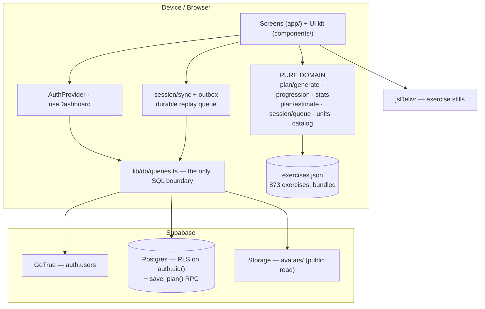
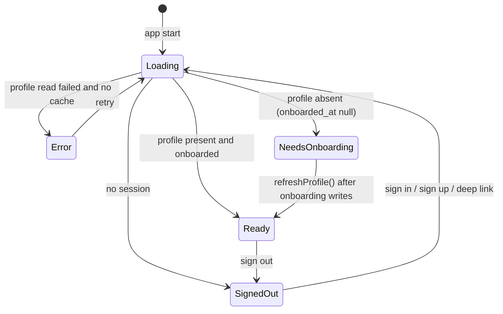
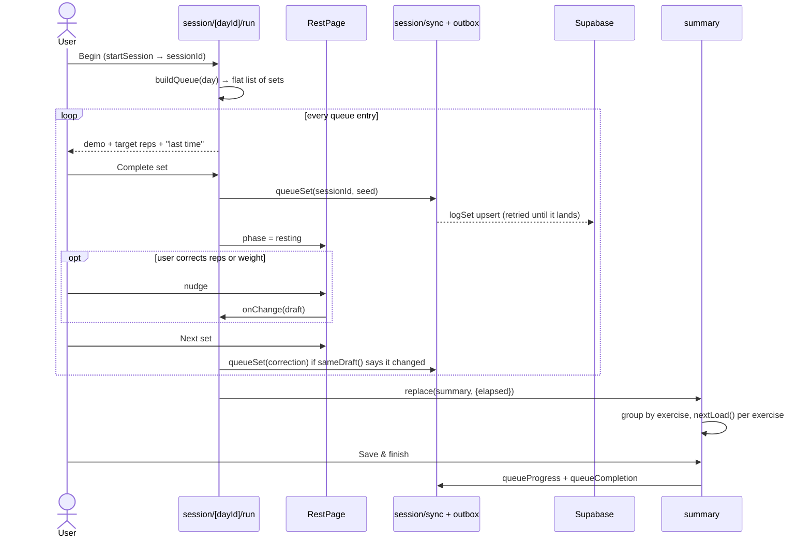
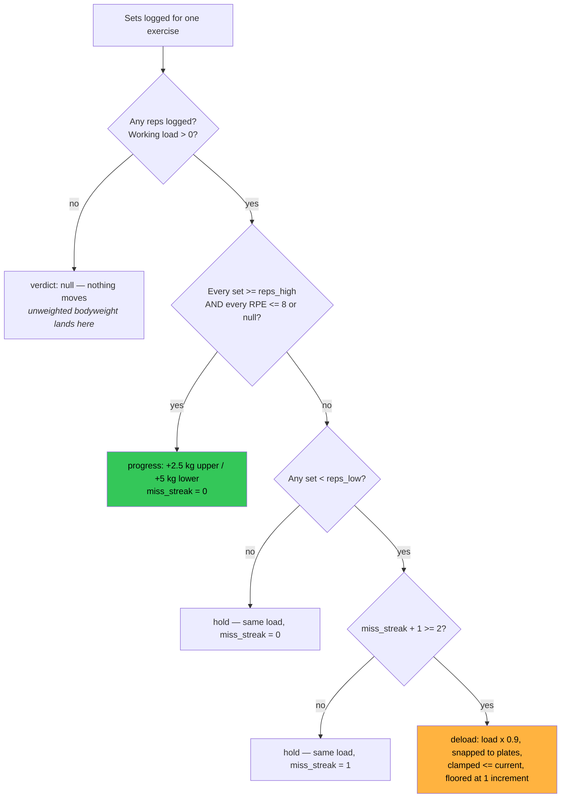
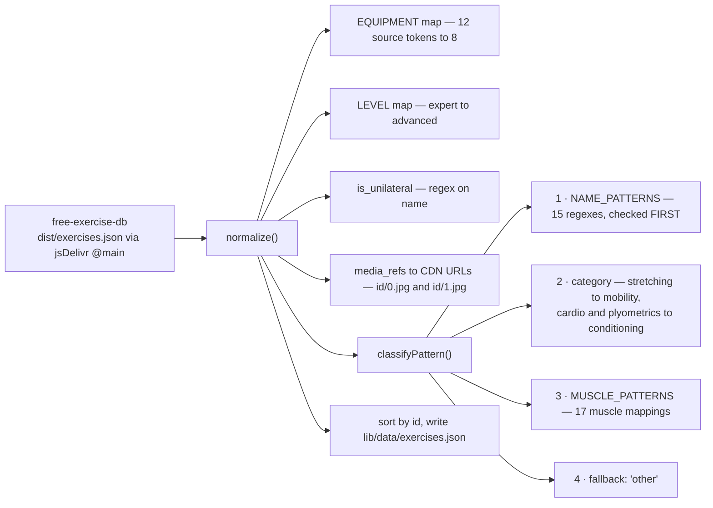
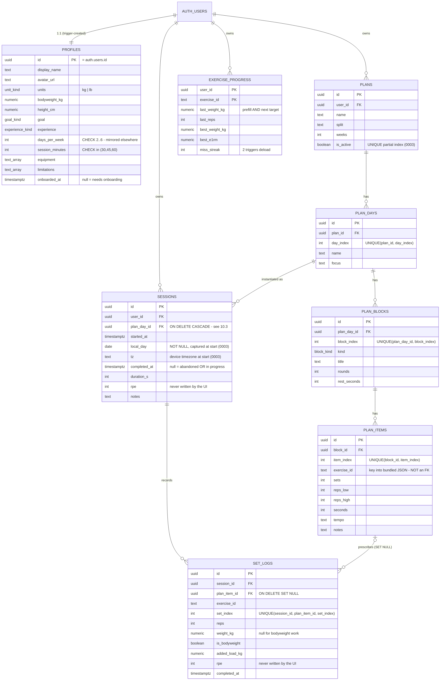
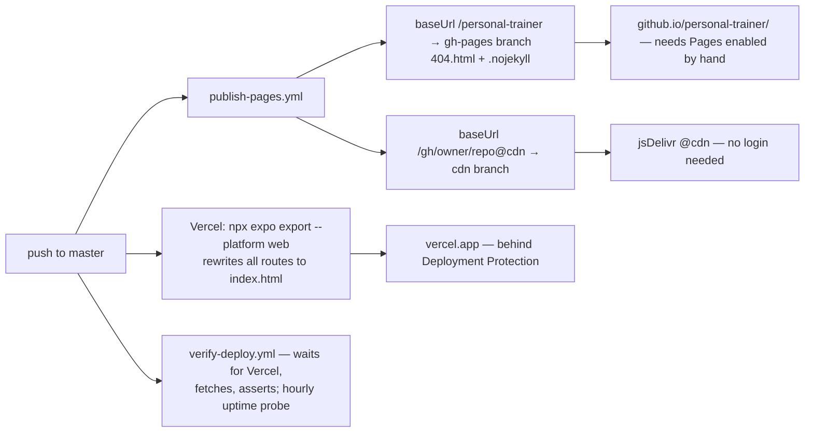

# Office Gym — Engineering Handoff

**Repo:** `mateosauton/personal-trainer` · **App:** Office Gym (`office-gym-trainer`)
**Audience:** the engineer taking this over. No prior context assumed.

> **Verified against commit `9245b5a`.** `npx tsc --noEmit` clean · `npx jest` → **16 suites, 114 tests, green**.
>
> This repo is moving fast: in the period this document was written it went through three architectural states
> and landed four migrations. **Re-verify before you trust a specific line of it** — [§0.5](#05-how-to-re-verify-this-document)
> gives you the commands. Facts here are stated with file and symbol names rather than line numbers, precisely
> because line numbers rot.

**Companion:** [IMPROVEMENTS.md](./IMPROVEMENTS.md) — prioritised proposals, with the ones already shipped marked as such.

---

## Contents

| § | Section | Read it when |
|---|---------|--------------|
| [0](#0-read-this-first) | **Read this first** | Now. Zero-to-running-app, and how to re-verify. |
| [1](#1-domain-model-and-glossary) | Domain model and glossary | Now. The words the codebase speaks. |
| [2](#2-risks-and-open-gaps) | **Risks and open gaps** | Now. What is still wrong. |
| [3](#3-framework-choices-and-why) | Framework choices, and why | Before proposing a swap. |
| [4](#4-architecture) | Architecture | Before your first change. §4.3 matters most. |
| [5](#5-runtime-behaviour) | Runtime behaviour | Before touching auth, routing or the player. |
| [6](#6-folder-structure) | Folder structure | When you can't find something. |
| [7](#7-conventions) | Conventions, and what "done" means | Before your first PR. |
| [8](#8-user-flows) | User flows | To understand the product. |
| [9](#9-the-exercise-database-the-catalog) | The exercise database | Before touching plan generation. |
| [10](#10-database-architecture) | Database architecture | Before any schema change. |
| [11](#11-environments-build-and-deploy) | Environments, build and deploy | Before shipping. |
| [12](#12-testing) | Testing | Before your first PR. |
| [13](#13-operations) | **Operations** — reset, debug, ownership | The first time something breaks. |
| [14](#14-design-system) | Design system | Reference, when writing UI. |
| [15](#15-your-first-two-weeks) | Your first two weeks | After §0–2. |
| [16](#16-appendix--where-everything-lives) | Appendix — where everything lives | Constantly. |

---

## 0. Read this first

### 0.1 What this app is, in three sentences

A personal-training app for an office gym. It asks you seven questions once, deterministically generates a week of
training from your answers, and then runs each session set by set — demo image, target reps, rest timer, weight
prompt — logging every set and progressing your loads automatically.

There is **no AI, no model call and no server-side application logic**. The plan generator is a pure rule engine
that runs on the device against a catalog bundled into the binary. Postgres holds only your own rows, and the one
piece of server-side code is a single `save_plan` function that exists to make a write atomic.

### 0.2 Zero to a running app

Requires **Node 22** (`package.json` pins `engines.node: "22.x"`; there is no `.nvmrc` — worth adding).

**Path A — no backend, about a minute.** `tools/dev/` ships a stand-in for every Supabase endpoint this app calls,
with two seeded accounts.

```bash
npm install
node tools/dev/mock-supabase.mjs 54321 &
printf 'EXPO_PUBLIC_SUPABASE_URL=http://127.0.0.1:54321\nEXPO_PUBLIC_SUPABASE_KEY=mock\n' > .env
npx expo start --web --port 8081
```

Sign in as **`demo@officegym.test` / `demo1234`** (onboarded, with a plan and history) or
**`fresh@officegym.test` / `demo1234`** (lands in onboarding). The mock also exposes `GET /__reset`,
`GET /__state` (assert a write landed) and `GET /__slow?ms=700` (hold loading states on screen).

**You did it right when:** the dark "Welcome back." sign-in screen appears, and `demo@officegym.test` lands on
**Home** with a streak card and a Start button.

**Path B — your own Supabase, about ten minutes.** Needed for anything touching real auth, RLS or Storage.

1. Create a project at [supabase.com](https://supabase.com). From **Settings → API** copy the **project URL** and the **publishable (anon) key**. Never the service-role key — [§11.1](#111-configuration).
2. **SQL Editor** → run in order, pasting each file whole: `0001_init.sql`, `0002_profile_identity.sql`, `0003_correctness_foundation.sql`, `0004_save_plan_rpc.sql`.
   > ⚠️ `0003` contains a **backfill that rewrites historical session data**. Read its comments before running it against a database you care about.
   > There is **no Supabase CLI setup in this repo** — migrations are applied by hand. See [§10.7](#107-migrations).
3. **Authentication → Providers → Email:** turn **Confirm email off** for local development, or every signup needs a working deep link.
4. **Authentication → URL Configuration:** add your deep link to the redirect allow-list. `Linking.createURL('/')` resolves to `exp://…` in Expo Go and `officegym://` in a standalone build.
5. `cp .env.example .env`, fill it in, then `npx expo start --lan` and scan the QR with the iPhone Camera app.

```bash
npm test        # 16 suites, 114 tests
npm run lint    # tsc --noEmit — NOT a linter (§7.1)
npm run catalog # rebuild lib/data/exercises.json from free-exercise-db
```

### 0.3 Fifteen-minute orientation

| # | File | Why |
|---|------|-----|
| 1 | `lib/types.ts` | The entire domain model. Every other file speaks these types. |
| 2 | `lib/plan/splits.ts` | The training templates — the product's opinion, expressed as data. |
| 3 | `lib/plan/generate.ts` | The generator. The most valuable file in the repo. |
| 4 | `lib/session/queue.ts` | How a plan becomes a flat list of "one set to do". |
| 5 | `lib/progression.ts` | Double progression: how loads move week to week. |
| 6 | `app/_layout.tsx` + `lib/auth-gate.ts` | The routing gate — four states, declaratively guarded. |
| 7 | `app/session/[dayId]/run.tsx` + `lib/session/sync.ts` | The player and its offline write path. |
| 8 | `supabase/migrations/` (all four) | The schema, every RLS policy, and the `save_plan` RPC. |

Then read [§2](#2-risks-and-open-gaps) and [§4.3](#43-where-each-number-is-computed).

### 0.4 What landed recently

Several problems an earlier review found have since been fixed. Knowing this saves you re-diagnosing them.

> ⚠️ **"Landed" is not "finished."** Each row below names a module that exists and works on the happy path. An
> audit of the shipped code found six real defects inside three of them — see R35–R40 in
> [§2](#2-risks-and-open-gaps). Treat this table as "the mechanism is in place", not "the problem is closed".

| Now in place | Where |
|--------------|-------|
| **Platform-safe dialogs.** `Alert.alert` is a no-op in react-native-web; every dialog now goes through `notify()` / `confirm()`. **No direct `Alert.alert` call remains.** | `lib/alerts.ts` |
| **Transactional plan writes.** `savePlan` is now a single `supabase.rpc('save_plan', …)` call — one transaction instead of five unguarded round trips. | `queries.ts`, `0004_save_plan_rpc.sql` |
| **A three-state profile gate.** "Could not reach the server" is no longer indistinguishable from "never onboarded", and a cached profile survives an offline launch. ⚠️ Partially — the signed-out mapping is wrong (R40), `refreshProfile` has no cache fallback, and two uncaught rejections in `auth.tsx` can still park the app on the splash. | `lib/auth-gate.ts`, `lib/auth.tsx` |
| **An offline outbox.** Sets, completions and progress writes queue durably and replay; the player shows "*n* sets syncing". ⚠️ Partially — see R35–R39, and note `startSession` is **not** queued, so a session cannot be *started* offline at all. | `lib/session/outbox.ts`, `lib/session/sync.ts` |
| **A derived, per-plan rotation cursor.** `getLastCompletedPlanDayIndex` replaced a lifetime session count, so a rebuild starts at day 1 and the cursor is idempotent under retry. | `queries.ts`, `lib/useDashboard.ts` |
| **One active plan, enforced.** A unique partial index replaced the non-unique one. | `0003_correctness_foundation.sql` |
| **Timezone-stable calendar days.** `sessions.local_day` and `tz` are captured at session start instead of being re-derived from whatever device reads them. | `0003_correctness_foundation.sql` |
| **Tests for the previously untested layer** — `queries`, `auth`, `outbox`, `stats`, `estimate`, plus component suites. | `__tests__/` |

### 0.5 How to re-verify this document

This repo changes quickly. Before relying on any claim below, run:

```bash
git log --oneline -1                 # what you are actually looking at
npx tsc --noEmit && npm test         # is it green?
ls app app/\(tabs\) lib components   # has the screen/module layout moved?
ls supabase/migrations               # how many migrations exist now?
grep -rn "Alert.alert" app lib components | grep -v lib/alerts.ts   # should be empty
wc -c lib/data/exercises.json        # expect 1082256 until R13 lands
                                     # (grep -c "" prints 1 — the file is minified onto one line)
```

If the shape has moved on, the durable parts of this document — [§1](#1-domain-model-and-glossary),
[§9](#9-the-exercise-database-the-catalog), [§10](#10-database-architecture), [§11](#11-environments-build-and-deploy)
— will still hold; the screen-level detail in [§5](#5-runtime-behaviour) and [§6](#6-folder-structure) is the part
that rots first.

---

## 1. Domain model and glossary

### 1.1 The nouns

| Term | Meaning | Type |
|------|---------|------|
| **Catalog** | The 873 bundled exercises. Static reference data; ships in the binary. | `Exercise[]` |
| **Pattern** | Movement pattern (`squat`, `hinge`, `h_push`, `v_pull`, `core`…). The unit the generator slots by. | `Pattern` |
| **Split** | Weekly shape, chosen by training frequency (Full Body, Upper/Lower, PPL). | `SPLITS[days]` |
| **Plan** | One user's generated programme. Exactly one is `is_active` — now enforced by a unique index. | `Plan` |
| **Day** | One session template in the rotation. Warm-up + 4 work blocks. | `PlanDay` |
| **Block** | A group inside a day. `warmup` \| `straight` \| `superset` \| `circuit`. | `PlanBlock` |
| **Item** | One exercise inside a block, with its sets/reps prescription. | `PlanItem` |
| **Session** | One actual training instance of a Day, stamped with a `local_day`. | `sessions` row |
| **Set log** | One logged set: reps, load, bodyweight flag. | `SetLog` |
| **Progress** | Per-exercise running state: last load, best load, best e1RM, miss streak. | `exercise_progress` row |

### 1.2 The training vocabulary

| Term | What it means here |
|------|--------------------|
| **Double progression** | Hold the load constant and work *up* the rep range; only when every set reaches the top do you add weight and drop back to the bottom. Two variables, moved one at a time. See [§8.3](#83-progression--what-happens-to-your-loads). |
| **RPE** | Rate of Perceived Exertion, 1–10. 8 ≈ "two reps left in the tank". The schema and `nextLoad` support it; **the UI still writes `null` every time** ([§2](#2-risks-and-open-gaps)). |
| **e1RM** | Estimated one-rep max via **Epley** (`load × (1 + reps/30)`), in `lib/units.ts`. Meaningful from 1–12 reps. |
| **Tonnage / volume** | Used interchangeably: `Σ (reps × effective load)`. `sessionTotals()` in `lib/stats.ts` is the canonical computation. |
| **Effective load** | Normal work: `weight_kg`. Bodyweight work: `profile.bodyweight_kg + added_load_kg`, which makes a weighted pull-up comparable to a lat pulldown. |
| **Local day** | `sessions.local_day` — the calendar day a session belongs to, captured **at session start** in the device's timezone, rather than re-derived later. The streak and calendar read this stored fact. |

### 1.3 Two structural facts that explain most of the code

**A plan is a rotation, not a schedule.** There is no "Tuesday is leg day". The next day is derived from the last
*completed* session **of this plan** (`getLastCompletedPlanDayIndex`), so missing a week leaves no hole, rebuilding
starts at day 1, and a retried write cannot skip a day.

**A block's `kind` changes the arithmetic.** For `straight`, sets live on the *item* (`item.sets`) and the block
runs once. For `superset`/`circuit`, sets live on the *block* (`block.rounds`) and the items rotate. Every place
that counts sets — `queue.ts`, `estimate.ts`, the summary — branches on this. Get it wrong and the numbers
silently disagree.

---

## 2. Risks and open gaps

**Deliberately at the front.** These are what remains open at `9245b5a`; each was re-verified for this document.
Ids match [IMPROVEMENTS.md](./IMPROVEMENTS.md).

| Id | Issue | Evidence | Impact |
|----|-------|----------|--------|
| [**R16**](./IMPROVEMENTS.md#r16--run-types-and-tests-in-ci) | **No CI runs types or tests.** `.github/workflows/` holds only `publish-pages.yml` and `verify-deploy.yml`, both of which deploy or probe. There is no linter either. A broken build has reached `master` before. | `ls .github/workflows` | 🔴 Regressions ship |
| [**R6**](./IMPROVEMENTS.md#r6--no-password-reset) | **There is no password reset.** No `resetPasswordForEmail`, no `signInWithOtp`, no email-change flow. A forgotten password is permanent loss of the entire training history. | `grep -rn resetPasswordForEmail app lib` → nothing | 🔴 Total account loss |
| [**R7**](./IMPROVEMENTS.md#r7--close-the-avatar-bucket) | **The `avatars` bucket is world-readable.** `0002` creates it `public = true` with `for select to public using (bucket_id = 'avatars')`, at the stable path `<uid>/avatar.<ext>`. No MIME allowlist, no size cap. Every user's face photo is fetchable unauthenticated. | `0002_profile_identity.sql` | 🔴 Security |
| [**R33**](./IMPROVEMENTS.md#r41--strip-the-dev-login-credential-at-build-time) | **`lib/dev-auth.ts` reads `EXPO_PUBLIC_DEV_LOGIN_PASSWORD`, which Expo inlines at *build* time.** `devLoginEnabled` is only a *runtime* gate, so any web export produced on a machine with a populated `.env` ships a real account password as a string literal. CI currently passes no such variable, so the published bundles are clean — this is a landmine, not an active leak. | `lib/dev-auth.ts` | 🔴 Security |
| [**R27**](./IMPROVEMENTS.md#r35--make-the-outbox-survivable) | **One failing operation wedges the outbox forever.** `Outbox.flush` is `try { send(items[0]) } catch { return; }` — no attempt counter, no dead-letter, and the error object is discarded. Any *terminal* error on the head (an RLS denial, a constraint violation, a 400 after a schema change) parks that operation at position 0 permanently, **across app restarts**, blocking every later set. | `lib/session/outbox.ts` | 🔴 Silent, permanent data loss |
| [**R28**](./IMPROVEMENTS.md#r36--namespace-and-clear-the-outbox-on-sign-out) | **The outbox key is global and is never cleared on sign-out.** `signOut` calls only `supabase.auth.signOut()`. Sign out with pending writes, sign in as someone else on the same device, and their client flushes the previous user's operations — which RLS rejects, which is terminal, which wedges the new user's queue (R27). The `office-gym.profile.<uid>` cache is likewise never cleared. | `lib/session/outbox.ts`, `lib/auth.tsx` | 🔴 Cross-account corruption |
| [**R29**](./IMPROVEMENTS.md#r37--make-queued-writes-genuinely-idempotent) | **`queueProgress` ids collide across sessions.** The id is `progress:<userId>:<sorted exercise ids>` with no session in it, and `enqueue` **replaces** on id match. Train the same plan day twice before the queue drains and the first session's progress update is silently discarded — `miss_streak` and `best_*` are accumulators, so a missed session vanishes from the deload logic. | `lib/session/sync.ts` | 🟠 Silent progression corruption |
| [**R30**](./IMPROVEMENTS.md#r38--stamp-queued-writes-at-event-time) | **Queued writes are timestamped at flush time, not event time.** `finishSession` sets `completed_at: new Date()` when the flush finally succeeds, and `set_logs.completed_at` takes the server `default now()`. Train Saturday offline, open the app Tuesday, and the session is recorded as Tuesday — which also drives `getLastCompletedPlanDayIndex`, so the rotation cursor becomes a function of network conditions. | `queries.ts`, `sync.ts` | 🟠 Wrong history and rotation |
| [**R31**](./IMPROVEMENTS.md#r39--stop-enqueue-blocking-behind-the-flush) | **"Advance immediately" does not hold.** `enqueue` and `flush` share one mutex and `flush` holds it for the *whole* drain, so on a slow-but-alive network the next set button waits for every queued round trip — exactly the flaky-signal case the outbox was built for. | `lib/session/outbox.ts` | 🟠 The core loop still stalls |
| [**R32**](./IMPROVEMENTS.md#r40--fix-the-signed-out-gate-mapping) | **`profileGate` returns `'ready'` when signed out**, and `_layout.tsx` computes `onboarded = gate === 'ready'`, so `(tabs)`, `profile` and `session` are declared for a signed-out user. Those screens call `useUserId()`, which throws — and with no error boundary, a deep link to a session while signed out is a white screen. This violates the invariant the file's own comment states. | `lib/auth-gate.ts`, `app/_layout.tsx` | 🟠 Guard bypass |
| [**R15**](./IMPROVEMENTS.md#r15--observability-for-a-blind-app) | **No error boundary, no crash reporting, no analytics.** A render error is a white screen you never hear about — and the app now contains a durable write queue whose failures you cannot see. | `grep -rl "ErrorBoundary\|Sentry"` → nothing | 🟠 Blind operation |
| [**R25**](./IMPROVEMENTS.md#r25--migration-tooling-backups-and-an-rls-test-harness) | **No migration tooling, no backups, no RLS test.** No `supabase/config.toml`, no local stack, and no record of which of the four migrations are live on production. `0003` contains an irreversible backfill. | `ls supabase/config.toml` → absent | 🟠 Every schema change is a leap |
| [**R14**](./IMPROVEMENTS.md#r14--fix-the-faint-token-contrast-failure) | **`colors.faint` (`#5A5A61`) fails WCAG contrast** — 2.89:1 on `bg`, 2.49:1 on `elevated` — and is used for real text in **nine** places. | `lib/theme.ts`; [§14.4](#144-accessibility-audit-of-the-palette) | 🟠 Accessibility |
| [**R13**](./IMPROVEMENTS.md#r13--stop-parsing-1-mb-of-json-at-startup) | **1,082,256 bytes of exercise JSON is parsed at startup**, of which ~60% is three fields (`instructions`, `secondary_muscles`, `force_type`) that **no screen or domain function reads**. | `wc -c lib/data/exercises.json`; grep | 🟠 Cold-start time |
| [**R11**](./IMPROVEMENTS.md#r11--decide-what-rpe-is-for) | **RPE is dead weight.** Two columns and a `nextLoad` branch exist; `run.tsx` writes `rpe: null` unconditionally, so the `rpe ≤ 8` gate is permanently true and progression is more aggressive than it claims. | `run.tsx`, `progression.ts` | 🟠 Untruthful behaviour |
| [**R23**](./IMPROVEMENTS.md#r23--add-a-query-cache) | **No query cache.** Home and Plan each hold their own `useDashboard`, and **both** call `useFocusEffect(reload)` — so every tab switch refetches the plan, the history and the progress map. | `(tabs)/index.tsx`, `(tabs)/plan.tsx` | 🟠 Latency and cost |
| [**R12**](./IMPROVEMENTS.md#r12--a-rest-timer-that-survives-a-locked-phone) | **The rest timer is a decrementing counter, not a clock.** `setInterval` with no wall-clock anchor; lock the phone mid-rest and the count is wrong, and the completion buzz only fires in the foreground. | `components/RestPage.tsx` | 🟠 Wrong rest = wrong training |
| [**R18**](./IMPROVEMENTS.md#r18--reach-the-rest-of-the-catalog) | **27% of the catalog is unreachable** — `ALL_EQUIPMENT` omits `'other'`, so 239 exercises can never be selected. **No test references `ALL_EQUIPMENT`**, so changing it is uncovered. | `generate.ts`; [§9.5](#95-how-much-of-it-the-app-can-actually-reach) | 🟡 Less variety than the data offers |
| [**R19**](./IMPROVEMENTS.md#r19--make-the-dev-harness-runnable) | **`drive.mjs` cannot run on a fresh checkout** — it imports `playwright`, which is not in `package.json`, and hardcodes a container Chromium path. | `tools/dev/drive.mjs` | 🟡 The harness rots |
| [**R20**](./IMPROVEMENTS.md#r20--housekeeping) | **Housekeeping:** `zustand` and `@gorhom/bottom-sheet` still have no importer anywhere. | `grep -rl` → nothing | 🟢 Tidiness |

**Two sharp edges that are not risks, just expensive to discover:**

- **The set write path is a four-part contract** now that the outbox exists. See [§5.3](#53-the-write-path-of-one-set).
- **The allowed training frequencies are mirrored in several files**, one of which is a database `CHECK`. See [§16](#16-appendix--where-everything-lives).

---

## 3. Framework choices, and why

| Layer | Choice | Why this, and what it costs |
|-------|--------|------------------------------|
| Runtime | **Expo** (managed), SDK 54 | Runs in Expo Go — no Xcode, no provisioning. Cost: native modules limited to what Expo ships or config plugins allow. |
| UI | **React Native** + **react-native-web** | One source, three targets. The hosted web build is the same code — which is why the `Alert.alert` no-op mattered. |
| Language | **TypeScript**, `strict: true` | The domain is full of near-identical numbers (kg vs lb, reps vs seconds) that types keep apart. No `any` in the repo. |
| Routing | **expo-router** (file-based) | Deep links come free — needed for Supabase email confirmation. Typed routes on. |
| Backend | **Supabase** (Postgres + GoTrue + Storage) | RLS means authorisation is one `auth.uid()` predicate per table. The only server-side code is the `save_plan` function. |
| State | **React Context + hooks** | One context (`AuthContext`), one shared hook (`useDashboard`). `zustand` is installed and **unused**. There is no cache layer — see [§2 R23](#2-risks-and-open-gaps). |
| Offline | **A hand-rolled durable outbox** | `lib/session/outbox.ts` is a serial replay queue with operation ids; `sync.ts` wraps it in `queueSet` / `queueProgress` / `queueCompletion`. ⚠️ **Two of those three are not actually idempotent, and the queue can wedge permanently** — see [§2](#2-risks-and-open-gaps) R35–R39. |
| Animation | **Reanimated 4** + worklets | UI-thread animation; the kit's `Chip` and `ProgressBar` respect `ReduceMotion.System`. |
| Icons | **lucide-react-native**, deep-imported | `components/Icon.tsx` deep-imports a handful of glyphs so the 1,500-icon barrel never enters the bundle. |
| Images | **expo-image** | `cachePolicy="memory-disk"` — a session repeats offline after its first run. |
| Tests | **Jest** + `jest-expo` | 16 suites, 114 tests, including component suites and `queries`/`auth`/`outbox`. |
| Native builds | **EAS** | `eas.json` with `preview` (internal APK) and `production` (autoIncrement) profiles. |
| Hosting | **Vercel** primary; GitHub Pages + jsDelivr mirrors; a `wrangler.jsonc` for Cloudflare Workers | `npx expo export --platform web` → static SPA. See [§11.2](#112-the-deployed-targets). |

### 3.1 Choices worth defending in a review

**The catalog is bundled, not in Postgres.** It is *reference data versioned with the binary*, and the generator
runs on-device, so it must work with no network. The size cost is real and is addressed in
[R13](./IMPROVEMENTS.md#r13--stop-parsing-1-mb-of-json-at-startup) without giving that up.

**Plan generation is deterministic, not a model call.** Seeded from the user id, so the same answers reproduce the
same plan and two users with identical answers still get different picks. Testable, free, instant, offline — and
measured at **1.25 ms per plan**.

**The one RPC is a deliberate exception, not a slippery slope.** `save_plan` exists because a five-step dependent
write cannot be made atomic from a client. Authorisation still happens through RLS (`security invoker`).

---

## 4. Architecture

### 4.1 The dependency rule

This is the whole architecture. Everything else is detail.

```
app/  ──▶  components/  ──▶  lib/theme, lib/motion, lib/types
  │
  ├──▶  lib/auth (+ auth-gate), lib/useDashboard  ──▶  lib/db/queries  ──▶  lib/db/supabase  ──▶  network
  │                                                          ▲
  │                          lib/session/sync ──▶ outbox ────┘   (durable, replayed)
  │
  └──▶  lib/catalog, lib/plan/*, lib/progression, lib/session/queue, lib/stats, lib/units
                                    ▲
                                    └── PURE. No I/O. No React. No Supabase. Ever.
```

**Domain never imports data access, and never imports React.** That is why those suites run with no mocks, and it
is what would let plan generation move server-side if the product ever needs it. Guard it: a CI check is proposed
in [R21](./IMPROVEMENTS.md#r21--enforce-the-architecture).

Note the outbox sits *beside* the query layer, not inside the domain — `lib/session/outbox.ts` takes an
`OutboxStorage` interface rather than importing `AsyncStorage` directly, which is why it is unit-testable.

### 4.2 The runtime shape



### 4.3 Where each number is computed

There is now **one owner for every derived number**, and that is worth protecting — Home and Plan previously did
their own arithmetic and drifted apart.

| Number | Owner | Consumers |
|--------|-------|-----------|
| Sets / reps / minutes / body parts for a planned day | `lib/plan/estimate.ts` → `estimateDay` | Home card, Plan cards |
| Projected tonnage before training | `lib/plan/estimate.ts` → `estimateVolumeKg` | Home card |
| Actual tonnage, sets, reps | `lib/stats.ts` → `sessionTotals` | Home (today), Plan (picked day), Summary |
| Streak, trained days, recent-day strip | `lib/stats.ts` | `Streak`, `Calendar` |
| Which day is next | `queries.getLastCompletedPlanDayIndex` → `useDashboard` | Home, Plan |
| Next load, verdict, miss streak | `lib/progression.ts` → `nextLoad` | Summary |
| Effective load, e1RM, unit conversion | `lib/units.ts` | Summary, `RestPage`, Profile |
| What set comes next | `lib/session/queue.ts` → `buildQueue` | Run player |

**Rule: a screen never does domain arithmetic inline.** If a screen needs a number that does not exist yet, add a
pure function next to its siblings, unit-test it, and call it. This is the single most important convention here,
and the codebase now largely honours it.

---

## 5. Runtime behaviour

### 5.1 The routing gate

`app/_layout.tsx` delegates the decision to `lib/auth-gate.ts`, which is a pure function and therefore testable:

```ts
export type ProfileState =
  | { status: 'loading' }
  | { status: 'ready'; profile: Profile | null }
  | { status: 'error'; error: Error };

export function profileGate(signedIn: boolean, state: ProfileState): ProfileGate
// → 'loading' | 'error' | 'onboarding' | 'ready'
```



Three rules, all commented in the code — do not undo them:

1. **Guard, don't redirect.** Screens behind the gate call `useUserId()`, which *throws* without a session. A screen the user does not belong on must never mount.
2. **Never unmount the navigator and then navigate.** Onboarding finishes by calling `refreshProfile()` and nothing else.
3. **"Unavailable" is not "absent".** This is the distinction `auth-gate.ts` exists to make: a failed profile read used to send an existing user into onboarding, which replaced their plan. A cached profile now also survives an offline launch.

### 5.2 A live session



Behaviours to understand before changing anything here:

- **The set is written on "Complete set", before the user confirms it** — seeded from last session's reps and load, then corrected during rest. One tap logs a set; the cost is that a *guess* is persisted if the user quits mid-rest. For a first-ever set the seed is `reps_high` at **0 kg**.
- **Writes go through the outbox, so a failure no longer blocks the set.** The player shows "*n* sets syncing". Everything routed through `sync.ts` must stay idempotent — `logSet` upserts on `(session_id, plan_item_id, set_index)`, and completion uses a coalescing update.
- **The player is escapable.** The root layout gives the session stack `presentation: 'fullScreenModal'` with `gestureEnabled: false`; the Close control confirms via `lib/alerts.ts`, which now works on web too.

### 5.3 The write path of one set

**Read this before adding any field to a logged set.** Four things must agree, and the compiler connects none of
them:

```
SetDraft            SetLog                 outbox op              set_logs
(display units)  →  (kg, DB shape)      →  (serialised JSON)   →  (Postgres row)
RestPage.tsx        lib/types.ts           session/sync.ts        0001_init.sql
        │                   │                      │
        │                   │                      └── persisted and replayed later:
        │                   │                          the payload must stay serialisable
        │                   │                          and forward-compatible
        │                   └── spread STRAIGHT into the upsert in queries.ts
        │                       → it is both the row type AND the insert type
        │
        └── compared by sameDraft() in run.tsx
            ┌──────────────────────────────────────────────────┐
            │ if (draft && !sameDraft(draft, savedRef.current)) │
            │     queueSet(...)                                 │
            └──────────────────────────────────────────────────┘
            This comparator decides whether a correction is written AT ALL.
            It compares exactly three fields: reps, weight, asBodyweight.
```

So adding a per-set `notes` field means touching the migration, `SetLog` (optional or defaulted, because it
doubles as the insert shape), the `SetDraft` and its UI, `run.tsx`'s seed, **`sameDraft`**, and confirming that
an outbox item queued by an older build still replays. Missing `sameDraft` means a notes-only edit is silently
never persisted; missing the outbox consideration means a queued write from a previous app version fails forever.

### 5.4 State ownership

| State | Owner | Lifetime |
|-------|-------|----------|
| Auth session + profile (+ cached copy) | `AuthProvider` | App |
| Plan, history, streak, today's totals | `useDashboard(userId, bodyweightKg)` | **Per screen instance** |
| Pending writes | `lib/session/outbox.ts` (AsyncStorage) | **Survives app restarts** |
| Session cursor, phase, draft | `run.tsx` local state | One session |
| Rest countdown | `RestPage` local state | One rest |

**Rule: lift state only when two siblings must agree.** That has happened once — Home and Plan both need plan +
history, so `useDashboard` exists. Each screen still holds its *own* instance and both reload on focus, which is
[R23](#2-risks-and-open-gaps).

---

## 6. Folder structure

```
.
├── app/                          # expo-router: the file tree IS the route tree
│   ├── _layout.tsx               #   root: providers + the four-state routing gate
│   ├── index.tsx                 #   public "/" — redirects to tabs or sign-in
│   ├── onboarding.tsx            #   7 steps, NOT in a route group (a group index would claim "/")
│   ├── profile.tsx               #   modal over the tabs, opened by the Home avatar
│   ├── (auth)/sign-in.tsx        #   sign in / sign up / dev sign-in. No password reset (R6)
│   ├── (tabs)/
│   │   ├── _layout.tsx           #     two tabs, icon + label
│   │   ├── index.tsx             #     Home — identity, streak, what's next, one button
│   │   └── plan.tsx              #     Plan — calendar + rotation + recent sessions
│   └── session/[dayId]/          #   full-screen, no tab bar, no swipe-back
│       ├── index.tsx             #     overview; prefetches the session's stills
│       ├── run.tsx               #     the player
│       └── summary.tsx           #     totals, PRs, progression verdicts
│
├── components/
│   ├── ui.tsx                    #   THE UI KIT: Screen, Card, Button, Chip, ProgressBar, type scale
│   ├── Icon.tsx                  #   the only place lucide is imported
│   ├── Header.tsx                #   avatar + greeting; the way into Profile
│   ├── ExerciseMedia.tsx         #   the 2-still crossfade — the signature element
│   ├── ExerciseStrip.tsx         #   a row of paused thumbnails
│   ├── RestPage.tsx              #   the between-sets screen (timer + logging + up-next)
│   ├── Calendar.tsx · Streak.tsx #   the record: month grid, streak + 14-day strip
│   ├── NumberField.tsx           #   numeric input with an iOS accessory bar
│   ├── Doodle.tsx                #   MarkerStroke / DoodlePop accents
│   └── Attribution.tsx
│
├── lib/
│   ├── types.ts                  # the domain model — read this first
│   ├── theme.ts · motion.ts      # design tokens; animation constants + reduced-motion helpers
│   ├── catalog.ts                # CATALOG, getExercise, candidates(filter), limitation rules
│   ├── units.ts · stats.ts       # conversions, effective load, e1RM; streak, totals, day keys
│   ├── progression.ts            # double progression: nextLoad()
│   ├── alerts.ts                 # notify()/confirm() — RN Alert is a NO-OP on web
│   ├── auth.tsx · auth-gate.ts   # AuthProvider + the pure gate function
│   ├── dev-auth.ts               # whitelisted one-tap test sign-in
│   ├── useDashboard.ts           # the one shared read for both tabs
│   ├── data/exercises.json       # 873 exercises — GENERATED, do not hand-edit
│   ├── db/{supabase,queries}.ts  # client singleton; the only SQL boundary (15 functions)
│   ├── media/provider.ts
│   ├── plan/{generate,splits,estimate,rng}.ts
│   └── session/{queue,outbox,sync}.ts
│
├── supabase/migrations/          # 0001 init · 0002 profile identity · 0003 correctness · 0004 save_plan RPC
├── scripts/build-catalog.mjs     # free-exercise-db → lib/data/exercises.json
├── tools/dev/                    # mock-supabase, drive, serve-dist
├── __tests__/                    # 16 suites, 114 tests
├── eas.json · wrangler.jsonc · vercel.json
└── .github/workflows/            # publish-pages.yml, verify-deploy.yml — neither runs tests (R16)
```

### 6.1 Where do I put a new…?

| New thing | Goes in | Tested? |
|-----------|---------|---------|
| Screen | `app/<route>.tsx` | Render test if it has branching states |
| Reusable visual | `components/` | Only if it has logic |
| Domain calculation | `lib/<area>.ts` | **Yes, always** |
| Query | `lib/db/queries.ts` | There is now a `queries.test.ts` — extend it |
| Anything queued for later | `lib/session/sync.ts` | **Yes** — and it must be idempotent |
| Design token | `lib/theme.ts` | Add it to the contrast test ([§14.4](#144-accessibility-audit-of-the-palette)) |
| Regression from a real bug | `__tests__/regressions.test.ts` | It *is* the test |
| Schema change | new `supabase/migrations/NNNN_name.sql` | Update `lib/types.ts` in the same commit |

---

## 7. Conventions

Most are unwritten and **unenforced** — there is no linter and no CI. Marked **[established]** (followed
throughout) or **[proposed]** (a gap).

### 7.1 Tooling

| Concern | Today | Proposal |
|---------|-------|----------|
| Types | `npm run lint` = `tsc --noEmit`, `strict: true`. Clean. | Rename to `typecheck` — calling it `lint` hides that **there is no linter**. |
| Linting | **None installed.** | **[proposed]** `eslint-config-expo` + `eslint-plugin-react-hooks`. |
| Formatting | None. Consistent by hand: 2-space indent, single quotes, trailing commas, ~100 col. | **[proposed]** Prettier + `--check` in CI. |
| Tests in CI | **Not run** ([R16](#2-risks-and-open-gaps)). | **[proposed]** [R16](./IMPROVEMENTS.md#r16--run-types-and-tests-in-ci). |
| Imports | `@/*` alias → repo root. | Keep. Never `../../..`. |

### 7.2 TypeScript **[established]**

- `strict: true`, **no `any`**. Untyped shapes crossing a boundary are narrowed explicitly rather than cast away.
- Domain unions over loose strings: `Goal`, `Level`, `Pattern`, `BlockKind`, `Units`, and now `ProfileState`.
- `Record<Union, T>` for exhaustive lookup tables (`SCHEME`, `SUBSTITUTES`, `REST`) — the compiler then tells you when a new union member needs a row.
- **`null` means "known absent", `undefined` means "not supplied".** Load-bearing in `effectiveLoadKg` — and now in `ProfileState`, where the whole point is that "absent" and "unavailable" are different.
- **Some types double as insert shapes.** `SetLog` is spread straight into an upsert ([§5.3](#53-the-write-path-of-one-set)).

### 7.3 Naming **[established]**

| Kind | Convention | Example |
|------|-----------|---------|
| Components / component files | `PascalCase` | `RestPage.tsx` |
| Library files | `camelCase.ts` or a lowercase noun | `useDashboard.ts`, `catalog.ts` |
| Hooks | `use` prefix | `useDashboard`, `useUserId` |
| Booleans | `is` / `has` / `can` | `is_bodyweight`, `isPlainLift` |
| DB columns and row types | `snake_case`, matching Postgres exactly | `reps_low`, `local_day` |
| Everything else | `camelCase` | `bodyweightKg`, `restSeconds` |
| Module constants | `SCREAMING_SNAKE` | `SPLITS`, `SUBSTITUTES` |
| **Units in the name** | Always suffix a physical quantity | `weight_kg`, `durationS`, `height_cm` |

Conversion happens **at the display edge only** — everything stored and computed is metric and seconds.
`SetDraft.weight` is display-units on purpose and says so in its doc comment.

### 7.4 Comments **[established — and unusual]**

This codebase comments **why, never what**, and does it well: `lib/catalog.ts`'s `LIMITATIONS` block explains the
bug that motivated it (a knee complaint that stripped out knee circles and left every squat standing);
`app/index.tsx` explains a web-only routing race; `0003`'s header explains why `local_day` is captured rather than
derived. **Never delete a "why" comment while changing the code it guards.**

### 7.5 Styling **[established]**

- `StyleSheet.create` at the bottom of each file, one `styles` object.
- **Every value comes from `lib/theme.ts`.** No literal hex, no magic spacing.
- Composition over props: `<Card>`, `<Overline>`, `<Body>` compose. No `variant="h1|h2|h3"` soup.
- Text renders through the kit's typography components; the oversized rest clock and stepper numerals are the deliberate exceptions.

### 7.6 Async, errors, and effects **[established]**

- **The cancellation pattern.** An awaiting effect uses `let cancelled = false` and checks before every `setState`.
- **Loading set before the await, cleared in `finally`.**
- **Queries throw, screens catch.** `queries.ts` does `if (error) throw error`; screens decide what failure looks like.
- **Every dialog goes through `lib/alerts.ts`.** Never `Alert.alert` directly — it is a literal no-op on react-native-web, which once silently broke every confirmation on the hosted build. **This is now enforced by convention only; a lint rule would make it real.**
- **Writes that can be retried go through `lib/session/sync.ts`**, and must be idempotent.
- **Degrade, don't strand** — but degrade *visibly*. The outbox surfaces "*n* sets syncing" rather than pretending.

### 7.7 Accessibility **[established, with gaps]**

- Every `Pressable` carries `accessibilityRole` and, where the label is not its text, `accessibilityLabel`.
- Selection state is announced (`accessibilityState={{ selected }}` on `Chip`); `ProgressBar` exposes `progressbar` semantics with a value.
- Animations respect the OS reduced-motion setting via `useReducedMotion()` / `ReduceMotion.System`.
- Touch targets ≥ 44 pt.
- **Gaps:** `colors.faint` fails contrast ([§14.4](#144-accessibility-audit-of-the-palette)); nothing reads the OS font scale, so large Dynamic Type sizes will clip fixed-height controls; the rest clock has no live region, so a screen-reader user is never told rest ended.

### 7.8 Testing **[established]**

- Files: `__tests__/<subject>.test.ts(x)`.
- **Pure domain logic is tested without mocks**, which is what §4.1 buys you.
- `regressions.test.ts` is a deliberate institution: every bug found in a real pass gets a test named after the defect.
- `it.each` for matrix coverage — every split × several equipment sets × limitation cases.
- Component suites query by accessible role/label rather than test id where a role exists.

### 7.9 Git **[established]**

Mixed: Conventional-commit prefixes for infrastructure (`ci:`, `chore:`, `docs:`) and plain imperative subjects for
product changes. **[proposed]** Standardise on Conventional Commits. Squash-merge to `master` — Vercel builds every
push to it, so `master` must always be deployable.

### 7.10 What "done" looks like

- [ ] `npx tsc --noEmit` clean and `npm test` green.
- [ ] Any bug you fixed has a test in `__tests__/regressions.test.ts`, named after the defect.
- [ ] New domain arithmetic is a pure function under `lib/` with its own test — not inline in a screen ([§4.3](#43-where-each-number-is-computed)).
- [ ] No new literal colour, spacing or font size.
- [ ] Every new `Pressable` has a role and a label; every new animation checks reduced motion.
- [ ] Any dialog goes through `lib/alerts.ts`; any retryable write goes through `lib/session/sync.ts` and is idempotent.
- [ ] A schema change is **one commit** with the migration **and** `lib/types.ts` **and** the query.
- [ ] Verified on a device *or* in the headless harness — not only in tests.

---

## 8. User flows

### 8.1 Onboarding — seven steps

`app/onboarding.tsx`: `you → goal → level → days → length → body → limits`, then a build screen with three named
stages (saving photo → building plan → saving profile).

| # | Step | Asks | Default | Feeds |
|---|------|------|---------|-------|
| 1 | `you` | Photo + name, both optional | none | `display_name`, `avatar_url` |
| 2 | `goal` | Stronger / muscle / lean / stay fit | `hypertrophy` | `SCHEME`, RNG seed |
| 3 | `level` | New / comfortable / experienced | `intermediate` | catalog level cap, specialist categories |
| 4 | `days` | 2–6 | `4` | `SPLITS[days]`, RNG seed |
| 5 | `length` | 30 / 45 / 60 min | `45` | `REST`, `CIRCUIT_ROUNDS` |
| 6 | `body` | Units, bodyweight, height | `kg`, blank | effective load, e1RM, projected volume |
| 7 | `limits` | Shoulders / lower back / knees / neck / wrists | none | `candidates()` exclusion rules |

- **Every answer has a default.** Tap Continue seven times and you get a working plan. Nothing blocks.
- **The equipment question was deliberately removed.** `ALL_EQUIPMENT` is assumed — one fewer question was judged worth more than the filtering. Its consequence is [R18](#2-risks-and-open-gaps).
- **Only `userId`, `goal` and `daysPerWeek` seed the RNG.** Experience is **not** in the seed — it changes the candidate *pool*, not the shuffle.
- **Onboarding never navigates.** It writes, calls `refreshProfile()`, and lets the gate move the app.

### 8.2 A training session

**How a plan becomes a queue** (`lib/session/queue.ts`):

| Block kind | Iteration | Queue key |
|------------|-----------|-----------|
| `warmup` | one entry per item | `block:item:1` |
| `straight` | `item.sets` entries per item | `block:item:<set>` |
| `superset` / `circuit` | `block.rounds` × items, **rotating** (A1 B1, A2 B2, A3 B3) | `block:item:<round>` |

> **Footnote, because it will catch you:** `buildQueue` has **no `warmup` branch**. Warm-up items fall through the
> identical `straight` path and yield one entry each only because the generator emits `sets: 1` for them.

`partnerOf(entry)` returns a partner exercise for the "Then straight into…" card. It fires for **both** `superset`
and `circuit` and returns only `others[0]`, so in a three-item circuit it names one of two, arbitrarily.

### 8.3 Progression — what happens to your loads



- **Increments are computed in the user's units, then stored in kg.** A kg-fixed 2.5 step walks a lb lifter onto 140.5, 146, 151.5 — numbers no plate set can make.
- **A missing RPE counts as manageable** — and since the UI never collects RPE, that branch is *always* true ([R11](#2-risks-and-open-gaps)).
- **Deload is clamped**, because rounding alone could push a light load *up*.

### 8.4 Bodyweight movements

Bodyweight work stores load as `profile.bodyweight_kg + added_load_kg`, with `weight_kg` null.
`effectiveLoadKg()` is the one function that resolves it, and every consumer goes through it. With no bodyweight on
file, bodyweight sets contribute reps but no volume, rather than a fabricated number.

---

## 9. The exercise database (the catalog)

### 9.1 What it is

**873 exercises** from [free-exercise-db](https://github.com/yuhonas/free-exercise-db) — public domain under the
Unlicense (per the upstream project; no upstream LICENSE is vendored here). Built by `scripts/build-catalog.mjs`
(`npm run catalog`) into `lib/data/exercises.json` (**1,082,256 bytes**), which `lib/catalog.ts` imports statically
and indexes into a `Map` at module load.

**It is generated. Never hand-edit `lib/data/exercises.json`.**

### 9.2 The shape of one exercise

```ts
interface Exercise {
  id: string;                 // free-exercise-db directory name, e.g. "3_4_Sit-Up"
  name: string;
  body_part: string;
  equipment: Equipment;       // normalised into 8 tokens
  mechanic: 'compound' | 'isolation' | null;
  force_type: string | null;                                // ← never read by the app
  level: Level;
  is_bodyweight: boolean;     // equipment === 'bodyweight'  ← feeds effectiveLoadKg
  is_unilateral: boolean;     // regex on the name → the "Per side" note
  primary_muscles: string[];
  secondary_muscles: string[];                              // ← never read by the app
  instructions: string[];                                   // ← never read by the app
  media_refs: { start: string; end: string };               // two CDN stills
  category: Category;
  pattern: Pattern;           // ← the derived field the generator actually uses
}
```

`instructions`, `secondary_muscles` and `force_type` appear only in `lib/types.ts` and the build script — **no
screen and no domain function reads them** ([R13](#2-risks-and-open-gaps)).

### 9.3 The build pipeline



**Name keywords are checked before muscle groups, on purpose:** "romanian deadlift" is a hinge no matter which
muscles the dataset tags.

Two properties verified across all 873 rows: ids are unique and URL-safe, and `media_refs.start`/`.end` are
**exactly** `<prefix>/<id>/0.jpg` and `/1.jpg` with zero exceptions — so the URLs are derivable from the id.

**The script fetches `@main`**, so the catalog is **not reproducible across builds**, and a rename upstream breaks
every demo image at once ([R24](./IMPROVEMENTS.md#r24--pin-and-version-the-catalog)).

### 9.4 What is in it

| Pattern | n | Pattern | n | Pattern | n |
|---------|---:|---------|---:|---------|---:|
| mobility | 113 | v_push | 91 | squat | 86 |
| core | 82 | h_push | 81 | hinge | 79 |
| conditioning | 72 | biceps | 68 | triceps | 60 |
| h_pull | 42 | v_pull | 26 | calves | 22 |
| delts | 14 | lunge | 12 | traps | 10 |
| forearms | 8 | other | 5 | carry | 2 |

**Equipment:** barbell 179 · dumbbell 123 · bodyweight 111 · cable 81 · machine 67 · kettlebell 53 · bands 20 · **other 239**
**Level:** beginner 523 · intermediate 293 · advanced 57
**Category:** strength 581 · stretching 123 · plyometrics 61 · powerlifting 38 · olympic weightlifting 35 · strongman 21 · cardio 14

### 9.5 How much of it the app can actually reach

| Filter | Reachable |
|--------|----------:|
| Whole catalog | 873 |
| Minus `equipment: 'other'` — `ALL_EQUIPMENT` omits it, so medicine balls, exercise balls and foam rollers are **unreachable** | 634 |
| A beginner (level cap + non-specialist categories) | **366** |
| An intermediate | **561** |
| An advanced user (specialist categories unlocked) | **634** |
| The warm-up pool (bodyweight ∧ beginner ∧ {stretching, cardio, strength}) | **73** — of which only **13** are `mobility` |

**239 exercises (27%) can never be selected** — [R18](#2-risks-and-open-gaps). Read that figure with its discount,
though: of the 239, **100 are `stretching` and 46 `plyometrics`**, which classify as mobility and conditioning
rather than work-block material. Including them widens warm-ups and finishers far more than it widens the
compound-lift pool.

### 9.6 Selection: `candidates()` and the widening search

`candidates(filter)` applies, in order: pattern ∈ filter · equipment ∈ filter · `LEVEL_RANK[e.level] ≤ cap` ·
category rule · limitation block.

**Limitations are structural, not textual.** Nothing in the dataset tags a back squat with "knee", so each
limitation names both the muscles that load the joint *and* the patterns built around it:

| Limitation | Blocks muscles | Blocks patterns |
|------------|----------------|-----------------|
| shoulders | shoulders, chest | v_push, delts |
| lower back | lower back | hinge, carry |
| knee | quadriceps | squat, lunge |
| neck | neck, traps | traps |
| wrist | forearms | forearms |

`generate.pick()` widens in stages — **pattern tier is the outer loop, equipment the inner**, so a substitute
pattern with the user's own kit beats the exact pattern done bare-handed:

```
for patternTier in [ exact, SUBSTITUTES[exact], ANY_PATTERN ]:
    for equipment in [ user's kit, user's kit + bodyweight ]:
        pool = candidates(...)
        prefer unused this week → prefer compound + plain lift → seeded shuffle → pick
```

`ANY_PATTERN` is the last resort, for the real case where bad knees *and* a bad lower back empty squat, hinge and
lunge together. `isPlainLift` deprioritises (never bans) peaking variations — bands, chains, deficits, pauses,
boards.

### 9.7 Media

Two stills per exercise, served from jsDelivr, crossfaded by `ExerciseMedia`. `expo-image` caches `memory-disk`
and the session overview prefetches the whole session, so a repeated session works offline.

---

## 10. Database architecture

### 10.1 The principle

**Postgres holds your data, and one function.** The catalog is client-side; authorisation is entirely row-level
security keyed on `auth.uid()`, which is why the publishable key can safely ship inside the bundle. The single
`save_plan` RPC exists only to make a five-step dependent write atomic — it runs `security invoker`, so RLS still
applies.

### 10.2 Schema



### 10.3 Design decisions to understand before you change it

**`plan_items.exercise_id` is text, not a foreign key.** Postgres holds no copy of the catalog, so there is nothing
to reference. The cost: nothing prevents an id that no longer exists, and a rename upstream orphans historical logs
silently.

**Plans are immutable and superseded, not edited.** `save_plan` deactivates the previous plan and inserts a new
one, inside one transaction; `0003`'s unique partial index makes "exactly one active plan" a database guarantee
rather than a client convention.

**Calendar days are captured, not derived.** `sessions.local_day` (and `tz`) are written at session start. The
streak and calendar read that stored fact, so a user who travels does not see history rearrange itself. Anything
new that groups by day should read `local_day`, never re-derive from `started_at`.

> ⚠️ **One exported function still breaks that rule.** `lib/stats.ts` exports
> `trainedDayKeys(sessions: { started_at }[])`, which re-derives day keys from `started_at`. No app code calls it —
> `useDashboard` correctly uses `queries.getTrainedDayKeys`, which reads `local_day` — but it is exported and
> covered by `stats.test.ts`, so it reads as sanctioned API and is the first thing a reader following
> [§16](#16-appendix--where-everything-lives) will find. Delete it, or rename it to make its input obvious.

**Deletion semantics are deliberate, but narrower than they look.** `set_logs.plan_item_id` is `ON DELETE SET
NULL`, so the record of a set survives the *item* that prescribed it.

> ⚠️ **That protection does not extend to deleting a plan — or a user.** `sessions.plan_day_id` cascades, so
> deleting a plan cascades plan → plan_days → sessions → set_logs and **destroys the training history with it**.
> And `profiles.id`, `plans.user_id`, `sessions.user_id` and `exercise_progress.user_id` all
> `references auth.users on delete cascade`, so deleting the auth user erases everything, with no `SET NULL`
> anywhere to soften it. Nothing deletes a plan today — `save_plan` only deactivates — and that is the only reason
> history is safe. Preserve that invariant, or repoint `sessions.plan_day_id`, before adding any delete path. This
> is exactly the path [R27](./IMPROVEMENTS.md#r27--data-export-and-account-deletion) proposes building.

**`exercise_progress` is a materialised summary.** After a summary saves, **`last_weight_kg` holds the *next
recommended* load, not the last one lifted.** `run.tsx` also refreshes the prefill mid-session, but that is local
React state, not a write.

**The new-user trigger.** `handle_new_user()` inserts an empty `profiles` row so onboarding has something to
`UPDATE`. It is `SECURITY DEFINER` with `search_path = ''`, and `EXECUTE` is revoked from `public, anon,
authenticated` — because a function in `public` is otherwise callable at `/rest/v1/rpc/…`. **Copy that pattern for
any future definer function**, and note `save_plan` is the deliberate opposite: `security invoker`, granted to
`authenticated`.

### 10.4 Storage — and its one real security problem

`0002` creates an `avatars` bucket with `public = true`, objects pathed `<uid>/avatar.<ext>`. Write/update/delete
policies correctly scope to the owner. **The read policy does not:**

```sql
create policy avatars_read on storage.objects
  for select to public using (bucket_id = 'avatars');
```

Every user's face photo is fetchable, unauthenticated, by anyone holding the URL — and the path is stable, so the
`?v=<timestamp>` cache-buster revokes nothing. `uploadAvatar` also takes the content type *and* file extension from
the fetched response's headers with no allowlist, and the bucket has no size limit. This is the one genuine
security finding — [R7](#2-risks-and-open-gaps).

### 10.5 RLS

Every user-scoped table has RLS with a single `FOR ALL TO authenticated` policy. Direct-ownership tables compare
`auth.uid()` to a column; nested tables (`plan_days`, `plan_blocks`, `plan_items`, `set_logs`) use an `EXISTS` walk
up to the owning plan or session, in both `USING` and `WITH CHECK`.

Correct at this scale. Three things to know: the deepest policy joins three tables per row; `auth.uid()` is
evaluated per row rather than per statement; and **no test has ever verified these policies with a second real
account** ([R25](#2-risks-and-open-gaps)).

### 10.6 The query layer — `lib/db/queries.ts`

Every network call is one of **fifteen** exported functions. Nothing else touches `supabase` except `auth.tsx`,
`deep-link.ts`, `dev-auth.ts` and `sign-in.tsx`.

| Function | Notes |
|----------|-------|
| `getProfile` / `updateProfile` | |
| `uploadAvatar` | No MIME allowlist, no size cap — §10.4 |
| `savePlan` | **One `supabase.rpc('save_plan', …)` call.** Atomic. |
| `getActivePlan` | One nested select, four levels deep; sorts on the way out because nested selects come back unordered |
| `startSession` / `finishSession` | |
| `getLastCompletedPlanDayIndex` | The rotation cursor — per plan, derived, idempotent |
| `getTrainedDayKeys` | Calendar days, unbounded — reads `local_day` |
| `logSet` | Upsert on `(session_id, plan_item_id, set_index)`. Idempotent, which is what makes the outbox safe |
| `getSetLogs` / `getSetLogsForSessions` | One round trip instead of N |
| `getProgress` / `upsertProgress` | Map keyed by `exercise_id` |
| `getRecentSessions(userId, limit = 30)` | Called with `200` by `useDashboard` for the history list and counters |

**Convention:** queries throw on error and return plain data. No React, no formatting, no domain maths here.

### 10.7 Migrations

Plain SQL in `supabase/migrations/`, numbered and named. **Forward-only; no down migrations; applied by hand in
the Supabase SQL Editor.** There is no CLI setup, no `config.toml`, and **no record of which are live on
production** ([R25](#2-risks-and-open-gaps)).

`0002` and `0003` are written idempotently (`add column if not exists`, `drop policy if exists`) — **follow that
style**, because a hand-applied migration will eventually be applied twice.

> ⚠️ **`0003` contains a backfill that rewrites historical `sessions` rows** (marking sufficiently-complete
> sessions as completed). Its own comment says to apply it only after a snapshot. It changes streaks and rotation
> positions for existing users.

---

## 11. Environments, build and deploy

### 11.1 Configuration

All runtime configuration is `EXPO_PUBLIC_*`, which Expo **inlines into the bundle at build time**. Anything here
is public by construction.

| File | Loaded by | Committed? |
|------|-----------|-----------|
| `.env` | `expo start` (local dev) | No |
| `.env.production` | `expo export` (hosted builds) | **Yes, deliberately** |
| `.env.test` | test / mock runs | Yes |
| `.env.example` | humans | Yes |

`.env.production` is committed so any checkout builds the same app, and is safe because the publishable key is
designed to ship in a client with RLS behind it. **Never put a service-role key, or any secret, in an
`EXPO_PUBLIC_*` variable.**

> ⚠️ `.gitignore` ends with `.env*` followed by a single negation, `!.env.test`. So `.env.production` is matched by
> the ignore rule and survives **only because it is already tracked**; a new `.env.staging` would be silently
> ignored unless you add its own `!` line, the way `.env.test` has one.

The dev sign-in shortcut (`lib/dev-auth.ts`) needs a dev build *or* `EXPO_PUBLIC_ALLOW_DEV_LOGIN=1`, both
credentials present, and a whitelisted address. Leave the flag unset for hosted builds.

### 11.2 The deployed targets



*Vercel* is the one you want (real SPA rewrites, so deep links work); Deployment Protection currently gates it, and
*Settings → Deployment Protection → Vercel Authentication → Disabled* makes it public with nothing exposed.
*GitHub Pages* has no rewrite rules, so `404.html` doubles as the SPA entry. *jsDelivr* needs no switch thrown but
cannot rewrite, so deep links 404 and you must enter at the root.

Pages and CDN need **separate exports** because `experiments.baseUrl` is baked into every asset URL;
`.github/scripts/set-base-url.mjs` patches `app.json` in CI rather than committing the prefix.

A `wrangler.jsonc` was added for Cloudflare Workers; treat it as a fourth, newest target and check whether it is
wired to CI before relying on it.

**Neither workflow runs `tsc` or `jest`** ([R16](#2-risks-and-open-gaps)).

> ⚠️ **`verify-deploy.yml` is not an uptime check.** When Vercel answers with its SSO page the script records
> `protected=0`, prints a message and **exits 0**. So it goes green on a fully gated deployment. Read it as "the
> build was reachable", not "the app is up" — and do not treat it as monitoring while
> [R15](#2-risks-and-open-gaps) is still open.

### 11.3 Native builds

`eas.json` has `preview` (internal distribution, Android APK) and `production` (`autoIncrement`) profiles, with
`appVersionSource: "remote"`. Missing: a `development` profile (needed for anything using `expo-notifications`),
**EAS Update** for OTA, store metadata and privacy declarations.

### 11.4 Driving the UI without a device

Use the mock backend from [§0.2](#02-zero-to-a-running-app). To check a real exported build:

```bash
npx expo export --platform web
node tools/dev/serve-dist.mjs dist 8090        # same rewrite rule Vercel applies
```

**Add flows to `drive.mjs` rather than writing new scripts** — but it does not run on a fresh checkout
([R19](#2-risks-and-open-gaps)).

---

## 12. Testing

### 12.1 What exists

**16 suites, 114 tests.** Coverage now reaches the layers that were previously blind spots:

| Area | Suites |
|------|--------|
| Plan generation and regressions | `generate`, `regressions` |
| Progression, stats, estimates, queue, motion | `progression`, `stats`, `estimate`, `queue`, `motion` |
| Data access and auth | `queries`, `auth`, `dev-auth` |
| Offline durability | `outbox` |
| Platform behaviour | `alerts` |
| Screens | `home`, `plan`, `onboarding`, `ui` |

### 12.2 What is still not covered

- **RLS** — never verified with a second real account. This is the one remaining structural gap, and it matters most because RLS *is* the authorisation model ([R25](#2-risks-and-open-gaps)).
- **The end-to-end session flow** — cursor/phase/draft, seed-then-correct, and quitting mid-session. Unit suites cover the pieces; nothing drives the whole loop. `drive.mjs` is the natural home once [R19](#2-risks-and-open-gaps) is fixed.
- **`save_plan`'s SQL itself** — the RPC is exercised only through mocks.
- **CI runs none of it** ([R16](#2-risks-and-open-gaps)).

> ⚠️ **The suite is only reliably green warm.** From a cold cache (`npx jest --clearCache`, or a fresh CI runner
> doing `npm ci`), `home.test.tsx` has been observed timing out under cold-transform load — 1 of 114 failing, with
> the run taking ~5 minutes against ~20 s warm. Wire [R16](#2-risks-and-open-gaps) with a generous
> `--testTimeout` (or a warm-cache step) so the first CI run is not red for a reason that has nothing to do with
> the code.

### 12.3 How to add a test

```bash
npx jest __tests__/progression.test.ts     # one suite
npx jest -t "deload"                       # one test by name
```

Pure logic: import the function, no mocks. Components: render with Testing Library, query by role or label. A bug
you fixed: add it to `regressions.test.ts` under a `describe` named after the defect.

---

## 13. Operations

### 13.1 Resetting your own data

Fastest: the mock backend's `GET /__reset` — no cloud project involved.

Against a real project, in the SQL Editor, signed in as the user you want to wipe:

```sql
-- Full reset: back to a fresh account, keeping the auth user
delete from set_logs where session_id in (select id from sessions where user_id = auth.uid());
delete from sessions          where user_id = auth.uid();
delete from exercise_progress where user_id = auth.uid();
delete from plans             where user_id = auth.uid();
update profiles set onboarded_at = null where id = auth.uid();
```

```sql
-- Just re-run onboarding, keeping history
update profiles set onboarded_at = null where id = auth.uid();
```

Sign out and back in afterwards. **Also clear the device's cached profile and any pending outbox items** — both
live in `AsyncStorage`, and a stale outbox will replay writes against the data you just deleted. In Expo Go,
reinstalling the app or clearing its data is the blunt version.

### 13.2 Debugging

| Symptom | First place to look |
|---------|---------------------|
| Writes seem to vanish, then reappear later | That is the outbox working. Check `pendingSyncCount()`; the player shows "*n* sets syncing" |
| A queued write never lands | `lib/session/outbox.ts` replays serially — one poisoned operation blocks the queue behind it. Inspect the stored queue |
| Stuck on the splash spinner | `lib/auth.tsx` — `loading` never cleared; `profileGate` should be showing `error` instead |
| Sent to onboarding as an existing user | Should no longer happen — `auth-gate.ts` distinguishes absent from unavailable. If it does, the gate got bypassed |
| "No plan yet" with a plan in the DB | `getActivePlan` uses `.maybeSingle()`; `0003`'s unique index should make two active plans impossible — verify the index is actually applied |
| Wrong day "Up next" | `getLastCompletedPlanDayIndex` — check it is filtering by the *active* plan id |
| A correction on the rest page never saves | `sameDraft` does not compare your new field ([§5.3](#53-the-write-path-of-one-set)) |
| Streak or calendar looks wrong | Read `sessions.local_day`, not `started_at`. If `local_day` is null, `0003` was not applied |
| Exercise renders as a raw id | `getExercise()` returned undefined — a stale `exercise_id` after a catalog rebuild |
| A query returns `[]` that should have rows | **An RLS denial reads as an empty result, not an error.** Check the policy before the query |
| A dialog does nothing | Should no longer happen — but check nothing reintroduced a direct `Alert.alert` |
| Web build 404s on a deep link | The jsDelivr and Pages mirrors cannot rewrite; only Vercel can ([§11.2](#112-the-deployed-targets)) |

**Supabase → Logs → API** shows the actual PostgREST requests — the fastest way to tell a bad filter from a policy
denial. React DevTools and the Expo dev menu work normally.

### 13.3 Ownership

There is no team, no on-call and no reviewer. **After this handoff, you own it.**

- Nobody will catch a bad merge. Land [R16](./IMPROVEMENTS.md#r16--run-types-and-tests-in-ci) first so CI does — a broken build has reached `master` before.
- Nobody will notice a crash, and the app now has a durable write queue whose failures are invisible. Land [R15](./IMPROVEMENTS.md#r15--observability-for-a-blind-app) early.
- Nobody remembers why. Keep the "why" comments and this document current, in the same PR as the code.

---

## 14. Design system

**Dark-only, near-black ground, high-contrast display type, one loud accent used sparingly so it always means
"act", and hand-drawn marker accents for moments of delight.**

### 14.1 Tokens — `lib/theme.ts`

| Token | Value | Role |
|-------|-------|------|
| `bg` | `#0A0A0B` | App ground |
| `surface` | `#141416` | Cards |
| `elevated` | `#1C1C1F` | Controls on a card: steppers, chips, inputs |
| `text` | `#FFFFFF` | Primary |
| `muted` | `#8E8E93` | Secondary |
| `faint` | `#5A5A61` | Placeholder / inactive — **fails contrast, §14.4** |
| `border` / `borderStrong` | white @ 8% / 16% | Hairlines |
| `accent` | `#D7FF3E` | **Action.** Never decoration. |
| `accentInk` | `#12160A` | The only thing legible on accent |
| `success` `danger` `warn` | `#34C759` `#FF453A` `#FFB340` | Status |

**Spacing** — `xs 4 · sm 8 · md 12 · lg 16 · xl 24 · xxl 32 · xxxl 48`. `lg` is the screen gutter.
**Radius** — `sm 10 · md 16 · lg 20 · xl 28 · pill 999`. Cards `lg`, buttons and chips `pill`.

**Type** — display sizes carry negative tracking; `overline` is the only positive-tracked style and is the
workhorse label ("BLOCK 2 OF 4").

| Style | Size / weight / tracking |
|-------|--------------------------|
| `display` | 40 / 800 / −1.2 |
| `title` | 28 / 800 / −0.8 |
| `heading` | 20 / 700 / −0.4 |
| `body` | 16 / 500 / −0.1 |
| `small` | 14 / 500 |
| `overline` | 11 / 800 / **+1.4**, uppercase |
| `numeral` | 44 / 800 / −1.5 |

> Every size is a fixed number and nothing reads the OS font scale, so large Dynamic Type settings will clip
> fixed-height controls rather than reflow.

**Motion** — `fast 140 · base 240 · slow 420 · crossfade 1200`, with springs in `lib/motion.ts`. Everything checks
reduced motion.

### 14.2 Component inventory

| Component | Notes |
|-----------|-------|
| `Screen` | Safe-area insets + the `lg` gutter. Ref-forwarding, so Plan can scroll itself back to the calendar. |
| `Card` | `surface` + hairline + `lg` radius + `lg` padding. |
| `Button` | `variant: accent\|surface\|ghost`, optional `icon`, min-height 56, pill. **One `accent` button per screen.** |
| `Chip` | Multi-select and small single-select; springs when selected, motion-safe. |
| `ProgressBar` | Animated rail with `progressbar` semantics and a value. |
| `Display` `Title` `Heading` `Body` `Muted` `Overline` | The type scale. Use these, not raw `<Text>`. |
| `Icon` | Deep-imported lucide glyphs; adding one is a single line in the `icons` map. |
| `ExerciseMedia` | The signature crossfade. `paused` (start frame only) is mandatory in lists. |
| `ExerciseStrip` · `Calendar` · `Streak` | The glanceable record: thumbnails, month grid, streak + 14-day strip. |
| `Header` | Avatar + greeting; the way into Profile now that it is a modal rather than a tab. |
| `NumberField` | `decimal-pad` has no return key, so iOS gets an `InputAccessoryView` with Done. |
| `Doodle` (`MarkerStroke`, `DoodlePop`) | Hand-drawn accents; both no-op under reduced motion. |

### 14.3 Usage rules

1. **Accent means "act".** One accent surface per screen.
2. **Never a raw hex or a raw pixel gap.** Tokens only.
3. **Text goes through the type components** — the rest clock and stepper numerals are the deliberate exceptions.
4. **Cards hold; screens flow.**
5. **Motion is subordinate**, and everything checks reduced motion.
6. **A destructive or lossy action asks first**, via `confirm()` from `lib/alerts.ts`.

### 14.4 Accessibility audit of the palette

Measured contrast ratios (WCAG 2.1):

| Foreground | on `bg` | on `surface` | on `elevated` | Verdict |
|------------|--------:|-------------:|--------------:|---------|
| `text` #FFFFFF | 19.79 | 18.40 | 17.00 | ✅ AAA |
| `accent` #D7FF3E | 17.21 | 16.00 | 14.78 | ✅ AAA |
| `warn` #FFB340 | 11.10 | 10.32 | 9.53 | ✅ AAA |
| `success` #34C759 | 8.91 | 8.29 | 7.66 | ✅ AAA |
| `muted` #8E8E93 | 6.07 | 5.64 | 5.21 | ✅ AA |
| `danger` #FF453A | 5.81 | 5.40 | 4.99 | ✅ AA |
| **`faint` #5A5A61** | **2.89** | **2.69** | **2.49** | ❌ **fails AA (4.5) and AA-large (3.0) on all three** |
| `accentInk` on `accent` | 15.95 | — | — | ✅ AAA |

`faint` is used for real text in **nine** places — input placeholders, the inactive tab label *and* its icon, the
calendar's weekday headers, and the not-yet-reached onboarding stage labels. Several sit on `elevated`, its worst
ground.

Fix in [R14](./IMPROVEMENTS.md#r14--fix-the-faint-token-contrast-failure). **`elevated` is the binding ground:** a
value that only clears 4.5:1 on `bg` is not a fix.

### 14.5 Dark-only, on purpose — and what that costs

No light theme, and `app.json` pins `userInterfaceStyle: "dark"`. A legitimate product decision. The consequence:
**every colour is a flat literal in one `as const` object**, so a future light mode is a mechanical but total
refactor. The same argument applies to language, and has not been made — every user-facing string is a literal in
JSX.

---

## 15. Your first two weeks

**Day 1 — orient**
- [ ] Run the app via [§0.2 Path A](#02-zero-to-a-running-app), then Path B against your own Supabase (all four migrations).
- [ ] Read the eight files in [§0.3](#03-fifteen-minute-orientation), then [§2](#2-risks-and-open-gaps) and [§4.3](#43-where-each-number-is-computed).
- [ ] Run [§0.5](#05-how-to-re-verify-this-document)'s commands and correct anything this document got wrong.

**Day 2–3 — the shipped work is not finished**
- [ ] [R35](./IMPROVEMENTS.md#r35--make-the-outbox-survivable) + [R36](./IMPROVEMENTS.md#r36--namespace-and-clear-the-outbox-on-sign-out) + [R37](./IMPROVEMENTS.md#r37--make-queued-writes-genuinely-idempotent) + [R38](./IMPROVEMENTS.md#r38--stamp-queued-writes-at-event-time): make the outbox survivable. **Every set, completion and progress write in the product goes through a queue that a single 4xx can wedge forever.** This outranks everything below it.
- [ ] [R40](./IMPROVEMENTS.md#r40--fix-the-signed-out-gate-mapping): one-line gate fix, plus the two uncaught rejections in `auth.tsx`.

**Then — cheap, high-value, low-risk**
- [ ] [R16](./IMPROVEMENTS.md#r16--run-types-and-tests-in-ci): CI on typecheck + tests. Do this on day 1, before the above.
- [ ] [R14](./IMPROVEMENTS.md#r14--fix-the-faint-token-contrast-failure): the contrast fix, with a palette test. Ideal first PR.
- [ ] [R20](./IMPROVEMENTS.md#r20--housekeeping): drop the two unused deps; add `.nvmrc`.
- [ ] [R24](./IMPROVEMENTS.md#r24--pin-and-version-the-catalog) step 1: pin the free-exercise-db ref. One line.

**Week 1 — close the account-level holes**
- [ ] [R15](./IMPROVEMENTS.md#r15--observability-for-a-blind-app): error boundary + crash reporting. The outbox makes this urgent.
- [ ] [R25](./IMPROVEMENTS.md#r25--migration-tooling-backups-and-an-rls-test-harness): CLI, a backup, and an RLS test — **before** any further schema change.
- [ ] [R6](./IMPROVEMENTS.md#r6--no-password-reset): password reset. Today a forgotten password is total account loss.
- [ ] [R7](./IMPROVEMENTS.md#r7--close-the-avatar-bucket): close the avatar bucket.

**Week 2 — quality and speed**
- [ ] [R11](./IMPROVEMENTS.md#r11--decide-what-rpe-is-for): wire RPE up or delete it. Stop shipping an inert branch.
- [ ] [R12](./IMPROVEMENTS.md#r12--a-rest-timer-that-survives-a-locked-phone): the wall-clock rest timer.
- [ ] [R13](./IMPROVEMENTS.md#r13--stop-parsing-1-mb-of-json-at-startup) + [R23](./IMPROVEMENTS.md#r23--add-a-query-cache): shrink the catalog, stop refetching on every tab focus.
- [ ] [R19](./IMPROVEMENTS.md#r19--make-the-dev-harness-runnable): make `drive.mjs` runnable, then add one end-to-end smoke flow — the coverage gap that unit tests structurally cannot close.

---

## 16. Appendix — where everything lives

⚠️ **Rows marked with a warning have values mirrored in more than one file.**

| I want to change… | Files |
|-------------------|-------|
| **⚠️ The allowed training frequencies** (e.g. add a 7-day split) | `lib/plan/splits.ts` (a `DayTemplate` + a `SPLITS` key) · `app/onboarding.tsx` (the day chips) · **a migration relaxing `profiles.days_per_week`'s `CHECK 2..6`** · the `[2,3,4,5,6]` matrices in `__tests__/generate.test.ts` and `__tests__/regressions.test.ts` · `tools/dev/mock-supabase.mjs`. Skip the migration and onboarding throws at the final write. |
| **⚠️ Anything about a logged set** | [§5.3](#53-the-write-path-of-one-set) — migration, `SetLog`, `SetDraft`, `run.tsx`'s seed, **`sameDraft`**, and outbox forward-compatibility. |
| **⚠️ The equipment the generator may use** | `ALL_EQUIPMENT` in `lib/plan/generate.ts` — **no test references it**, so a change here is uncovered. |
| What exercises are chosen | `lib/plan/generate.ts` (`pick`, `SUBSTITUTES`) + `lib/catalog.ts` (`candidates`) |
| Sets and reps per goal | `SCHEME` in `lib/plan/generate.ts` |
| Rest lengths / circuit rounds | `REST`, `CIRCUIT_ROUNDS` in `lib/plan/generate.ts` |
| How loads progress | `lib/progression.ts` |
| Onboarding questions | `STEPS` and the step blocks in `app/onboarding.tsx` |
| Any colour, spacing or type size | `lib/theme.ts` — **only** here |
| Animation timings | `lib/motion.ts` |
| A shared visual component | `components/ui.tsx`; an icon → `components/Icon.tsx` |
| Streak / totals / calendar maths | `lib/stats.ts` (reads `local_day`) |
| Pre-session projections | `lib/plan/estimate.ts` |
| The order of sets in a session | `lib/session/queue.ts` |
| Anything queued for retry | `lib/session/sync.ts` + `lib/session/outbox.ts` — **must stay idempotent** |
| Routing / the app states | `app/_layout.tsx` + `lib/auth-gate.ts` |
| Anything about the exercise data | `scripts/build-catalog.mjs`, then `npm run catalog` |
| The schema | a new `supabase/migrations/NNNN_*.sql` + `lib/types.ts` + the query — applied **by hand**, [§10.7](#107-migrations) |
| Any query | `lib/db/queries.ts` (15 exported functions) |
| Hosting and CI | `vercel.json`, `wrangler.jsonc`, `eas.json`, `.github/workflows/` |

### Licensing

Exercise data and images come from [free-exercise-db](https://github.com/yuhonas/free-exercise-db), public domain
under the Unlicense as stated by the upstream project. Nothing there restricts commercial use; the credit in
Profile → Attribution is courtesy rather than obligation.
