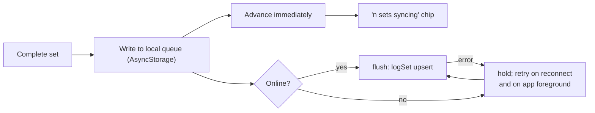

# Office Gym — Improvement Proposals

**Companion to [ENGINEERING_HANDOFF.md](./ENGINEERING_HANDOFF.md).** That document describes the system as it is.
This one describes what to do about it: make it **safer**, **faster**, **easier to use**, and **more scalable**.

Every proposal states the problem with evidence from the code, the fix, what it depends on, the effort, the risk,
and how you know it worked. Nothing here is speculative polish — each item traces to something observable in the
repo today, and every number in it was measured rather than estimated.

**Effort:** S = under a day · M = 1–3 days · L = a week or more.

---

## Contents

| Band | Sections |
|------|----------|
| [Day one](#day-one--before-anything-else) | Q1 CI · U1 contrast · C6 unique index · P4.1 pin the CDN ref · Q4 housekeeping |
| [Make failure visible](#priority-order) | U6 observability |
| [Prerequisites for touching production](#prerequisites-for-touching-production) | M4 migration tooling · M5 backups · M6 RLS test harness |
| [C — Correctness & data integrity](#c--correctness--data-integrity) | C1 · C2 · C3 · C4 · C5 · C6 · C7 · C8 |
| [P — Performance](#p--performance) | P1 · P2 · P3 · P4 · P5 · P6 |
| [U — Usability](#u--usability) | U1 · U2 · U3 · U4 · U5 · U6 · U7 |
| [S — Scalability](#s--scalability) | S1 · S2 · S3 · S4 · S5 · S6 |
| [Q — Quality & process](#q--quality--process) | Q1 · Q2 · Q3 · Q4 · Q5 |
| [M — Missing entirely](#m--missing-entirely) | M1 · M2 · M3 · M4 · M5 · M6 · M7 · M8 · M9 · M10 · M11 |
| [How to know it worked](#how-to-know-it-worked) · [What not to do](#what-not-to-do) | |

---

## Priority order

You are a solo engineer inheriting this. The order below is chosen so that **each item makes the next one safer**:
CI before changes, observability before risky changes, tooling and backups before schema changes, and the largest
change (offline sync) last, when you can finally see it fail.

| # | Item | Effort | Why here |
|---|------|--------|----------|
| 1 | [Q1](#q1--run-types-and-tests-in-ci) Run types and tests in CI | S | Nothing else should land before something checks it. |
| 2 | [U1](#u1--fix-the-faint-token-contrast-failure) Fix the `faint` contrast failure | S | One token. Ideal first PR. |
| 3 | [C6](#c6--guard-against-a-duplicate-active-plan) Unique partial index on the active plan | S | One line, and a **precondition for reasoning about [C1](#c1--make-saveplan-transactional)**. |
| 4 | [P4.1](#p4--own-the-exercise-imagery) Pin the free-exercise-db ref | S | One line. Removes a whole class of upstream breakage and **unblocks [P1](#p1--stop-parsing-1-mb-of-json-at-startup) step 2**. |
| 5 | [Q4](#q4--housekeeping) + [Q5](#q5--fix-the-two-unguarded-effects) Housekeeping and the unguarded effects | S | Cheap, and Q5 removes a silent hang. |
| 6 | [U6](#u6--observability-for-a-blind-app) Observability | M | **Everything after this is safer because of it.** You cannot debug the items below in an app where a crash is a white screen nobody hears about. |
| 7 | [M4](#m4--migration-tooling-and-drift-detection) + [M5](#m5--backups-and-a-tested-restore) + [M6](#m6--an-rls-test-harness) Tooling, backups, RLS tests | M | **Six proposals below change production SQL.** None of them is safe until these exist. |
| 8 | [M1](#m1--password-reset-and-account-recovery) Password reset | S–M | A forgotten password is currently total, unrecoverable account loss. More likely to hit a real user in month one than anything in C. |
| 9 | [C3](#c3--stop-a-failed-profile-read-looking-like-a-new-user) Profile-read failure | S | Cheapest item that closes the highest-severity risk. |
| 10 | [C1](#c1--make-saveplan-transactional) Transactional `savePlan` | L | The other half of the same data loss. Needs #3 and #7. |
| 11 | [M3](#m3--close-the-avatar-bucket) Close the avatar bucket | S | The one real security finding. |
| 12 | [C2](#c2--complete-the-session-when-it-ends-not-when-a-button-is-pressed) + [C5](#c5--remove-the-200-session-ceiling) + [C8](#c8--make-the-rotation-per-plan) Session completion and the rotation cursor | M | One coherent change; doing them separately means writing the cursor twice. |
| 13 | [U2a](#u2--a-rest-timer-that-survives-a-locked-phone) Wall-clock rest timer | S | Most of U2's value, and it ships on the current toolchain. |
| 14 | [P1](#p1--stop-parsing-1-mb-of-json-at-startup) + [P2](#p2--one-cache-instead-of-four-independent-reads) + [P3](#p3--fetch-the-plan-once-per-session) Speed | M | Visible to every user, low risk, no schema. |
| 15 | [S6](#s6--a-native-release-pipeline) EAS build + **EAS Update** | M | Turns every later fix into an OTA push instead of a store review, and unblocks [U2b](#u2--a-rest-timer-that-survives-a-locked-phone). |
| 16 | [M2](#m2--data-export-and-account-deletion) Export and deletion | M | Do before there is a second user, not after. |
| 17 | [C4](#c4--offline-tolerant-set-logging) Offline-tolerant logging | L | The biggest and riskiest change. Last, with observability in place. |
| 18+ | [C7](#c7--make-the-calendar-day-explicit) · [U3](#u3--let-people-swap-an-exercise) · [U4](#u4--stop-persisting-a-guess-as-a-logged-set) · [U5](#u5--decide-what-rpe-is-for) · [S1](#s1--reach-the-rest-of-the-catalog) · [S2](#s2--version-the-catalog) · [P5](#p5--tighten-rls-and-index-for-growth) · [M7](#m7--what-happens-when-a-user-changes-dayspweek)–[M11](#m11--abuse-surface-and-rate-limiting) · [S3](#s3--make-plans-editable-instead-of-disposable) · [S4](#s4--semantic-colour-tokens) | | Product and polish, once the foundation holds. |

### Day one — before anything else

Q1, U1, C6, P4.1, Q4, Q5. All S, all low-risk, and together they mean the rest of this document can be worked
without flying blind.

### Prerequisites for touching production

**Six proposals change production SQL** — [C1](#c1--make-saveplan-transactional) (RPC),
[C6](#c6--guard-against-a-duplicate-active-plan) (unique index), [C2](#c2--complete-the-session-when-it-ends-not-when-a-button-is-pressed)
(backfill), [U4](#u4--stop-persisting-a-guess-as-a-logged-set) and [S2](#s2--version-the-catalog) (new columns),
[U5](#u5--decide-what-rpe-is-for) (a column drop), [P5](#p5--tighten-rls-and-index-for-growth) (every RLS policy).

Migrations here are **applied by hand in the SQL Editor, with no record of what is live and no backup**. Do
[M4](#m4--migration-tooling-and-drift-detection), [M5](#m5--backups-and-a-tested-restore) and
[M6](#m6--an-rls-test-harness) first. It is two days, and it is the difference between "medium risk" and "tested".

---

## C — Correctness & data integrity

### C1 · Make `savePlan` transactional

**Depends on:** [C6](#c6--guard-against-a-duplicate-active-plan), [M4](#m4--migration-tooling-and-drift-detection), [M5](#m5--backups-and-a-tested-restore)

**Problem.** `lib/db/queries.ts:savePlan` performs five dependent writes over the network with no transaction, the
*first* is destructive, and **its error is not even checked**:

```ts
await supabase.from('plans').update({ is_active: false }).eq('user_id', userId);  // ← destructive, unchecked
const { data: plan }   = await supabase.from('plans').insert({...}).select('id').single();
const { data: days }   = await supabase.from('plan_days').insert(...).select('id, day_index');
const { data: blocks } = await supabase.from('plan_blocks').insert(blockRows).select(...);
await supabase.from('plan_items').insert(itemRows);
```

Lose connectivity after step 1 and the user has **no active plan**. Fail at step 4 and they have a plan with days
but no exercises — which `getActivePlan` returns happily and every screen renders as empty. This runs at the end of
onboarding and behind Profile → Rebuild: both moments where a user is most likely on office Wi-Fi that just dropped.

**Fix.** One Postgres function, called once. A `plpgsql` body is a single transaction, so ordering stops mattering
for durability and the deactivation rolls back with everything else.

```sql
-- supabase/migrations/0004_save_plan_rpc.sql
create or replace function public.save_plan(plan jsonb)
  returns uuid
  language plpgsql
  security invoker              -- RLS still applies; the caller is the user
  set search_path = ''
as $$
declare
  new_plan_id uuid;
begin
  -- Bound the input: this function is reachable by any authenticated user.
  if jsonb_array_length(plan->'days') not between 1 and 7 then
    raise exception 'a plan must have between 1 and 7 days';
  end if;

  -- Safe to deactivate first: we are inside a transaction, and C6's unique
  -- partial index is checked per statement, so the new insert would otherwise
  -- collide with the still-active old plan.
  update public.plans set is_active = false
   where user_id = auth.uid() and is_active;

  insert into public.plans (user_id, name, split, weeks)
  values (auth.uid(), plan->>'name', plan->>'split', coalesce((plan->>'weeks')::int, 4))
  returning id into new_plan_id;

  with days as (
    insert into public.plan_days (plan_id, day_index, name, focus)
    select new_plan_id, d.ord - 1, d.value->>'name', d.value->>'focus'
      from jsonb_array_elements(plan->'days') with ordinality as d(value, ord)
    returning id, day_index
  ),
  blocks as (
    insert into public.plan_blocks (plan_day_id, block_index, kind, title, rounds, rest_seconds)
    select dy.id, b.ord - 1,
           (b.value->>'kind')::public.block_kind, b.value->>'title',
           (b.value->>'rounds')::int, (b.value->>'rest_seconds')::int
      from jsonb_array_elements(plan->'days') with ordinality as d(value, ord)
      join days dy on dy.day_index = d.ord - 1
      cross join lateral jsonb_array_elements(d.value->'blocks') with ordinality as b(value, ord)
    returning id, plan_day_id, block_index
  )
  insert into public.plan_items
    (block_id, item_index, exercise_id, sets, reps_low, reps_high, seconds, tempo, notes)
  select bl.id, i.ord - 1,
         i.value->>'exercise_id', (i.value->>'sets')::int,
         (i.value->>'reps_low')::int, (i.value->>'reps_high')::int,
         nullif(i.value->>'seconds', 'null')::int,
         i.value->>'tempo', i.value->>'notes'
    from jsonb_array_elements(plan->'days') with ordinality as d(value, ord)
    join days dy on dy.day_index = d.ord - 1
    cross join lateral jsonb_array_elements(d.value->'blocks') with ordinality as b(value, ord)
    join blocks bl on bl.plan_day_id = dy.id and bl.block_index = b.ord - 1
    cross join lateral jsonb_array_elements(b.value->'items') with ordinality as i(value, ord);

  return new_plan_id;
end;
$$;

-- The repo revokes EXECUTE on handle_new_user for good reason; this one is
-- meant to be called, so grant it explicitly rather than relying on defaults.
grant execute on function public.save_plan(jsonb) to authenticated;
```

Client side, `savePlan` collapses to one call:

```ts
const { data, error } = await supabase.rpc('save_plan', { plan: generated });
if (error) throw error;
return data as string;
```

> **Do not "just reverse the order" client-side.** It is tempting — insert the new plan, then deactivate the
> others — but the existing deactivate statement is `.eq('user_id', userId)` with **no `id` filter and no
> `is_active` filter**, so moving it to the end deactivates the plan you just inserted. The user ends up with no
> active plan on the *happy* path, every rebuild, permanently — strictly worse than the bug being fixed. If you
> genuinely cannot write SQL today, the statement must become
> `.eq('user_id', userId).eq('is_active', true).neq('id', newPlanId)` — and note that this path is **incompatible
> with [C6](#c6--guard-against-a-duplicate-active-plan)**, which forbids the two-active window it depends on. Take
> the RPC.

**Effort** L, not M — the three-level `with ordinality` CTE chain above *is* the work, and it replaces the least
tested code in the repo. **Risk** medium: a hand-applied function that reshapes a JSON tree, against a database
with no local stack. This is exactly why [M4](#m4--migration-tooling-and-drift-detection)/[M5](#m5--backups-and-a-tested-restore)
come first.

**Done when:** killing the network at each of the five original steps leaves the user with either their old plan or
a complete new one, never anything between; and a generated plan round-trips through `save_plan` to an identical
tree (assert it against `getActivePlan` in a test using the mock backend).

---

### C2 · Complete the session when it ends, not when a button is pressed

**Depends on:** [M5](#m5--backups-and-a-tested-restore) (the backfill is irreversible) · **Pairs with:** [C5](#c5--remove-the-200-session-ceiling), [C8](#c8--make-the-rotation-per-plan), [M9](#m9--session-resume-and-zombie-sessions)

**Problem.** `sessions.completed_at` is written only by `finishSession()`, called from the summary's **Save &
finish** button, and `getRecentSessions` filters `.not('completed_at', 'is', null)`. A user who trains a full
session and then closes the app on the summary has: every set logged ✅, no session in history ❌, no streak credit
❌, no rotation advance ❌, no progression applied ❌. The work is in the database and invisible.

**Fix.**

1. **Write `completed_at` and `duration_s` when the queue is exhausted**, in `run.tsx`'s existing "finished" effect, before navigating. The session is over at that point by definition.
2. **Apply progression when the summary mounts**, not on Save — it already computes `pendingProgress` in its load effect. The button becomes "Done": navigation only.
3. Make both idempotent, because [C4](#c4--offline-tolerant-set-logging) will retry them: `update ... set completed_at = coalesce(completed_at, now())`.

**The backfill needs care.** The obvious version marks *every* session with ≥ 1 set log complete — including the
user who logged one set, hated it, and quit at set 1 of 24. Gate it, and set a duration:

```sql
-- Only sessions that got meaningfully far. Adjust the threshold after looking
-- at the distribution; there is no single right answer.
with logged as (
  select session_id, count(*) as n, max(completed_at) as last_set
    from set_logs group by session_id
)
update sessions s
   set completed_at = l.last_set,
       duration_s   = greatest(1, extract(epoch from (l.last_set - s.started_at))::int)
  from logged l
 where l.session_id = s.id
   and s.completed_at is null
   and l.n >= 5;
```

⚠️ **Say this out loud before running it:** the backfill changes every affected user's completed-session count, and
therefore their rotation position and streak. Run it in the same window as [C8](#c8--make-the-rotation-per-plan),
after a snapshot.

**Effort** S (app) + S (backfill) · **Risk** low in the app, medium for the backfill.
**Done when:** force-quitting on the summary still yields a session in history, streak credit and a rotation advance.

---

### C3 · Stop a failed profile read looking like a new user

**Depends on:** nothing. Do it early.

**Problem.** In `lib/auth.tsx`:

```ts
getProfile(userId)
  .then((p) => { if (!cancelled) setProfile(p); })
  .catch(() => { if (!cancelled) setProfile(null); })   // ← a network error
```

and in `app/_layout.tsx` the gate reads `onboarded = signedIn && profile?.onboarded_at != null`.

`profile === null` therefore means two different things — *"never onboarded"* and *"we could not reach the
server"* — and the gate treats both as **send them to onboarding**. Completing onboarding calls `savePlan`, which
deactivates the existing plan. A transient error at cold start can cost a user their programme.

**Fix.** Make the states explicit instead of collapsing them into one nullable:

```ts
type ProfileState =
  | { status: 'loading' }
  | { status: 'ready';  profile: Profile | null }   // null = genuinely absent → onboarding
  | { status: 'error';  error: Error };             // → retry screen, never onboarding
```

The gate renders: `loading` → splash; `error` → "Couldn't reach the server / Retry", with a sign-out escape;
`ready` → the existing logic. Then persist the last known profile to `AsyncStorage` so an offline launch of an
onboarded user goes straight to Home with cached data.

**Effort** S for the state machine, M with the cache · **Risk** low.
**Done when:** launching with the network off, as an onboarded user, lands on Home or a retry screen — never on
onboarding. Test it in `__tests__/auth.test.tsx` with `getProfile` rejecting. *(The offline-launch half of that
criterion requires the cache; the S version is verified by the retry screen alone.)*

---

### C4 · Offline-tolerant set logging

**Depends on:** [U6](#u6--observability-for-a-blind-app) (you cannot debug a sync layer blind), [Q1](#q1--run-types-and-tests-in-ci) · **Conflicts with:** any non-idempotent write — see [C5](#c5--remove-the-200-session-ceiling)

**Problem.** The app's core loop is a network call:

```ts
const ok = await save(entry, seed);
if (!ok) return;                    // ← the user cannot advance
```

`logSet` failing shows an alert and **blocks the set**. Gyms — especially basement office gyms — have poor signal.
This is a total failure of the primary use case in exactly the environment the app is named after.

**Fix.** Make writes local-first and reconcile in the background. The schema already supports it: `logSet` upserts
on `(session_id, plan_item_id, set_index)`, so replay is idempotent.



A `lib/session/outbox.ts` with `enqueue(op)`, `flush()`, `pending()`, backed by `AsyncStorage`, drained on
`NetInfo` reconnect and `AppState` → active. Route `logSet`, `finishSession` and `upsertProgress` through it.
Sessions started offline need a client-generated `uuid` for `sessions.id` (the column already defaults to
`gen_random_uuid()`; let the client supply it instead). Show pending state honestly — a small "3 sets syncing"
chip — rather than pretending.

**Every operation you put in the outbox must be idempotent.** That is a constraint on the rest of this document,
not just on C4: it is why [C5](#c5--remove-the-200-session-ceiling) must derive the rotation rather than increment
a counter, and why [C2](#c2--complete-the-session-when-it-ends-not-when-a-button-is-pressed) uses `coalesce`.

**Effort** L · **Risk** medium-high; this one deserves its own design note and its own test suite.
**Done when:** **no logged set is lost** with the network off for a whole session, and everything lands within
seconds of reconnecting. Note this criterion is about *writes*: starting a session offline additionally needs
`getActivePlan`, `getProgress` and `startSession`, which is a **read cache** — either scope that in explicitly
(and re-size to L+) or state that offline *start* is out of scope for C4.

---

### C5 · Remove the 200-session ceiling

**Depends on:** [C2](#c2--complete-the-session-when-it-ends-not-when-a-button-is-pressed) · **Pairs with:** [C8](#c8--make-the-rotation-per-plan)

**Problem.**

```ts
getRecentSessions(userId, 200)                                  // useDashboard
const completedCount = sessions.length;                          // capped at 200
const nextDay = plan.days[completedCount % plan.days.length];     // ← freezes at 200
const trainedDays = trainedDayKeys(sessions);                     // ← calendar truncates
```

At four sessions a week a user hits 200 in about a year. From then on the rotation stops advancing and the calendar
loses its earliest months. (The streak survives — `getRecentSessions` returns the *most recent* 200, so
`streakDays` is correct unless someone trains 200 consecutive days.)

**Fix — derive the cursor, never increment one.** A counter (`rotation_index = rotation_index + 1`) is the
canonical non-idempotent write, and [C4](#c4--offline-tolerant-set-logging)'s outbox will retry
`finishSession`, silently skipping a training day. Derive it instead, which needs **no new column**:

```sql
-- The next day is the one after the most recently completed session of THIS plan.
select d.day_index
  from sessions s
  join plan_days d on d.id = s.plan_day_id
 where s.user_id = auth.uid()
   and d.plan_id = $1                     -- the active plan
   and s.completed_at is not null
 order by s.completed_at desc
 limit 1;
```

`nextDay = plan.days[(thatIndex + 1) % plan.days.length]`, or `plan.days[0]` when there is no row. This is
idempotent, per-plan (which is [C8](#c8--make-the-rotation-per-plan) for free), and it fixes the subtler bug that
completing a *non-next* day — Plan → "View session" → Begin — advanced the rotation by one instead of moving to the
day after the one you actually did.

Separately, stop deriving the **calendar** from a capped list: add `getTrainedDayKeys(userId)` selecting only
`started_at`, unlimited and cheap, and keep the limited query for the "Recent" list.

**Effort** S–M · **Risk** low; no migration, no backfill.
**Done when:** a seeded account with 500 sessions shows a correct next day and a full calendar. *(There is no
seeding tool — `mock-supabase.mjs` seeds two fixed users. Budget half a day to add one, or write it as a SQL
fixture.)*

---

### C6 · Guard against a duplicate active plan

**Blocks:** [C1](#c1--make-saveplan-transactional)'s client-side alternative (deliberately)

**Problem.** `getActivePlan` uses `.maybeSingle()`, which errors if two rows come back. Nothing in the schema
prevents two `is_active` plans — `plans_user_idx` is a **non-unique** partial index, and only `savePlan`'s ordering
keeps the invariant.

**Fix.** One line, replacing the existing partial index:

```sql
drop index if exists plans_user_idx;
create unique index plans_one_active_per_user on plans (user_id) where is_active;
```

This makes the invariant the database's job, and makes `.maybeSingle()` honest. It is also why
[C1](#c1--make-saveplan-transactional) must deactivate *before* inserting — inside a transaction, which is fine.

**Effort** S · **Risk** low — verify no user currently has two:
`select user_id, count(*) from plans where is_active group by 1 having count(*) > 1;`

---

### C7 · Make the calendar day explicit

**Problem.** `dayKey()` formats a UTC `timestamptz` through the **device's** timezone, and the streak, the calendar
and "today's totals" all key on it — and on `started_at`, not `completed_at`. Nothing anywhere documents this. A
user who travels can see a day appear twice or a streak break that did not happen; a user who trains at 23:50 gets
a result they cannot explain. Neither is currently reproducible or debuggable.

**Fix.** Decide the semantics, then encode them:

1. **Pick a rule and write it down.** "A session belongs to the local calendar day it *started* in, in the timezone of the device that logged it" is a reasonable rule and matches the current behaviour.
2. **Store it.** Add `sessions.local_day date` (and optionally `sessions.tz text`), written at `startSession` from the device. Then the streak and calendar read a stored fact rather than re-deriving one from a moving reference frame, and a user who travels keeps a stable history.
3. **Test the boundaries.** `stats.test.ts` currently uses a fixed `TODAY`; add cases at 23:59 / 00:01 and across a timezone change.

**Effort** M · **Risk** low. **Done when:** changing the device timezone does not change any past day's key.

---

### C8 · Make the rotation per plan

**Fixed for free by** [C5](#c5--remove-the-200-session-ceiling)'s derived cursor — listed separately because it is a
**live bug today**, not a future one.

**Problem.** `useDashboard` computes `completedCount = sessions.length` from `getRecentSessions`, which returns
every completed session the user has ever had — **across every plan**. So a user with 37 lifetime sessions who
rebuilds into a 3-day plan starts that brand-new plan at `37 % 3 = index 2`: day 3 of 3, on day one of a programme
they have never seen.

**Fix.** The per-plan derived cursor in [C5](#c5--remove-the-200-session-ceiling). A rebuild then naturally starts
at day 1, because the new plan has no completed sessions yet.

**Effort** included in C5 · **Risk** low.
**Done when:** rebuilding a plan puts "Up next" on day 1, for an account with any amount of history.
