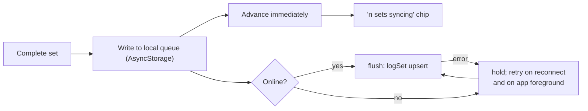

# Office Gym — Improvement Proposals

**Companion to [ENGINEERING_HANDOFF.md](./ENGINEERING_HANDOFF.md).** That document describes the system as it is.
This one describes what to do about it: make it **work**, then **safe**, then **fast**, **easier to use** and
**more scalable**.

Every proposal states the problem with evidence from the code, the fix, what it depends on, the effort, the risk,
and how you know it worked. Every number in it was measured against this commit, not estimated.

**Effort:** S = under a day · M = 1–3 days · L = a week or more.

---

## Contents

| Band | Items |
|------|-------|
| [Stop the bleeding](#band-0--stop-the-bleeding) | [R1](#r1--fix-the-build) fix the build · [R16](#r16--run-types-and-tests-in-ci) CI · [R2](#r2--delete-the-dead-onboarding-route) dead route · [R3](#r3--every-dialog-is-a-no-op-on-the-web-build) web dialogs · [R14](#r14--fix-the-faint-token-contrast-failure) contrast · [R17](#r17--guard-against-a-duplicate-active-plan) unique index · [R20](#r20--housekeeping) housekeeping |
| [See what is happening](#band-1--see-what-is-happening) | [R15](#r15--observability-for-a-blind-app) observability |
| [Prerequisites for production SQL](#band-2--prerequisites-for-production-sql) | [R25](#r25--migration-tooling-backups-and-an-rls-test-harness) tooling, backups, RLS tests |
| [Stop losing data](#band-3--stop-losing-data) | [R6](#r6--no-password-reset) · [R5](#r5--stop-a-failed-profile-read-looking-like-a-new-user) · [R4](#r4--make-saveplan-transactional) · [R7](#r7--close-the-avatar-bucket) |
| [The core loop](#band-4--the-core-loop) | [R10](#r10--complete-the-session-when-it-ends) · [R9](#r9--fix-the-rotation-cursor) · [R12](#r12--a-rest-timer-that-survives-a-locked-phone) · [R22](#r22--extract-the-inline-arithmetic) · [R8](#r8--offline-tolerant-set-logging) |
| [Faster](#faster) | [R13](#r13--stop-parsing-1-mb-of-json-at-startup) · [R23](#r23--add-a-query-cache) · [R24](#r24--pin-and-version-the-catalog) |
| [Easier to use](#easier-to-use) | [R11](#r11--decide-what-rpe-is-for) · [R29](#r29--let-people-swap-an-exercise) · [R32](#r32--accessibility-beyond-contrast) · [R28](#r28--session-resume-and-zombie-sessions) |
| [More scalable](#more-scalable) | [R18](#r18--reach-the-rest-of-the-catalog) · [R26](#r26--finish-the-release-pipeline) · [R27](#r27--data-export-and-account-deletion) · [R30](#r30--make-plans-editable) · [R31](#r31--semantic-colour-tokens) · [R33](#r33--i18n-or-an-explicit-decision-not-to) · [R34](#r34--abuse-surface-and-rate-limiting) |
| [The shipped work is not finished](#the-shipped-work-is-not-finished) | [R35](#r35--make-the-outbox-survivable) · [R36](#r36--namespace-and-clear-the-outbox-on-sign-out) · [R37](#r37--make-queued-writes-genuinely-idempotent) · [R38](#r38--stamp-queued-writes-at-event-time) · [R39](#r39--stop-enqueue-blocking-behind-the-flush) · [R40](#r40--fix-the-signed-out-gate-mapping) · [R41](#r41--strip-the-dev-login-credential-at-build-time) · [R42](#r42--fix-0003s-local_day-backfill-or-its-comment) · [R43](#r43--make-the-training-profile-editable) · [R44](#r44--make-progression-accumulators-server-derived) |
| [Quality](#quality) | [R19](#r19--make-the-dev-harness-runnable) · [R21](#r21--enforce-the-architecture) |
| [How to know it worked](#how-to-know-it-worked) · [What not to do](#what-not-to-do) | |

---

## Status at commit `9245b5a`

Nine of these proposals have **already shipped** — the build is green, dialogs work on web, plan writes are
transactional, the profile gate distinguishes "unavailable" from "absent", writes survive a dead network, and the
rotation cursor is derived per plan. Each is marked ✅ in place, with its analysis kept as the record of why.

**What is still open, in the order to do it:**

| # | Item | Effort | Why here |
|---|------|--------|----------|
| 1 | [R16](#r16--run-types-and-tests-in-ci) — types and tests in CI | S | A broken build has reached `master` before. Nothing else should land first. Budget a generous `--testTimeout`: the suite is minutes from a cold cache and has been seen failing one test there. |
| **2** | **[R35](#r35--make-the-outbox-survivable) + [R36](#r36--namespace-and-clear-the-outbox-on-sign-out) + [R37](#r37--make-queued-writes-genuinely-idempotent) + [R38](#r38--stamp-queued-writes-at-event-time) — make the outbox survivable** | M | **The shipped work is not finished.** Every set, completion and progress write goes through a queue that one 4xx wedges permanently, that is never cleared on sign-out, whose progress ids collide across sessions, and that stamps writes at flush time. This outranks everything below it. |
| **3** | **[R40](#r40--fix-the-signed-out-gate-mapping) — the signed-out gate + two uncaught rejections** | S | A one-line sign error mounts protected screens for signed-out users; two missing `.catch`es can park the app on the splash forever. |
| 4 | [R41](#r41--strip-the-dev-login-credential-at-build-time) — dev-login credential | S | `EXPO_PUBLIC_*` is inlined at build time; a web export from a populated `.env` ships a real password. Not currently leaking — a landmine. |
| 5 | [R14](#r14--fix-the-faint-token-contrast-failure) — the `faint` contrast failure | S | One token, nine call sites, measurable. Ideal first PR. |
| 6 | [R20](#r20--housekeeping) — unused deps, `.nvmrc`, stale comments | S | Cheap. |
| 7 | [R24](#r24--pin-and-version-the-catalog) step 1 — pin the upstream ref | S | One line; makes builds reproducible and removes a class of upstream breakage. |
| 8 | [R15](#r15--observability-for-a-blind-app) — error boundary + crash reporting | M | **Now more urgent than before:** the app has a durable write queue whose failures are currently invisible. |
| 9 | [R25](#r25--migration-tooling-backups-and-an-rls-test-harness) — CLI, backups, RLS tests | M | Four migrations are live-by-hand with no record and no snapshot, and `0003` contains an irreversible backfill. |
| 10 | [R6](#r6--no-password-reset) — password reset | S–M | A forgotten password is still total, unrecoverable account loss. |
| 11 | [R7](#r7--close-the-avatar-bucket) — close the avatar bucket | S | The one real security finding. |
| 12 | [R11](#r11--decide-what-rpe-is-for) — wire RPE up or delete it | S–M | An inert branch that makes progression more aggressive than it claims. |
| 13 | [R12](#r12--a-rest-timer-that-survives-a-locked-phone) — wall-clock rest timer | S | R12a ships today; R12b needs a dev build ([R26](#r26--finish-the-release-pipeline)). |
| 14 | [R13](#r13--stop-parsing-1-mb-of-json-at-startup) + [R23](#r23--add-a-query-cache) — speed | M | ~60% of the bundled catalog is unread fields; both tabs refetch everything on focus. |
| 15 | [R19](#r19--make-the-dev-harness-runnable) — make `drive.mjs` run, then one smoke flow | S + M | The end-to-end gap unit tests structurally cannot close. |
| 16+ | [R18](#r18--reach-the-rest-of-the-catalog) · [R21](#r21--enforce-the-architecture) · [R22](#r22--extract-the-inline-arithmetic) · [R26](#r26--finish-the-release-pipeline)–[R34](#r34--abuse-surface-and-rate-limiting) | | Product and polish, once the foundation holds. |

> [R22](#r22--extract-the-inline-arithmetic) has largely been overtaken by events — `lib/stats.ts` and
> `lib/plan/estimate.ts` now exist and own the arithmetic. What remains is to keep it that way; see
> [R21](#r21--enforce-the-architecture).

**Still true, and still the reason to be careful:** migrations are applied by hand with no tooling and no backup,
and RLS — the only authorisation mechanism in the app — has never been tested with a second account. Do
[R25](#r25--migration-tooling-backups-and-an-rls-test-harness) before any further schema change.

The band headings below describe the original triage and are kept for context.

---

## Band 0 — stop the bleeding

### R1 · Fix the build

> ✅ **Shipped.** `tsc` is clean and 114 tests pass at `9245b5a`. The analysis below is kept as the record of why it was done.

**Depends on:** nothing. **This is item one.**

**Problem.** `npx tsc --noEmit` fails with three errors, both from half-finished refactors:

```
app/(tabs)/profile.tsx(95,9):   error TS2304: Cannot find name 'equipment'.
app/(tabs)/profile.tsx(112,45): error TS18004: No value exists in scope for the shorthand property 'equipment'.
app/session/[dayId]/summary.tsx(123,9): error TS2304: Cannot find name 'pendingProgress'.
```

- **`profile.tsx`** — the equipment picker was removed from the screen, but `regenerate()` still opens with `if (equipment.length === 0)` and still calls `updateProfile(userId, { equipment })`. The rebuild path is dead. Note the `generatePlan` call below it already passes `ALL_EQUIPMENT`, so the guard and the persist are both **vestigial**: the fix is to delete them, not to reintroduce the state.
- **`summary.tsx`** — the `pendingProgress` `useRef` was deleted while its two uses remain (`pendingProgress.current = updates` in the load effect, and the read in `save()`). The whole progression-save path is dead.

**Fix.**

```ts
// app/(tabs)/profile.tsx — regenerate()
const regenerate = async () => {
  if (!profile?.goal || !profile.experience) {
    notify('Not enough to go on', 'Finish onboarding first so we know your goal and experience.');
    return;
  }
  const rebuild = await confirm({
    title: 'Build a new plan?',
    message: 'Your logged sessions and weights stay. The current plan is replaced.',
    confirmLabel: 'Rebuild',
  });
  if (!rebuild) return;
  // ...generatePlan({ ..., equipment: ALL_EQUIPMENT, ... })
  // The `equipment.length` guard and `updateProfile({ equipment })` are deleted:
  // the generator no longer reads the profile's equipment list.
};
```

```ts
// app/session/[dayId]/summary.tsx — restore the ref alongside the other state
const pendingProgress = useRef<ProgressRow[]>([]);
```

Doing this together with [R3](#r3--every-dialog-is-a-no-op-on-the-web-build) is natural: the `Promise<boolean>`
form of `confirm()` removes the nested-callback shape in `regenerate` that was hiding the bug in the first place.

**Effort** S · **Risk** low.
**Done when:** `npx tsc --noEmit` exits 0, Profile → *Rebuild my plan* produces a new plan, and finishing a session
writes `exercise_progress` and `completed_at`.

---

### R16 · Run types and tests in CI

**Depends on:** nothing. Land it immediately after R1 so R1 cannot recur.

**Problem.** Two workflows exist — `publish-pages.yml` (deploy) and `verify-deploy.yml` (probe the deployed URL
plus an hourly uptime check). **Neither runs `tsc` or `jest`.** A build with three type errors reached `master` and
was deployed to three hosts, and the deploy verifier reported success, because the app still *serves*.

**Fix.**

```yaml
# .github/workflows/ci.yml
name: CI
on:
  push: { branches: [master] }
  pull_request:
jobs:
  check:
    runs-on: ubuntu-latest
    steps:
      - uses: actions/checkout@v4
      - uses: actions/setup-node@v4
        with: { node-version: 22, cache: npm }
      - run: npm ci
      - run: npx tsc --noEmit
      - run: npm test -- --ci
```

Then make it mean something: mark it required on `master`, and rename the `lint` script to `typecheck` so nobody
believes a linter ran. Adding ESLint (`eslint-config-expo` + `eslint-plugin-react-hooks`) is the natural follow-up
and would have flagged the orphaned `equipment` reference at edit time.

**Effort** S · **Risk** none. **Done when:** a PR with a type error cannot be merged.

---

### R2 · Delete the dead onboarding route

> ✅ **Shipped.** `app/(onboarding)/` is gone; `app/onboarding.tsx` is the only flow. The analysis below is kept as the record of why it was done.

**Depends on:** nothing.

**Problem.** `app/(onboarding)/index.tsx` (368 lines) and `app/onboarding.tsx` (501 lines) are two different
onboarding flows. The root layout guards `name="onboarding"`, so only the latter is reachable. The former asks an
eight-way equipment question the live flow deliberately dropped, and never collects a name, photo or height.

It is not merely redundant. `app/_layout.tsx` carries this comment:

> *"Onboarding is not in a route group: a group index would claim `/` too, and the tab bar's Today screen already owns it."*

That is exactly what `(onboarding)/index.tsx` is — a group index declaring a route for `/`, which `app/index.tsx`
also declares. Today the auth gate keeps them apart. A refactor that reorders the guards will not.

**Fix.** `git rm -r "app/(onboarding)"`. Diff the two files first and confirm nothing in the old one is worth
keeping — the equipment picker is the only real difference, and dropping it was a deliberate product call whose
consequence [R18](#r18--reach-the-rest-of-the-catalog) revisits.

**Effort** S · **Risk** low. **Done when:** a `fresh@officegym.test` account still onboards end to end.

---

### R3 · Every dialog is a no-op on the web build

> ✅ **Shipped.** `lib/alerts.ts` exists and **no direct `Alert.alert` call remains** in `app/`, `lib/` or `components/`. The analysis below is kept as the record of why it was done.

**Depends on:** nothing. Pairs with [R1](#r1--fix-the-build).

**Problem.** `Alert.alert` is **literally an empty method** in react-native-web. Three screens call it directly:

| Screen | What silently does nothing on web |
|--------|-----------------------------------|
| `session/[dayId]/run.tsx` | "Leave this session?" — **and the "Could not save that set" error** |
| `(tabs)/profile.tsx` | "Build a new plan?", "Photo access is off", "Could not save" |
| `session/[dayId]/summary.tsx` | "Could not save" |

The web build is a **shipped target** — currently the only publicly reachable one. So on the hosted app the
session Close control does nothing at all (and the player has no tab bar and, on iOS, no reliable back gesture),
and every failure is invisible.

**Fix.** A twelve-line module and three import changes:

```ts
// lib/alerts.ts
import { Alert, Platform } from 'react-native';

export function notify(title: string, message?: string): void {
  if (Platform.OS === 'web') { window.alert(message ? `${title}\n\n${message}` : title); return; }
  Alert.alert(title, message);
}

export function confirm({ title, message, confirmLabel = 'OK', cancelLabel = 'Cancel', destructive = false }: {
  title: string; message?: string; confirmLabel?: string; cancelLabel?: string; destructive?: boolean;
}): Promise<boolean> {
  if (Platform.OS === 'web') {
    return Promise.resolve(window.confirm(message ? `${title}\n\n${message}` : title));
  }
  return new Promise((resolve) => {
    Alert.alert(title, message, [
      { text: cancelLabel, style: 'cancel', onPress: () => resolve(false) },
      { text: confirmLabel, style: destructive ? 'destructive' : 'default', onPress: () => resolve(true) },
    ]);
  });
}
```

Add `alerts.test.ts` mocking `Platform.OS`, and a convention line: **never call `Alert.alert` directly**.

**Effort** S · **Risk** low.
**Done when:** on the exported web build (`node tools/dev/serve-dist.mjs dist 8090`) the session Close control asks
and obeys, and a forced `logSet` failure shows a message.

---

### R14 · Fix the `faint` token contrast failure

**Depends on:** nothing.

**Problem.** `colors.faint` (`#5A5A61`) measures **2.89:1** on `bg`, **2.69:1** on `surface` and **2.49:1** on
`elevated`. WCAG 2.1 AA needs 4.5:1 for body text and 3.0:1 even for large text — it fails all three placements at
every size.

`faint` has **nine** call sites today, and they are not all placeholders: `sign-in.tsx` ×2, `onboarding.tsx:212`,
`app/profile.tsx:172` and `NumberField.tsx:54` (placeholders); `onboarding.tsx:400` (the not-yet-reached build-stage
label) and `Calendar.tsx:112` (weekday headers) — **both real body text**; `(tabs)/_layout.tsx:59` (inactive tab
label); and `(tabs)/_layout.tsx:15`, which is an **icon tint** — a non-text case WCAG 1.4.11 holds to 3:1, and which
`#5A5A61` also fails. Extend the guard test to assert that case at 3:1 separately.

**Fix — re-tier `muted` and `faint` together, not `faint` alone.** `#85858B` clears AA on every ground
(**5.40 / 5.02 / 4.63**), but `muted` is `#8E8E93` at 6.07 / 5.64 / 5.21, and the two measure **1.12:1 against each
other**. Moving `faint` there collapses the three-tier hierarchy (`text` / `muted` / `faint`) into two, and this
item's own "Done when" — *still reads as secondary* — becomes unverifiable because it will read as *identical to
`muted`*. Lift the pair: `muted` toward **`#A0A0A6`** (7.61 / 7.07 / 6.54) and `faint` to **`#85858B`**, which
restores a visible 1.41:1 separation between them while both clear AA.

> Do **not** use `#7A7A82`. It clears 4.5:1 on `bg` only (4.65) and fails on `surface` (4.32) and `elevated`
> (3.99) — and `elevated` is where the Profile and `NumberField` placeholders sit. **`elevated` is the binding
> ground.**

Add a guard so it cannot regress:

```ts
// __tests__/theme.test.ts
const GROUNDS = [colors.bg, colors.surface, colors.elevated];
// `danger` passes today at 4.99 on `elevated` — half a point of margin and no test.
it.each(['text', 'muted', 'faint', 'danger'] as const)('%s meets AA on every ground', (token) => {
  for (const ground of GROUNDS) expect(contrast(colors[token], ground)).toBeGreaterThanOrEqual(4.5);
});
```

**Effort** S · **Risk** none. **The ideal first PR once the build compiles.**
**Done when:** the test passes and the inactive tab label still reads as secondary rather than shouting.

---

### R17 · Guard against a duplicate active plan

> ✅ **Shipped.** `0003_correctness_foundation.sql` replaces `plans_user_idx` with a unique partial index. The analysis below is kept as the record of why it was done.

**Depends on:** [R25](#r25--migration-tooling-backups-and-an-rls-test-harness) for a safety net; the change itself
is one line. **Blocks:** any client-side "insert then deactivate" ordering (deliberately).

**Problem.** `getActivePlan` uses `.maybeSingle()`, which errors if two rows come back. Nothing in the schema
prevents two `is_active` plans — `plans_user_idx` is a **non-unique** partial index, and only `savePlan`'s ordering
keeps the invariant.

**Fix.**

```sql
-- Verify first: select user_id, count(*) from plans where is_active group by 1 having count(*) > 1;
drop index if exists plans_user_idx;
create unique index plans_one_active_per_user on plans (user_id) where is_active;
```

This makes the invariant the database's job and `.maybeSingle()` honest. It is also **why
[R4](#r4--make-saveplan-transactional) must deactivate before inserting** — safe there, because it happens inside a
transaction.

**Effort** S · **Risk** low.

---

### R20 · Housekeeping

- **Remove `zustand` and `@gorhom/bottom-sheet`** — no importer anywhere. Check `expo-constants` with `npm ls` before touching it.
- **Fix `jest.config.js`'s header comment — but not the way an earlier draft of this document said.** The config now reads `preset: 'jest-expo'` with `testMatch: ['**/__tests__/**/*.test.{ts,tsx}']`, and five component suites exist. The comment is stale in the *opposite* direction: it still claims coverage of "media resolution" (there is no such test) and still says the tests "compile with plain Babel presets rather than babel-preset-expo", which the `jest-expo` preset directly contradicts. Rewrite it to describe what the config actually does.
- **Fix `scripts/build-catalog.mjs`'s dangling reference** to a `catalog_is_client_side` migration that does not exist. Point it at `0001_init.sql`.
- **Add `.nvmrc` with `22`** to match `engines.node`.
- **Add `CONTRIBUTING.md`** — [§7 of the handoff](./ENGINEERING_HANDOFF.md#7-conventions), compressed to a page.

**Effort** S total · **Risk** none.

---

## Band 1 — see what is happening

### R15 · Observability for a blind app

**Depends on:** nothing. **Blocks (in practice):** [R8](#r8--offline-tolerant-set-logging).

**Problem.** There is no error boundary, no crash reporting and no analytics. A render error is a white screen
nobody hears about — and this codebase currently ships **three known dead code paths**. You cannot answer "does
anyone finish onboarding?", "how many sessions get abandoned?" or "did that release break the player?".

**Fix.**

1. **An error boundary at the root** (`app/_layout.tsx`) rendering a real screen: what happened, a Reload button, a sign-out escape. A crash inside the player currently strands the user.
2. **Crash reporting** — Sentry has a first-class Expo SDK and config plugin.
3. **A handful of events**, not a tracking plan: `onboarding_started/completed`, `session_started/completed/abandoned`, `plan_rebuilt`, `set_log_failed`.
4. **Surface the errors currently swallowed.** `auth.tsx` catches a profile read failure into `null`; `run.tsx`'s load effect has **no `.catch` at all**; onboarding drops a failed avatar upload silently. Degrading gracefully is right; degrading *invisibly* means you never learn.

This is personal health data: log identifiers and event names, never bodyweight, never photos.

**Effort** M · **Risk** low.
**Done when:** a forced throw in the player shows a recoverable screen and appears in the dashboard within a minute.

---

## Band 2 — prerequisites for production SQL

### R25 · Migration tooling, backups, and an RLS test harness

**Blocks:** [R4](#r4--make-saveplan-transactional), [R7](#r7--close-the-avatar-bucket),
[R10](#r10--complete-the-session-when-it-ends)'s backfill, [R11](#r11--decide-what-rpe-is-for),
[R17](#r17--guard-against-a-duplicate-active-plan).

**Problem.** Three gaps that compound:

- **No migration tooling.** No `supabase/config.toml`, no `supabase` devDependency, no `db push`, no local stack, and **no record of which migrations are live on production**. Migrations are pasted into the SQL Editor by hand — which is why `0002` had to be written idempotently.
- **No backup.** No PITR on the free tier, no scheduled `pg_dump`, no restore rehearsal. Several proposals here are irreversible against production.
- **No RLS test.** RLS is the *only* authorisation mechanism in this app, and no test has ever verified it with a second real account.

**Fix.**

```bash
npx supabase init                     # commit supabase/config.toml
npx supabase link --project-ref <ref>

# ⚠️ DO THIS BEFORE THE FIRST PUSH. All four migrations were applied by hand, so
# supabase_migrations.schema_migrations is EMPTY. `db push` would try to re-run
# them — and 0001 is not idempotent (bare `create type` / `create table` /
# `create policy`), so it aborts on the first statement; worse, 0003's backfill
# would re-run against live data.
npx supabase migration repair --status applied 0001 0002 0003 0004

npx supabase db push                  # now applies only what is genuinely new
npx supabase start                    # a local Postgres to test against
```

Then add `supabase db diff --linked` to CI to catch drift, and a nightly `pg_dump` to object storage from a
scheduled workflow, with a **written, rehearsed** restore procedure.

For RLS: a small Node script seeded with two users via the service role (locally only), asserting that each of the
eight tables denies cross-tenant `select`/`insert`/`update`/`delete`. Run it against `supabase start` in CI. Half a
day, and it converts every later policy change from "medium risk" to "tested".

**Rule to adopt:** no migration in this document ships without a fresh snapshot taken first.

Note `supabase db diff --linked` in CI needs the production database password in Actions secrets — worth stating
explicitly, since this document is otherwise careful about credentials.

**Effort** L, not M — baselining, a rehearsed restore and a two-tenant harness is a week's work for someone meeting
the Supabase CLI for the first time · **Risk** low, and it *reduces* the risk of everything after it.
**Done when:** a clean checkout can `supabase start && supabase db push` and run the RLS suite green, and a restore
from the nightly dump has been rehearsed at least once.

---

## Band 3 — stop losing data

### R6 · No password reset

**Depends on:** nothing.

**Problem.** `app/(auth)/sign-in.tsx` offers exactly two actions: `signInWithPassword` and `signUp`. There is no
`resetPasswordForEmail`, no magic-link fallback, no email-change flow. **A user who forgets their password is
permanently locked out of their entire training history**, with no path back that does not involve you opening the
Supabase dashboard.

**Fix.** `lib/deep-link.ts` already handles the token round trip for both PKCE and implicit flows, so the recovery
link is ~80% built:

1. A "Forgot password?" control on sign-in → `supabase.auth.resetPasswordForEmail(email, { redirectTo: authRedirectTo() })`.
2. An `app/(auth)/reset.tsx` screen reached by the deep link, calling `supabase.auth.updateUser({ password })`.
3. Add the redirect URL to the Supabase allow-list (the same list as signup confirmation).

Optionally add `signInWithOtp` as a fallback — no new screen, and it covers the case where the password manager
lost the entry too.

**Effort** S–M · **Risk** low.
**Done when:** a test account can lock itself out and recover, end to end, on a device and on the web build.

---

### R5 · Stop a failed profile read looking like a new user

> ⚠️ **Partially shipped.** `lib/auth-gate.ts` implements the three-state `ProfileState` and a pure `profileGate()`, with a cached-profile fallback on mount. Residue: `profileGate` returns `'ready'` when **signed out**, so the protected screens are declared for a signed-out user ([R40](#r40--fix-the-signed-out-gate-mapping)); `refreshProfile` has no cached fallback and rethrows into a `void` call; and `getSession()` / `getInitialURL()` in `auth.tsx` have no `.catch`, so a rejection leaves the app on the splash forever — a state this item's criterion does not exclude.

**Depends on:** nothing.

**Problem.** In `lib/auth.tsx`:

```ts
getProfile(userId)
  .then((p) => { if (!cancelled) setProfile(p); })
  .catch(() => { if (!cancelled) setProfile(null); })   // ← a network error
```

and the gate in `app/_layout.tsx` reads `onboarded = signedIn && profile?.onboarded_at != null`.

`profile === null` therefore means two different things — *"never onboarded"* and *"we could not reach the
server"* — and the gate treats both as **send them to onboarding**. Completing onboarding calls `savePlan`, which
deactivates the existing plan. A transient error at cold start can cost a user their programme.

**Fix.** Make the states explicit instead of collapsing them into one nullable:

```ts
type ProfileState =
  | { status: 'loading' }
  | { status: 'ready';  profile: Profile | null }   // null = genuinely absent → onboarding
  | { status: 'error';  error: Error };             // → retry screen, never onboarding
```

The gate renders: `loading` → splash; `error` → "Couldn't reach the server / Retry" with a sign-out escape;
`ready` → the existing logic. Then persist the last known profile to `AsyncStorage` so an offline launch of an
onboarded user goes straight to Today with cached data.

**Effort** S for the state machine, M with the cache · **Risk** low.
**Done when:** launching with the network off, as an onboarded user, lands on Today or a retry screen — never on
onboarding. *(The offline-launch half needs the cache; the S version is verified by the retry screen alone.)*

---

### R4 · Make `savePlan` transactional

> ✅ **Shipped, and better than proposed.** `savePlan` is a single `supabase.rpc('save_plan', …)` call. Note the
> shipped `0004_save_plan_rpc.sql` uses **nested `FOR` loops, not the CTE chain sketched below** — shorter, and free
> of the join-key ambiguity a three-level CTE invites. The sizing note below ("L, not M — the CTE chain *is* the
> work") was therefore wrong; prefer the shipped construct if you ever rewrite it. It also adds an
> `auth.uid() is null` guard and a `jsonb_typeof` check that the sketch lacks.
>
> **Three edges remain open:** (1) the input bound covers *days only* — one day may still carry unbounded blocks
> and items, so add caps on blocks/day, items/block and `length(plan::text)`; (2) `grant execute … to
> authenticated` restricts nothing, because Postgres grants `EXECUTE` to `PUBLIC` by default — add
> `revoke execute on function public.save_plan(jsonb) from public, anon;` to match `0001`'s treatment of
> `handle_new_user`, and note the real defence today is the `auth.uid() is null` check; (3) two concurrent rebuilds
> surface as a raw `23505` from the unique index, which `savePlan` rethrows verbatim into `notify()` — catch
> `unique_violation` and re-raise something a human can read.

**Depends on:** [R17](#r17--guard-against-a-duplicate-active-plan), [R25](#r25--migration-tooling-backups-and-an-rls-test-harness)

**Problem.** `savePlan` performs five dependent writes over the network with no transaction, the *first* is
destructive, and **its error is never checked**:

```ts
await supabase.from('plans').update({ is_active: false }).eq('user_id', userId);  // ← destructive, unchecked
const { data: plan }   = await supabase.from('plans').insert({...}).select('id').single();
const { data: days }   = await supabase.from('plan_days').insert(...).select('id, day_index');
const { data: blocks } = await supabase.from('plan_blocks').insert(blockRows).select(...);
await supabase.from('plan_items').insert(itemRows);
```

Lose connectivity after step 1 and the user has **no active plan**. Fail at step 4 and they have a plan with days
but no exercises — which `getActivePlan` returns happily and every screen renders as empty. This runs at the end of
onboarding and behind Profile → Rebuild.

**Fix.** One Postgres function, called once. A `plpgsql` body is a single transaction, so ordering stops mattering
for durability and the deactivation rolls back with everything else.

```sql
-- supabase/migrations/0003_save_plan_rpc.sql
create or replace function public.save_plan(plan jsonb)
  returns uuid
  language plpgsql
  security invoker              -- RLS still applies; the caller is the user
  set search_path = ''
as $$
declare
  new_plan_id uuid;
begin
  -- Bound the input: any authenticated user can call this.
  if jsonb_array_length(plan->'days') not between 1 and 7 then
    raise exception 'a plan must have between 1 and 7 days';
  end if;

  -- Safe to deactivate first: we are inside a transaction, and R17's unique
  -- partial index is checked per statement, so inserting while the old plan is
  -- still active would otherwise collide.
  update public.plans set is_active = false
   where user_id = auth.uid() and is_active;

  insert into public.plans (user_id, name, split, weeks)
  values (auth.uid(), plan->>'name', plan->>'split', coalesce((plan->>'weeks')::int, 4))
  returning id into new_plan_id;

  with days as (
    insert into public.plan_days (plan_id, day_index, name, focus)
    select new_plan_id, d.ord - 1, d.value->>'name', d.value->>'focus'
      from jsonb_array_elements(plan->'days') with ordinality as d(value, ord)
    returning id, day_index
  ),
  blocks as (
    insert into public.plan_blocks (plan_day_id, block_index, kind, title, rounds, rest_seconds)
    select dy.id, b.ord - 1,
           (b.value->>'kind')::public.block_kind, b.value->>'title',
           (b.value->>'rounds')::int, (b.value->>'rest_seconds')::int
      from jsonb_array_elements(plan->'days') with ordinality as d(value, ord)
      join days dy on dy.day_index = d.ord - 1
      cross join lateral jsonb_array_elements(d.value->'blocks') with ordinality as b(value, ord)
    returning id, plan_day_id, block_index
  )
  insert into public.plan_items
    (block_id, item_index, exercise_id, sets, reps_low, reps_high, seconds, tempo, notes)
  select bl.id, i.ord - 1,
         i.value->>'exercise_id', (i.value->>'sets')::int,
         (i.value->>'reps_low')::int, (i.value->>'reps_high')::int,
         nullif(i.value->>'seconds', 'null')::int,
         i.value->>'tempo', i.value->>'notes'
    from jsonb_array_elements(plan->'days') with ordinality as d(value, ord)
    join days dy on dy.day_index = d.ord - 1
    cross join lateral jsonb_array_elements(d.value->'blocks') with ordinality as b(value, ord)
    join blocks bl on bl.plan_day_id = dy.id and bl.block_index = b.ord - 1
    cross join lateral jsonb_array_elements(b.value->'items') with ordinality as i(value, ord);

  return new_plan_id;
end;
$$;

-- 0001 revokes EXECUTE on handle_new_user for good reason; this one is meant to
-- be called, so grant it explicitly rather than relying on defaults.
grant execute on function public.save_plan(jsonb) to authenticated;
```

Client side, `savePlan` collapses to one call:

```ts
const { data, error } = await supabase.rpc('save_plan', { plan: generated });
if (error) throw error;
return data as string;
```

> **Do not "just reverse the order" client-side.** The existing deactivate is `.eq('user_id', userId)` with **no
> `id` filter and no `is_active` filter**, so moving it after the insert deactivates the plan you just created —
> leaving the user with no active plan on the *happy* path, every rebuild. If you truly cannot write SQL today it
> must become `.eq('user_id', userId).eq('is_active', true).neq('id', newPlanId)` — and that path is
> **incompatible with [R17](#r17--guard-against-a-duplicate-active-plan)**, which forbids the two-active window it
> relies on. Take the RPC.

**Effort** L, not M — the three-level `with ordinality` CTE chain *is* the work, and it replaces the least-tested
code in the repo. **Risk** medium.
**Done when:** killing the network at each of the five original steps leaves the user with either their old plan or
a complete new one, never anything between; and a generated plan round-trips through `save_plan` to a tree
identical to what `getActivePlan` returns.

---

### R7 · Close the avatar bucket

**Depends on:** [R25](#r25--migration-tooling-backups-and-an-rls-test-harness)

**Problem.** `0002_profile_identity.sql` creates the `avatars` bucket with `public = true` and:

```sql
create policy avatars_read on storage.objects
  for select to public using (bucket_id = 'avatars');
```

Objects live at the stable path `<uid>/avatar.<ext>`. So every user's face photo is fetchable, unauthenticated, by
anyone holding the URL, forever — the `?v=<timestamp>` cache-buster revokes nothing because the path never
changes. The uid is a UUIDv4 and so not enumerable, but an unguessable URL is not access control.

Compounding it, `uploadAvatar` takes the content type *and* the file extension straight from the fetched
response's headers with **no allowlist**, and the bucket has no `file_size_limit` or `allowed_mime_types`.

**Fix.**

```sql
update storage.buckets
   set public = false,
       file_size_limit = 2097152,                                   -- 2 MB
       allowed_mime_types = array['image/jpeg','image/png','image/webp']
 where id = 'avatars';

drop policy if exists avatars_read on storage.objects;
create policy avatars_read on storage.objects
  for select to authenticated
  using (bucket_id = 'avatars' and (storage.foldername(name))[1] = auth.uid()::text);
```

⚠️ **This is a breaking change to existing data, and the order matters.** `uploadAvatar` returns
`getPublicUrl(path) + '?v=' + Date.now()`, and that **full URL** is what every `profiles.avatar_url` holds today.
Flipping the bucket private turns every stored value into a 400 immediately, including onboarding's preview. Do it
in three steps:

1. **Render from a path, with a legacy fallback.** Teach the render sites to accept either a bare path (mint a `createSignedUrl(path, 3600)` at render time) or a legacy absolute URL.
2. **Backfill `avatar_url` to bare paths** — strip the origin, the `/storage/v1/object/public/avatars/` prefix *and* the `?v=` query string.
3. **Only then flip the bucket** and swap the read policy.

Also validate the MIME type client-side before upload rather than trusting the response header. And be honest about
what a signed URL buys: it is still an unauthenticated URL, just time-boxed — the "unguessable URL is not access
control" argument applies to it too.

**Effort** S for the policy, M including the signed-URL refactor · **Risk** low, but it changes how avatars are
read everywhere they are shown (Profile, and onboarding's preview).
**Done when:** fetching another user's avatar path unauthenticated returns 400/403, and your own still renders.

---

## Band 4 — the core loop

### R10 · Complete the session when it ends

> ⚠️ **Partially shipped.** Completion is queued through the outbox and `0003` carries the gated backfill. But because the queue stamps at flush time ([R38](#r38--stamp-queued-writes-at-event-time)), an offline session is recorded as completed on the day it *syncs*, not the day it was trained — and `getLastCompletedPlanDayIndex` orders by `completed_at`, so the rotation cursor inherits the distortion.

**Depends on:** [R1](#r1--fix-the-build) (the summary must compile first), [R25](#r25--migration-tooling-backups-and-an-rls-test-harness) for the backfill · **Pairs with:** [R9](#r9--fix-the-rotation-cursor)

**Problem.** `sessions.completed_at` is written only by `finishSession()`, called from the summary's **Save &
finish** button, and `getRecentSessions` filters `.not('completed_at', 'is', null)`. A user who trains a full
session and then closes the app on the summary has: every set logged ✅, no session in History ❌, no rotation
advance ❌, no progression applied ❌.


**Fix.**

1. **Write `completed_at` and `duration_s` when the queue is exhausted**, in `run.tsx`'s existing "finished" effect, before navigating. The session is over at that point by definition.
2. **Apply progression when the summary mounts**, not on Save — it already computes the updates in its load effect. The button becomes "Done": navigation only.
3. Make both idempotent, because [R8](#r8--offline-tolerant-set-logging) will retry them: `set completed_at = coalesce(completed_at, now())`.

**The backfill needs care.** The naive version marks *every* session with ≥ 1 set log complete — including someone
who logged one set and quit at set 1 of 24. Gate it and set a duration:

```sql
with logged as (
  select session_id, count(*) as n, max(completed_at) as last_set
    from set_logs group by session_id
)
update sessions s
   set completed_at = l.last_set,
       duration_s   = greatest(1, extract(epoch from (l.last_set - s.started_at))::int)
  from logged l
 where l.session_id = s.id
   and s.completed_at is null
   and l.n >= 5;                    -- tune after looking at the distribution
```

⚠️ Say this out loud before running it: the backfill changes every affected user's completed-session count, and
therefore their rotation position. Run it in the same window as [R9](#r9--fix-the-rotation-cursor), after a
snapshot.

**Effort** S (app) + S (backfill) · **Risk** low in the app, medium for the backfill.
**Done when:** force-quitting on the summary still yields a session in History and a rotation advance.

---

### R9 · Fix the rotation cursor

> ✅ **Shipped.** `getLastCompletedPlanDayIndex` derives the cursor per plan; it is uncapped and idempotent. The analysis below is kept as the record of why it was done.

**Depends on:** [R10](#r10--complete-the-session-when-it-ends)

**Problem.** `lib/usePlan.ts`:

```ts
Promise.all([getActivePlan(userId), getRecentSessions(userId, 200)])
  .then(([activePlan, sessions]) => { setCompletedCount(sessions.length); ... });

const nextDay = plan && plan.days.length > 0 ? plan.days[completedCount % plan.days.length] : null;
```

Two bugs in three lines:

- **It is capped at 200.** At four sessions a week a user hits that in about a year, after which the rotation freezes forever.
- **It counts sessions across *every* plan.** `getRecentSessions` has no plan filter. So a user with 37 lifetime sessions who rebuilds into a 3-day plan starts that brand-new plan at `37 % 3 = index 2` — day 3 of 3, on day one of a programme they have never seen. **This fires on every rebuild, today.**

**Fix — derive the cursor, never increment one.** A counter (`rotation_index = rotation_index + 1`) is the
canonical non-idempotent write, and [R8](#r8--offline-tolerant-set-logging)'s outbox will retry `finishSession`,
silently skipping a training day. Derive it instead — **no new column needed**:

```sql
-- The next day is the one after the most recently completed session OF THIS PLAN.
select d.day_index
  from sessions s
  join plan_days d on d.id = s.plan_day_id
 where s.user_id = auth.uid()
   and d.plan_id = $1                     -- the active plan
   and s.completed_at is not null
 order by s.completed_at desc
 limit 1;
```

`nextDay = plan.days[(thatIndex + 1) % plan.days.length]`, or `plan.days[0]` when there is no row. This is
idempotent, per-plan (so a rebuild starts at day 1), uncapped, and it fixes a third bug for free: completing a
*non-next* day — Plan → "View session" → Begin — previously advanced the rotation by one instead of moving to the
day after the one you actually trained.

**Effort** S–M · **Risk** low; no migration, no backfill.
**Done when:** rebuilding a plan puts "Up next" on day 1 for an account with any amount of history, and a seeded
account with 500 sessions shows a correct next day. *(There is no seeding tool — `mock-supabase.mjs` seeds two
fixed users. Budget half a day for a SQL fixture.)*

---

### R12 · A rest timer that survives a locked phone

**Depends on:** notifications depend on [R26](#r26--finish-the-release-pipeline) · split accordingly.

**Problem.** `components/RestPage.tsx`:

```ts
const id = setInterval(() => setRemaining((v) => (v <= 0 ? 0 : v - 1)), 1000);
```

The countdown is a **decrementing counter, not a clock**:

- Lock the phone or switch apps during a 150-second rest — exactly what people do — and JS timers are throttled or suspended. Come back and the timer is wrong, sometimes wildly.
- `setInterval` drifts under load even in the foreground.
- The buzz at zero only fires **if the app is in the foreground**, so rest ends silently otherwise — which defeats the purpose.

**Fix, split by what can ship today:**

**R12a (S, ships now).** Anchor to the wall clock: store `restEndsAt = Date.now() + restSeconds * 1000` and render
`Math.max(0, restEndsAt - now)` on a tick, recomputing on `AppState` → `active`. The tick's accuracy stops
mattering. Note `Date.now()` is wall-clock, not monotonic — an NTP correction or a manual clock change mid-rest
jumps the timer, so clamp the result to `[0, restSeconds]` and treat a negative elapsed as zero. The same exposure
already exists in `run.tsx`'s `duration_s` calculation. Add `expo-keep-awake` for the duration of a session — a phone that sleeps mid-set is the most-reported
annoyance in every training app. Both work in Expo Go.

**R12b (M, blocked).** Schedule a local notification for `restEndsAt` (`expo-notifications`), cancelled if the user
advances early. **This needs a development build**, so [R26](#r26--finish-the-release-pipeline) first — it will not
work in Expo Go.

**Done when (R12a):** backgrounding the app for 60 s of a 90 s rest returns to ~30 s remaining.

---

### R22 · Extract the inline arithmetic

> ✅ **Largely shipped.** `lib/stats.ts` and `lib/plan/estimate.ts` now exist and own the arithmetic, with their
> own suites, and `tsc` is clean. What remains is keeping it that way — see [R21](#r21--enforce-the-architecture).

**Depends on:** [R1](#r1--fix-the-build) — do this *while* you are already in `summary.tsx`.

**Problem.** [Handoff §4.3](./ENGINEERING_HANDOFF.md#43-where-each-number-is-computed) has the full table. The short
version: `lib/` holds beautifully tested pure functions for progression, units and the session queue — and then the
screens compute everything else inline. The worst case is `summary.tsx`, which holds ~60 lines of grouping,
tonnage, top-load, e1RM and PR detection.

**Fix.** Two new pure modules, both trivially testable:

```ts
// lib/stats.ts
export function sessionTotals(logs: LoggedSet[], bodyweightKg: number | null): {
  sets: number; reps: number; volumeKg: number;
};
export function topLoadKg(logs: LoggedSet[], bodyweightKg: number | null): number | null;
export function bestE1rm(logs: LoggedSet[], bodyweightKg: number | null): number;

// lib/plan/estimate.ts
export function estimateDay(day: PlanDay): {
  blocks: number; sets: number; reps: number; minutes: number; bodyParts: string[];
};
```

`summary.tsx` then groups and renders; the maths lives in `lib/` with tests. `estimateDay` also fixes a small
honesty problem on the Today tab, which prints `profile.session_minutes` under a "Minutes" label — the length the
user *asked for*, not the length of the session in front of them.

Watch the block-kind branch when you extract: `straight` takes sets from the item, `superset`/`circuit` from the
block. That is the bug this extraction exists to stop repeating.

**Effort** M · **Risk** low (pure functions, added tests).
**Done when:** `summary.tsx` contains no arithmetic, `lib/stats.ts` and `lib/plan/estimate.ts` have their own
suites, and the Today tab's minutes reflect the actual session.

---

### R8 · Offline-tolerant set logging

> ⚠️ **Partially shipped — the criterion below is NOT met.** `lib/session/outbox.ts` + `sync.ts` exist and work on the happy path, but: a single terminal error wedges the queue permanently ([R35](#r35--make-the-outbox-survivable)); the key is global and never cleared on sign-out ([R36](#r36--namespace-and-clear-the-outbox-on-sign-out)); `queueProgress` ids collide across sessions ([R37](#r37--make-queued-writes-genuinely-idempotent)); writes are stamped at flush time ([R38](#r38--stamp-queued-writes-at-event-time)); and `enqueue` blocks behind the whole drain ([R39](#r39--stop-enqueue-blocking-behind-the-flush)). Also **`startSession` was never queued** — it is an `INSERT` awaiting a server-generated id, so a session cannot be *started* offline at all, which makes the "whole session with the network off" criterion unexecutable. Calling that a *read* cache, as this item originally did, was wrong.

**Depends on:** [R15](#r15--observability-for-a-blind-app), [R16](#r16--run-types-and-tests-in-ci) · **Constrains:** [R9](#r9--fix-the-rotation-cursor), [R10](#r10--complete-the-session-when-it-ends) (every retried write must be idempotent)

**Problem.** The app's core loop is a network call:

```ts
const ok = await save(entry, seed);
if (!ok) return;                    // ← the user cannot advance
```

`logSet` failing shows an alert — which on web shows **nothing** ([R3](#r3--every-dialog-is-a-no-op-on-the-web-build)) — and **blocks the set**. Gyms, especially basement office gyms, have poor signal. This is a total failure
of the primary use case in exactly the environment the app is named after.

**Fix.** Local-first writes, reconciled in the background. The schema already supports it: `logSet` upserts on
`(session_id, plan_item_id, set_index)`, so replay is idempotent.



A `lib/session/outbox.ts` with `enqueue(op)`, `flush()`, `pending()`, backed by `AsyncStorage`, drained on
`NetInfo` reconnect and `AppState` → active. Route `logSet`, `finishSession` and `upsertProgress` through it.
Sessions started offline need a client-generated `uuid` for `sessions.id` (the column already defaults to
`gen_random_uuid()`; let the client supply it). Show pending state honestly — a small "3 sets syncing" chip.

**Every operation in the outbox must be idempotent.** That is a constraint on the rest of this document: it is why
[R9](#r9--fix-the-rotation-cursor) derives the cursor rather than incrementing a counter, and why
[R10](#r10--complete-the-session-when-it-ends) uses `coalesce`.

**Effort** L · **Risk** medium-high; deserves its own design note and test suite.
**Done when:** **no logged set is lost** with the network off for a whole session, and everything lands within
seconds of reconnecting. Note the criterion is about *writes*: starting a session offline additionally needs
`getActivePlan`, `getProgress` and `startSession`, which is a **read cache** — either scope that in explicitly (and
re-size upward) or state that offline *start* is out of scope.

---
## Faster

### R13 · Stop parsing 1 MB of JSON at startup

**Depends on:** [R24](#r24--pin-and-version-the-catalog) for step 2.

**Problem.** `lib/catalog.ts` does this at module scope:

```ts
import raw from '@/lib/data/exercises.json';
export const CATALOG = raw as unknown as Exercise[];
const BY_ID = new Map(CATALOG.map((e) => [e.id, e]));
```

`exercises.json` is **1,082,256 bytes**. On web it is inlined into the JS bundle and parsed before anything
renders; on native it is evaluated on first import. `catalog.ts` is imported by `plan/generate`, Today, Plan, the
session overview, the player and the summary — i.e. immediately.

Now measure what is in it. Verified by grep, **three fields are never read by any screen or domain function** —
they appear only in `lib/types.ts` and `scripts/build-catalog.mjs`:

| Removal | Resulting file size | Saved |
|---------|--------------------:|------:|
| (baseline) | **1,057 KB** | — |
| drop `instructions`, `secondary_muscles`, `force_type` | **421 KB** | −636 KB (**60%**) |
| …and derive `media_refs` from `id` | **229 KB** | −828 KB total (**78%**) |

`media_refs` is safe to derive: across all 873 rows, `start` is **exactly** `<prefix>/<id>/0.jpg` and `end`
`<prefix>/<id>/1.jpg`, with zero exceptions. Move the prefix into `lib/media/provider.ts` and build the URL there.

**Fix.**
1. Stop copying the three unread fields in `build-catalog.mjs`, and remove them from the `Exercise` interface so the compiler proves nothing broke. **−636 KB, free.**
2. Derive `media_refs`. **A further −192 KB** — but only after [R24](#r24--pin-and-version-the-catalog), because deriving hard-codes the two-image assumption and moves the CDN ref from generated data into runtime code. The build script's `images[1] ?? images[0]` fallback exists because upstream *can* ship one image.

> **Do not add a pattern index.** It is tempting ("`candidates()` scans all 873 rows on every `pick`"), but
> measured: **20 full plan generations in 25 ms — 1.25 ms per plan**, once per onboarding or rebuild. That is a
> rounding error, and this document should not manufacture scalability work.

Two caveats on the framing. **The compiler does not enforce step 1** — `scripts/build-catalog.mjs` is untyped
`.mjs`, so the proof that the three fields are unread is the grep, not `tsc`. And **the byte figures are raw, not
gzipped**: highly repetitive JSON compresses well, so a user's connection sees far less than −60%. The change is
still worth making, but the real win is parse time on device, not transfer.

**Effort** S for step 1, S for step 2 · **Risk** low.
**Done when:** `wc -c lib/data/exercises.json` is under 300 KB and the suite is green.

**If you later want the instructions back** — see [R29](#r29--let-people-swap-an-exercise) — do not re-bundle them.
Put them in a lazily fetched JSON keyed by id, and cache it.

---

### R23 · Add a query cache

**Depends on:** nothing; composes well with [R8](#r8--offline-tolerant-set-logging).

**Problem.** There is no caching anywhere. `lib/useDashboard.ts` runs `getActivePlan` (a four-level nested select),
`getRecentSessions(userId, 200)`, `getProgress` and more on mount; **Home and Plan each hold their own instance**,
and **both** call `useFocusEffect(reload)`, so every tab switch refetches everything. On top of that, the session
overview, the player and the summary each call `getActivePlan` again — so starting one session fetches the entire
plan tree **three times**.

**Fix.** Two options:

- **TanStack Query** (`@tanstack/react-query`) — keys `['plan', userId]`, `['sessions', userId]`, `['progress', userId]`; a `staleTime` of ~30 s makes a tab switch free, and invalidation after a session is explicit. ~13 KB gzipped, and it brings retry and background refetch, several of which [R8](#r8--offline-tolerant-set-logging) needs anyway.
- **A hand-rolled provider** — lift `useDashboard` into a provider mounted in `(tabs)/_layout.tsx` so both tabs share one instance, and replace the focus-effect reload with explicit invalidation after a session finishes.

Given R8 is coming, TanStack Query is the better investment. Either way, **the blanket "refetch everything on
focus" is the actual defect**; the cache just makes it cheap to stop.

Also add `getPlanDay(dayId)` — `run.tsx` needs one day, not the whole plan.

**Effort** M · **Risk** low.
**Done when:** a Today → Plan → Today round trip issues zero network requests inside the stale window, and starting
a session reads the plan once.

---

### R24 · Pin and version the catalog

**Blocks:** [R13](#r13--stop-parsing-1-mb-of-json-at-startup) step 2.

**Problem.** `scripts/build-catalog.mjs` fetches `free-exercise-db@main`, and the images are hot-linked from that
same moving ref. Two consequences: **the catalog is not reproducible** — two people running `npm run catalog` a
month apart can produce different files from the same commit — and a rename upstream breaks every demo image in
the app at once. Nothing records which catalog version a plan was generated against, so if an `exercise_id`
disappears, historical logs silently degrade to raw ids.

**Fix.**
1. **Pin the ref** to a commit SHA or tag, in both the data URL and the image prefix. One line; removes the whole class of upstream breakage, makes builds reproducible, and makes upgrading a deliberate reviewable commit. **Do this first — it is the cheapest item in this document.**
2. **Emit a version.** Have the script write `{ version, generatedAt, sourceRef, exercises: [...] }` and export `CATALOG_VERSION` from `lib/catalog.ts`.
3. **Record it.** Add `plans.catalog_version text`, stamped in `savePlan`. A plan generated against an older catalog becomes identifiable instead of mysterious.
4. **Add a build-time invariant test:** every id unique, non-empty and URL-safe; every `pattern` a member of the `Pattern` union; every row's `media_refs` matching the derivable form (which is what makes R13 step 2 safe). A malformed catalog should fail the build, not the app.
5. **Consider mirroring the images** to Supabase Storage, resized to the two sizes the app actually uses. The thumbnails are currently full-size dataset JPEGs scaled down in the client.

**Effort** S for (1), M for (2)–(5) · **Risk** low.
**Done when:** two clean checkouts of the same commit produce byte-identical `exercises.json`.

---

## Easier to use

### R11 · Decide what RPE is for

**Depends on:** [R25](#r25--migration-tooling-backups-and-an-rls-test-harness) if you choose to remove the columns.

**Problem.** `sessions.rpe` and `set_logs.rpe` exist with `check (rpe between 1 and 10)`. `nextLoad` branches on
`s.rpe == null || s.rpe <= 8`. And `run.tsx:90` writes:

```ts
rpe: null,   // "The effort scale is gone; progression treats a null as manageable."
```

Every RPE in the database is null, so the condition is **permanently true** — the "manageable" gate does nothing,
and progression is more aggressive than the algorithm claims. This is a half-removed feature masquerading as a
working one.

**Fix.** Pick one and make the code say so:

- **Wire it up.** The rest page already has the user's attention and two steppers; a three-way "easy / hard / failed" maps cleanly onto RPE ≤ 8 / 9 / 10 and is one tap. This is the honest version of double progression.
- **Remove it.** Drop the columns, drop the parameter from `nextLoad`, simplify the docs. Half the effort, and the app becomes truthful about what it does.

Either is fine. The current state — dead columns, an inert branch, and a comment explaining the corpse — is not.

**Effort** S (remove) to M (wire up) · **Risk** low.

---

### R29 · Let people swap an exercise

**Depends on:** nothing (the machinery already exists).

**Problem.** The generator picks well, but there is **no way to say no**. If the only barbell is in use, or an
exercise hurts, the options are: do something else and log it under the wrong name, or rebuild the entire plan
from Profile — which replaces all of it. This is the largest gap between "a plan was generated for me" and "this
is my plan".

**Fix.** A **Swap** control on the work screen and in the session overview. `candidates()` already does the work:

```ts
const alternatives = candidates({
  patterns: [exercise.pattern],
  equipment: ALL_EQUIPMENT,
  level: profile.experience,
  limitations: profile.limitations,
}).filter((e) => e.id !== exercise.id);
```

Show three to five with their demo stills. Choosing one updates `plan_items.exercise_id` for that item, so the
swap persists into future rotations — the behaviour users expect. This is also the feature that would justify
fetching `instructions` lazily (see [R13](#r13--stop-parsing-1-mb-of-json-at-startup)).

**Effort** M · **Risk** low; it writes one column.
**Done when:** any work exercise can be replaced in under three taps and the choice survives to the next rotation.

---

### R32 · Accessibility beyond contrast

**Depends on:** [R14](#r14--fix-the-faint-token-contrast-failure) handles colour; this is the rest.

**Problem.** The roles-and-labels hygiene is good, but three gaps are unaddressed:

- **`ProgressBar` is invisible to assistive tech** — no `accessibilityRole="progressbar"`, no `accessibilityValue`. It is the session's only progress signal.
- **The rest clock is a raw `<Text>` updating every second with no live region.** A blind user is never told rest ended — and [R12](#r12--a-rest-timer-that-survives-a-locked-phone)'s whole premise is that rest ending must be perceivable.
- **No Dynamic Type support.** Every size in `theme.ts` is a fixed number, nothing touches `allowFontScaling`, and `Button` has a hard `minHeight: 56` with 56×56 steppers. At the larger iOS text sizes, labels and the two oversized numerals clip rather than reflow.
- **The session Close control has a label but no `accessibilityRole`** (`run.tsx:203`).
- **No animation anywhere checks reduced motion** — currently minor (only fades and the media crossfade), but it should be the habit before more motion is added.

**Fix.** Add the role and value to `ProgressBar`; give the clock `accessibilityLiveRegion="polite"` and announce
"Rest complete"; test at the largest Dynamic Type setting and let the type scale respond; add the missing role.

**Effort** M · **Risk** low. **Done when:** a VoiceOver pass through one full session is coherent.

---

### R28 · Session resume and zombie sessions

**Depends on:** [R10](#r10--complete-the-session-when-it-ends)

**Problem.** `startSession` inserts unconditionally. Quitting mid-session leaves a row with `completed_at = null`
forever; nothing detects or resumes it; tapping Start twice creates two. After R10 lands, these become the *only*
rows with a null `completed_at`, which makes them both easy to find and important to handle — R10's backfill has to
guess about exactly these rows.

**Fix.** On entering the session overview, look for an in-progress session for this `plan_day_id` started within
N hours and offer **Resume** (restoring the cursor from the highest logged `set_index`). Expire the rest — a
scheduled job, or opportunistically on next start.

**Effort** M · **Risk** low. **Done when:** quitting mid-session and returning offers to resume where you stopped.

---

## More scalable

### R18 · Reach the rest of the catalog

**Depends on:** [R16](#r16--run-types-and-tests-in-ci) — see the coverage warning below.

**Problem.** `ALL_EQUIPMENT` lists seven tokens and omits `'other'`. The catalog has **239 exercises (27%)** tagged
`other` — medicine balls, exercise balls, foam rollers — which can therefore never be selected. For a beginner the
reachable pool is 366 of 873; an intermediate sees 561. Adding `'other'` takes an intermediate to **772**.

⚠️ **No test references `ALL_EQUIPMENT`.** Both `generate.test.ts` and `regressions.test.ts` hard-code their own
equivalent seven-token literal, so changing the constant would leave the suite green while the real selection pool
moved by 239 exercises. **Step one of this fix is to make the tests import `ALL_EQUIPMENT`.**

**Fix.** A product decision with two defensible answers:

- **Include `'other'`** — one token. Instantly +239, mostly mobility and conditioning work where variety matters most. Risk: an office gym may not have a medicine ball, and the app no longer asks.
- **Re-map `'other'` in the build script** — but ⚠️ **do not map it to `bodyweight`**. `build-catalog.mjs` sets `is_bodyweight: equipment === 'bodyweight'`, and `effectiveLoadKg()` resolves a bodyweight set as `profile.bodyweight_kg + added_load_kg`. Remap a medicine-ball slam to `bodyweight` and every logged rep counts the user's entire bodyweight as tonnage. If you remap, add a ninth token (`ball`) or decouple `is_bodyweight` from `equipment` first.

Note the selective remap **cannot** reach 772: of the 239, 100 are `stretching` and 46 `plyometrics`, which land in
mobility/conditioning rather than the work blocks. Only the blanket include hits that number.

Also worth revisiting: the warm-up pool is **73 exercises, only 13 of them `mobility`** — small enough that
warm-ups repeat noticeably across a week.

**Effort** S (include) / M (remap, because of `is_bodyweight`) · **Risk** low once the tests import the constant.

---

### R26 · Finish the release pipeline

> 📌 **Moving as this was written.** The pin for these documents is `9245b5a`. HEAD has since added
> `.github/workflows/eas-update.yml`, so the EAS Update half of this item is landing. Re-check before starting.
> Note it is an *update* workflow, not a CI one — nothing yet runs `tsc` or `jest`
> ([R16](#r16--run-types-and-tests-in-ci) is still open).


**Blocks:** [R12b](#r12--a-rest-timer-that-survives-a-locked-phone) and anything else needing a development build.

**Problem.** `eas.json` exists with `preview` (internal APK) and `production` (autoIncrement) profiles — a good
start — but there is no **EAS Update**, no store metadata, no privacy declarations, and no development-build
profile. Today the app effectively ships as Expo Go + a web build.

**Fix.**
1. Add a `development` profile (`developmentClient: true`) — this is what unblocks `expo-notifications`.
2. **EAS Update.** With no custom native code, virtually every fix in this document ships OTA instead of through store review. This is the highest-leverage item in the section.
3. `eas build --profile preview` for TestFlight and an Android internal track.
4. Store metadata and **privacy nutrition labels** — this app collects health data (bodyweight, height, training logs) and a face photo; that must be declared.
5. Keep any dev-login environment variables out of the production profile.

**Effort** M · **Risk** low.

---

### R27 · Data export and account deletion

**Depends on:** [R25](#r25--migration-tooling-backups-and-an-rls-test-harness)

**Problem.** The app stores bodyweight, height, a face photo and a complete training log — unambiguously personal
data, and health data at that. There is **no delete-account path, no export, and no privacy policy**.

Deletion is architecturally awkward here: `auth.admin.deleteUser` needs the service role, which the "no
server-side logic" principle forbids on the client. So this requires the app's **first Edge Function** — which is
cheap, because deleting the `auth.users` row cascades everything else away for free.

Export is easy: one screen that runs the existing queries and writes a JSON/CSV bundle.

**Fix.** An Edge Function `delete-account` (verifies the caller's JWT, calls `auth.admin.deleteUser`), a Profile
control that confirms twice, an export button, and a written retention position. **Do this before there is a
second user**, not after.

**Effort** M · **Risk** low, but irreversible by design — put the confirmation behind typing the account email.

---

### R30 · Make plans editable

**Depends on:** [R29](#r29--let-people-swap-an-exercise) is the first slice of this.

**Problem.** The only ways to change a plan are "rebuild it entirely" or "change nothing". `savePlan` deactivates
and inserts; there is no update path. Everything a user might reasonably want — swap an exercise, change rest, add
a set, reorder blocks — is unreachable. This is the structural ceiling on the product: progressive overload works
for weeks, but a plan you cannot shape stops being yours by about week three.

**Fix.** The schema already supports mutation — `plan_items`, `plan_blocks` and `plan_days` are ordinary rows with
`(parent, index)` uniqueness. What is missing is a write path and the UI. In order:

1. `updatePlanItem(itemId, patch)` for `exercise_id`, `sets`, `reps_low/high` — unlocks R29 immediately.
2. Block-level edits: `rest_seconds`, `rounds`.
3. Reordering — index juggling under a unique constraint, so do it in an RPC.
4. Add/remove items.

History is already safe from edits: `sessions` point at `plan_days`, and each set log carries its own
`exercise_id`.

**Effort** L · **Risk** medium. Deserves its own design note.

---

### R31 · Semantic colour tokens

**Problem.** `lib/theme.ts` is a flat `as const` map of literal hex values consumed directly (`colors.accent`,
`colors.faint`). Right for a dark-only v1 — but light mode, a high-contrast mode, or any theming at all is a change
to every file rather than to one object.

**Fix.** One layer of indirection, no runtime cost:

```ts
const palette = { ink900: '#0A0A0B', ink800: '#141416', /* … */ lime400: '#D7FF3E' } as const;
export const colors = {
  bg: palette.ink900, surface: palette.ink800, accent: palette.lime400,
  textPrimary: palette.white, textSecondary: palette.grey400, textTertiary: palette.grey300,
} as const;
```

While you are there, rename `faint` — it describes appearance, and after [R14](#r14--fix-the-faint-token-contrast-failure) it will not be faint.

**Effort** M (mechanical) · **Risk** low.

---

### R33 · i18n, or an explicit decision not to

Every user-facing string is a literal in JSX; `date-fns` uses the default locale. That is a defensible v1 choice —
but [R31](#r31--semantic-colour-tokens) argues for indirection so a *theme* can be added later, and the same
argument for *language* has not been made at all. **If the answer is "English-only, forever", write it down** next
to the dark-mode decision, so it is a decision rather than an omission.

**Effort** S to decide, L to implement.

---

### R34 · Abuse surface and rate limiting

**Problem.** Public signup is unrestricted (no captcha, no domain allowlist), the avatar bucket has no size cap
([R7](#r7--close-the-avatar-bucket)), [R4](#r4--make-saveplan-transactional)'s proposed RPC would accept unbounded
JSON without the guard written into it, and Supabase's default auth rate limits have never been reviewed. For an
app whose entire security model is "the anon key grants nothing because RLS", the remaining exposure is **resource
exhaustion**, and nobody has looked at it.

**Fix.** Turn on captcha for signup, set the bucket limits from R7, keep the `jsonb_array_length` guard in the RPC,
and write down what the auth rate limits actually are.

**Effort** S · **Risk** none.

---

## Quality

### R19 · Make the dev harness runnable

**Problem.** `tools/dev/drive.mjs` is a good idea that does not run:

```js
import { chromium, devices } from 'playwright';                       // not in package.json
executablePath: '/opt/pw-browsers/chromium-1194/chrome-linux/chrome'  // a container path
```

On a fresh checkout the documented command fails immediately.

**Fix.** Add `@playwright/test` as a devDependency, drop the `executablePath`, add `npm run drive`. Then it is a
short step to running one smoke flow — sign in → onboard → start a session → log a set → summary — against
`mock-supabase.mjs` in CI. **That single test would cover the parts of the app the unit suite structurally
cannot**, including both files that are currently broken.

**Effort** S (harness) + M (the CI smoke flow) · **Risk** low.

---

### R21 · Enforce the architecture

**Problem.** The best property of this codebase is that `lib/plan/*`, `lib/progression.ts`, `lib/session/queue.ts`,
`lib/stats.ts`, `lib/units.ts` and `lib/catalog.ts` are **pure — no I/O, no React**. That is why those suites run
with no mocks in a plain environment. It is protected by nothing but discipline: one `import { supabase }` in
`generate.ts` and it is gone, quietly, in a reasonable-looking PR.

> **Correction to an earlier draft of this item.** It claimed `jest.config.js` matched only `*.test.ts` and that
> "no component test can run at all". That is **no longer true** — the config is `preset: 'jest-expo'` with
> `testMatch: ['**/__tests__/**/*.test.{ts,tsx}']`, and five component suites exist (`ui`, `home`, `plan`,
> `onboarding`, `dev-auth`). That gap is closed; do not reopen it.

**Fix.**
1. **A test that asserts the boundary** — walk the import graph of the pure modules and fail on any edge into `lib/db/`, `lib/session/sync.ts`, `react`, `react-native` or `expo-*`. Twenty lines, or `madge`. This is the whole item now, and it protects the property the handoff calls the codebase's best — it should not be buried at the bottom of a "Quality" section.
2. **ESLint `no-restricted-imports`**, scoped by path, once ESLint exists. Add a second rule while you are there: ban `Alert.alert` outside `lib/alerts.ts`, which is currently a convention held up by nothing.

**Effort** S · **Risk** none.
**Done when:** adding `import { supabase } from '@/lib/db/supabase'` to `lib/plan/generate.ts` fails CI.

---

## The shipped work is not finished

These are defects **inside the code that shipped**, found by auditing the implementations rather than the
proposals. They are not new features; they are the difference between "the mechanism exists" and "the criterion is
met". **R35–R38 together outrank everything in the priority table except CI**, because every set, completion and
progress write in the product passes through the queue they describe.

### R35 · Make the outbox survivable

**Depends on:** nothing. **Do this first.**

**Problem.** `lib/session/outbox.ts`:

```ts
async flush() {
  await this.exclusive(async () => {
    let items = await this.read();
    while (items.length) {
      try { await this.send(items[0]); }
      catch { return; }              // ← head stays, forever; the error is discarded
      items = items.slice(1);
      await this.write(items);
    }
  });
}
```

`catch { return; }` cannot tell a transient network failure from a terminal one. Any non-retryable error on the
head — an RLS denial, a `23505`, a check-constraint violation, a `set_logs` row whose `plan_item_id` was nulled by
`on delete set null`, a 400 after a schema change — parks that operation at position 0 **permanently, across app
restarts**, blocking every set behind it. There is no attempt counter, no dead-letter, no max age, no cap on queue
length, and the `catch` discards the error object, so nothing is loggable even once
[R15](#r15--observability-for-a-blind-app) lands. The queue then grows until `AsyncStorage.setItem` throws on
quota, at which point `enqueue` rejects and the player shows "Could not save that set" — the exact failure
[R8](#r8--offline-tolerant-set-logging) existed to remove.

**Fix.** Per-operation `attempts`, `firstFailedAt` and `lastError`. Classify PostgREST errors: 4xx except 408/429
is terminal, everything else retryable. Terminal operations move to a bounded `dead` list and **the drain continues
past them** instead of returning. Exponential backoff with jitter for retryables. Hard caps on queue length and
operation age, dropping the oldest loudly. Surface `pending` and `dead` counts plus the last error on Profile, with
"retry all" and "discard" controls, and report `dead` to the crash reporter.

**Effort** M · **Risk** low (it only makes a stuck queue move).
**Done when:** injecting a permanently-failing operation at the head still lets every subsequent set reach the
server, and the failure is visible both in the UI and in the reporter within one flush.

---

### R36 · Namespace and clear the outbox on sign-out

**Depends on:** [R35](#r35--make-the-outbox-survivable) (they share the same file).

**Problem.** The outbox key is the global constant `office-gym.session-outbox.v1`, and `signOut` calls only
`supabase.auth.signOut()` — it clears neither the queue nor the `office-gym.profile.<userId>` cache. So: sign out
as A with pending operations, sign in as B on the same device, and B's client flushes A's operations.
`queueProgress` carries `userId: A` in its payload and calls `upsertProgress(A, …)` while authenticated as B, which
`exercise_progress_rw` rejects — a *terminal* error, which under [R35](#r35--make-the-outbox-survivable) wedges B's
queue on their first session. Two accounts and one device reproduce it; shared devices and the public web build
make it reachable.

Separately, the cached profile — bodyweight, height, display name, avatar URL — persists in plaintext
`AsyncStorage`/`localStorage` after sign-out indefinitely, which is a live concern for
[R27](#r27--data-export-and-account-deletion).

**Fix.** Namespace the key by user id. In `signOut`: attempt a bounded flush, then clear the outbox and the profile
cache. On flush, assert the operation's owning user matches the current session and dead-letter mismatches rather
than sending them.

**Effort** S · **Risk** low. **Done when:** sign out with pending writes, sign in as a second account, and that
account's first session syncs cleanly.

---

### R37 · Make queued writes genuinely idempotent

**Depends on:** nothing.

**Problem.** `lib/session/sync.ts`:

```ts
export const queueProgress = (userId: string, rows: ProgressRow[]) => enqueue({
  id: `progress:${userId}:${rows.map((row) => row.exercise_id).sort().join(',')}`, …
});
```

The id contains **no session identifier**, and `Outbox.enqueue` *replaces* on id match. Two runs of the same plan
day produce the same exercise set, hence the same id. Finish Monday's Push day offline; finish Push again Thursday
before the queue drains; Thursday's operation replaces Monday's and Monday's update is gone, with no error.
`last_weight_kg` self-heals because it is absolute, but `miss_streak` and `best_*` are accumulators computed
against a stale server read — so a missed session is erased from the deload logic.

This makes the handoff's former claim that "every wrapped write is idempotent" false: this operation is not
idempotent, it is **lossy-collapsing**.

**Fix.** `id: \`progress:${sessionId}\``. Then re-audit the other two ids for the same property — `queueSet` keys on
`(sessionId, planItemId, setIndex)` and `queueCompletion` on `sessionId`, both of which are correct.

**Effort** S · **Risk** low. **Done when:** two sessions of the same plan day queued offline both apply on flush.

---

### R38 · Stamp queued writes at event time

**Depends on:** nothing. **Pairs with:** [R35](#r35--make-the-outbox-survivable).

**Problem.** `finishSession` sets `completed_at: new Date().toISOString()` **when the flush finally succeeds**, and
`set_logs.completed_at` is not in the `SetLog` interface at all, so it takes the server-side `default now()` — also
flush time. Train Saturday with no signal, open the app Tuesday, and the session and all its sets are recorded as
Tuesday.

That is not cosmetic. `getLastCompletedPlanDayIndex` orders by `completed_at`, so **the rotation cursor becomes a
function of network conditions**; `getSetLogs` orders by it; and `0003`'s backfill derives `completed_at` from
`max(set_logs.completed_at)`, inheriting the same distortion. Note `local_day` is the one field that already does
this correctly — captured client-side at session start — which shows the principle was understood and applied in
exactly one place.

**Fix.** Add `occurredAt` to the operation payload at enqueue time; send it as `completed_at` for both `logSet` and
`finishSession`. Clamp or reject a future `completed_at` so a badly-set device clock cannot write one.

**Effort** S–M · **Risk** low.
**Done when:** a session logged with the radio off and flushed 48 hours later appears in History on the day it was
trained, and leaves the rotation cursor on the right day.

---

### R39 · Stop `enqueue` blocking behind the flush

**Depends on:** nothing.

**Problem.** `enqueue` and `flush` serialise on the same `tail` promise, and `flush` holds it for the **whole
drain**, not just the read-modify-write. `run.tsx` does `await save(...)`, which awaits `queueSet`. So on a
slow-but-alive network with N operations queued, the next set button waits for N round trips — precisely the
flaky-signal case the outbox was built for. [R8](#r8--offline-tolerant-set-logging)'s own diagram promises
"Write to local queue → **Advance immediately**"; that is not what shipped. `__tests__/outbox.test.ts` already
exercises the trace, asserting it as "does not drop an operation enqueued during a flush" — true, and the same
trace is the stall.

**Fix.** Hold the mutex only across `read` → `write`; let the send loop re-read between operations.

**Effort** S · **Risk** low — but add a test that `enqueue` resolves while a send is in flight, so the fix does not
silently regress the drop-safety the current test protects.

---

### R40 · Fix the signed-out gate mapping

**Depends on:** nothing.

**Problem.** `lib/auth-gate.ts` returns `'ready'` when `!signedIn`, and `app/_layout.tsx` then computes
`const onboarded = gate === 'ready'` and wraps `(tabs)`, `profile` and `session` in
`<Stack.Protected guard={onboarded}>`. Signed out, `onboarded` is `true`, so those screens are declared. They call
`useUserId()`, which throws — and with no error boundary ([R15](#r15--observability-for-a-blind-app)), a deep link
to `/session/<id>/run` while signed out is a white screen. This contradicts the invariant `_layout.tsx`'s own
comment states: *"a screen the user does not belong on must never mount in the first place."*

Two related defects in `lib/auth.tsx`, same fix session:

- **`refreshProfile` has no cached fallback** and sets `{status:'error'}` on failure, unlike the mount path. An offline onboarded user who taps Retry is thrown to the error screen. It then rethrows into a `void` call — an unhandled rejection on every failed retry.
- **`getSession()` and `Linking.getInitialURL()` have no `.catch`.** `loading` starts `true` and is only cleared inside those `then` bodies, so a rejection (a corrupt persisted session, a Safari private-mode storage error on the web build) parks the app on the splash **forever** — a state `profileGate` never sees, because it never runs.

**Fix.** Give `profileGate` a distinct `'signed-out'`, or gate on `signedIn && gate === 'ready'`. Add the cached
fallback to `refreshProfile`. Add `.catch` to both promises, clearing `loading` and routing into the `error` state.

**Effort** S · **Risk** low.
**Done when:** a deep link to a session URL while signed out lands on sign-in, and a forced `getSession()` rejection
shows the retry screen rather than an indefinite splash. Restate [R5](#r5--stop-a-failed-profile-read-looking-like-a-new-user)'s
criterion to exclude the splash: *"reaches Today or a retry screen within N seconds — never onboarding, never an
indefinite splash."*

---

### R41 · Strip the dev-login credential at build time

**Depends on:** nothing.

**Problem.** `lib/dev-auth.ts` reads `EXPO_PUBLIC_DEV_LOGIN_PASSWORD`. `devLoginEnabled` is a **runtime** gate, but
`EXPO_PUBLIC_*` is inlined at **build** time regardless — so any web export produced on a machine with a populated
`.env` ships a real Supabase account password as a string literal in a public JS file.

**Currently not leaking:** `publish-pages.yml` passes only `EXPO_NO_TELEMETRY`/`EXPO_OFFLINE`, so the published
gh-pages and jsDelivr bundles are clean. This is a landmine, not an active breach — but it means
[R7](#r7--close-the-avatar-bucket) is no longer "the one security finding", and
[R26](#r26--finish-the-release-pipeline)'s "keep dev-login variables out of the production profile" understates the
fix.

**Fix.** Do not carry a password in an `EXPO_PUBLIC_*` variable at all. Either strip it at build time (a Babel
plugin or a build-profile env allowlist that fails the build if the key is present), or replace the shortcut with a
magic link / OTP that carries no secret. Add a CI grep asserting the exported bundle contains no
`DEV_LOGIN_PASSWORD` value.

**Effort** S · **Risk** none. **Done when:** `grep -r "$EXPO_PUBLIC_DEV_LOGIN_PASSWORD" dist/` finds nothing after
an export on a machine where that variable is set.

---

### R42 · Fix `0003`'s `local_day` backfill, or its comment

**Depends on:** [R25](#r25--migration-tooling-backups-and-an-rls-test-harness).

**Problem.** `0003_correctness_foundation.sql` states the principle and then violates it:

```sql
-- C7: calendar membership is a fact captured when the session starts, not a
-- value recalculated later in whatever timezone the device happens to use.
update public.sessions set local_day = (started_at at time zone 'UTC')::date where local_day is null;
```

The backfill recalculates every historical row in an arbitrary timezone. For a UTC−5 user who trains at 8pm, every
pre-migration session is filed on the *following* day, shifting the streak and the calendar. And `tz` is added but
**never backfilled and never made `not null`**, so the information needed to correct this later was not captured.

**Fix.** Either backfill from a known user timezone if you have one, or accept UTC and **say so in the comment**
instead of claiming the opposite. Then either backfill `tz` and make it `not null`, or drop the column — a
half-populated `tz` is worse than none, because it invites code that trusts it.

**Effort** S · **Risk** medium (it rewrites historical rows — snapshot first).

---

### R43 · Make the training profile editable

**Depends on:** nothing.

**Problem.** `days_per_week` is written once, at onboarding, and thereafter only read — `app/profile.tsx` feeds
`profile.days_per_week ?? 4` into a rebuild. There is no editor anywhere, and the same is true of `goal`,
`experience`, `session_minutes` and `limitations`.

So a user who moves from three days a week to five — the single most common change in this product's domain — has
**no path at all**, not even the destructive one, because Rebuild regenerates from the value they cannot change.
This is a ceiling on the product rather than a risk to it, which is why it belongs above most of the polish items.

**Fix.** A "Training preferences" section on Profile writing those fields, with an explicit *"this changes your
plan — rebuild now?"* prompt, since changing `days_per_week` without regenerating leaves the plan and the profile
disagreeing. Note the mirrored `CHECK 2..6` constraint if you widen the range.

**Effort** M · **Risk** low.
**Done when:** a user can go from 3 to 5 days and get a matching plan without re-onboarding.

---

### R44 · Make progression accumulators server-derived

**Depends on:** [R37](#r37--make-queued-writes-genuinely-idempotent)

**Problem.** `logSet` upserts last-writer-wins, and `upsertProgress` overwrites `miss_streak` and `best_*` —
accumulators computed on the client from a read taken at summary-mount time. Two devices, or one device with a
stale queue, silently clobber each other. [R37](#r37--make-queued-writes-genuinely-idempotent) fixes the specific
id collision; this fixes the class.

**Fix.** Derive the accumulators server-side — a trigger or an RPC that recomputes `best_weight_kg` / `best_e1rm`
as a max over `set_logs` and `miss_streak` from the actual set history. Replay order then stops mattering, which is
exactly the property an outbox needs from everything it carries.

**Effort** M · **Risk** medium (it moves logic into the database; test it with the RLS harness from
[R25](#r25--migration-tooling-backups-and-an-rls-test-harness)).

---

## How to know it worked

Two columns, because several of these have already moved: **At triage** is the state when the item was written;
**At `9245b5a`** is what I measured for this revision. Re-measure before you start — see
[the handoff's §0.5](./ENGINEERING_HANDOFF.md#05-how-to-re-verify-this-document).

| Metric | How to measure | At triage | At `9245b5a` | Target |
|--------|----------------|-----------|--------------|--------|
| Build | `npx tsc --noEmit` | 3 errors | **0** ✅ | 0 |
| Dialogs that work on the web build | `grep -rn "Alert.alert" app lib components \| grep -v lib/alerts.ts` | 0 of 6 | **9 call sites, all via `lib/alerts.ts`** ✅ | stays 0 direct |
| Plan writes atomic | read `savePlan` | 5 unguarded round trips | **1 RPC** ✅ | 1 |
| "Up next" after a rebuild | seeded account with history | wrong day | **day 1** ✅ | day 1 |
| Sets lost with the network off | aeroplane-mode run | all after the first failure | **0 while the queue drains** — but a terminal error wedges it ([R35](#r35--make-the-outbox-survivable)) | 0, and a poisoned op cannot block the queue |
| Starting a session offline | aeroplane-mode run | impossible | **still impossible** — `startSession` is not queued | possible, or explicitly out of scope |
| CI gates on types + tests | `.github/workflows/` | ❌ | ❌ | ✅ ([R16](#r16--run-types-and-tests-in-ci)) |
| Account recovery path | manual | none | **none** | password reset works end to end ([R6](#r6--no-password-reset)) |
| Avatar readable by a stranger | `curl` the path unauthenticated | yes | **yes** | 403 ([R7](#r7--close-the-avatar-bucket)) |
| WCAG AA failures in the palette | the guard test in [R14](#r14--fix-the-faint-token-contrast-failure) | 1 (`faint`, all three grounds) | **1** | 0, with `muted`/`faint` still distinguishable |
| `exercises.json` | `wc -c lib/data/exercises.json` | 1,082,256 B | **1,082,256 B** | **< 300,000 B** ([R13](#r13--stop-parsing-1-mb-of-json-at-startup)) |
| Plan reads per session start | network panel, or the mock's `__state` | 3 | **3** | 1 ([R23](#r23--add-a-query-cache)) |
| Queries on a Home → Plan → Home trip | same | refetch-all | **refetch-all** | 0 in the stale window ([R23](#r23--add-a-query-cache)) |
| Rest-timer error after 60 s backgrounded | stopwatch | unbounded | **unbounded** | < 1 s ([R12a](#r12--a-rest-timer-that-survives-a-locked-phone)) |
| Reachable catalog (intermediate) | count via `candidates()` | 561 / 873 | **561 / 873** | 772 with the blanket include ([R18](#r18--reach-the-rest-of-the-catalog)) |
| Crash visibility | Sentry dashboard | none | **none** | every crash within a minute ([R15](#r15--observability-for-a-blind-app)) |
| Catalog reproducibility | two clean checkouts, `npm run catalog`, `diff` | not reproducible | **not reproducible** | byte-identical ([R24](#r24--pin-and-version-the-catalog)) |

> **On timings quoted elsewhere in this document.** "1.25 ms per plan" and "~150 s for the component suites" were
> single measurements on one machine and do **not** reproduce reliably — an independent run measured 3.8–4.0 ms per
> plan, and the jest suite at 17.7 s warm versus 293.9 s from a cold cache, with `home.test.tsx` timing out on the
> cold run. Treat them as orders of magnitude: plan generation is single-digit milliseconds (so
> [R13](#r13--stop-parsing-1-mb-of-json-at-startup)'s "do not add a pattern index" conclusion holds comfortably),
> and the suite is minutes, not seconds, on a cold CI runner — which [R16](#r16--run-types-and-tests-in-ci) must
> budget for, including a `--testTimeout` generous enough that the first CI run is not red.

## What not to do

Each of these is a plausible-sounding change that would make this app worse:

- **Do not replace the deterministic generator with a model call.** It is testable, free, instant, offline and reproducible — and it runs a full plan in **1.25 ms**. Every one of those properties is load-bearing. If personalisation needs to improve, improve the rules: they are 350 readable lines.
- **Do not move the catalog into Postgres.** The generator runs on-device and must work with no network. [R13](#r13--stop-parsing-1-mb-of-json-at-startup) solves the size problem without giving that up.
- **Do not optimise `candidates()`.** Measured at 1.25 ms per plan generation, once per onboarding. There is no problem there.
- **Do not add a state-management library** before [R23](#r23--add-a-query-cache) proves a cache is not enough. `zustand` is already installed and unused; that is the tell.
- **Do not let domain logic reach for the network.** See [R21](#r21--enforce-the-architecture).
- **Do not "fix" the two broken files by reintroducing the state they reference.** The `equipment` picker was deliberately removed; the fix is to finish that removal, not undo it.
- **Do not delete the "why" comments** while changing the code they guard. Several encode bugs that took a real test pass to find — the knee-limitation matcher, the deload rounding clamp, the web routing race in `app/index.tsx`.
